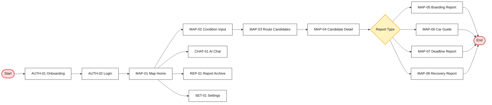

# 탈수있나 Mobile FSD  
## 모바일 화면 기능명세 및 와이어프레임 문서

**문서 유형:** Functional Specification Document  
**서비스명:** 탈수있나  
**플랫폼:** Mobile Web App 기준  
**버전:** v0.1  
**핵심 UX:** 지도형 웹앱 + 지도 기반 AI 챗봇 + 이동 판단 리포트  
**핵심 키워드:** 탑승가능성 / 마감도착 / 실패복구  
**작성 기준:** 지도 중심 모바일 레이아웃, 카드형 리스트, 하단 시트, 칩 필터, 미니멀한 흑백 UI, 라임 포인트 컬러

---

## 0. 문서 목적

본 문서는 **탈수있나**의 모바일 화면을 실제 와이어프레임, Figma/FigJam 화면, 프론트엔드 컴포넌트, API 연동, QA 기준으로 전환하기 위한 기능명세 문서다.

이 문서는 다음 산출물 제작에 사용된다.

1. 모바일 화면 와이어프레임
2. Figma 프로토타입
3. 프론트엔드 컴포넌트 설계
4. API 연동 범위 정의
5. 기능별 QA 체크리스트
6. 대회 제출용 시연 시나리오

---

## 1. 레퍼런스 무드 해석

업로드한 레퍼런스는 **지도 중심 물류/경로 앱**에 가깝다. 탈수있나에는 다음 요소를 적용한다.

| 레퍼런스 요소 | 관찰 포인트 | 탈수있나 적용 |
|---|---|---|
| 지도 중심 화면 | 지도 위 핀, 경로, 리스트 카드가 결합됨 | 메인 화면은 풀스크린 지도 + 하단 시트 |
| 라임/올리브 포인트 | 버튼, 경로, 활성 요소에 강한 포인트 | 추천 경로, 핵심 CTA, 성공 상태에 라임 사용 |
| 저채도 지도 | 지도는 배경화되어 정보가 잘 보임 | 지도는 회색/저채도, 경로만 강조 |
| 카드형 리스트 | 후보 카드가 반복 배열됨 | 경로 후보, 리포트 후보, 저장 리포트에 적용 |
| 칩 필터 | Small/Medium/Large 같은 조건 필터 | 빠른 도착, 덜 붐빔, 비용 최소, 택시 제외 |
| 하단 시트 | 지도 위에서 조건·상세·확정 단계 진행 | 조건 입력, 후보 선택, 리포트 요약에 적용 |
| 단일 CTA | 화면 하단에 명확한 Confirm/Explore 버튼 | “경로 찾기”, “리포트 보기”, “플랜 선택” |
| 미니멀 UI | 흰색 카드, 검정 텍스트, 제한된 강조색 | 정보 밀도를 높이되 시각 노이즈 최소화 |

---

## 2. Visual System Draft

### 2.1 Color Token

| Token | 값 | 용도 |
|---|---|---|
| `--bg` | `#F7F8F2` | 앱 배경 |
| `--surface` | `#FFFFFF` | 카드, 시트, 폼 |
| `--surface-muted` | `#F1F3EA` | 보조 카드 |
| `--text-primary` | `#151A1D` | 제목, 본문 |
| `--text-secondary` | `#6D7378` | 보조 설명 |
| `--border` | `#E3E5DD` | 카드 경계 |
| `--accent` | `#A6D600` | CTA, 추천 경로, 활성 칩 |
| `--accent-dark` | `#6D8F00` | 강조 텍스트, 경로 라인 |
| `--danger` | `#E5484D` | 실패, 위험 |
| `--warning` | `#F5B700` | 지연, 주의 |
| `--info` | `#2F80ED` | 실시간 정보 |
| `--map-route` | `#94B800` | 추천 경로 라인 |
| `--map-alt` | `#A8ADB3` | 대안 경로 라인 |

### 2.2 Type Scale

| Token | Size | Weight | 용도 |
|---|---:|---:|---|
| Display | 28 | 700 | 온보딩 핵심 문구 |
| H1 | 24 | 700 | 화면 제목 |
| H2 | 20 | 700 | 리포트 제목 |
| H3 | 17 | 600 | 섹션 제목 |
| Body | 15 | 400 | 본문 |
| Body Strong | 15 | 600 | 강조 본문 |
| Caption | 12 | 400 | 보조 설명 |
| Label | 13 | 600 | 칩, 태그, 버튼 |

### 2.3 Common UI Pattern

| Pattern | 적용 |
|---|---|
| Full Map + Bottom Sheet | 지도 메인, 경로 후보, 후보 상세 |
| Card List | 플랜 후보, 리포트 아카이브 |
| Chip Row | 조건 필터, 교통수단 필터 |
| Report Card | 최종 판단 리포트 |
| Chat Input | AI 챗 메인 |
| Timeline | 후보 상세, 이동 단계 |
| Data Badge | 실시간/추정/패턴/정적 데이터 표시 |
| Risk Badge | 낮음/중간/높음 위험 표시 |

---

## 3. Global Navigation

### 3.1 Bottom Tab

| Tab ID | 탭명 | 역할 |
|---|---|---|
| TAB-01 | 지도 | 직접 위치·조건 입력 후 경로 탐색 |
| TAB-02 | AI 챗 | 자연어 이동 질문 |
| TAB-03 | 리포트 | 과거 리포트 확인 |
| TAB-04 | 설정 | 개인 조건, AI 스타일, 계정 관리 |

### 3.2 공통 플로팅 액션

| 컴포넌트 | 표시 화면 | 기능 |
|---|---|---|
| 현재 위치 버튼 | 지도 화면 | GPS 현위치로 이동 |
| AI 질문 버튼 | 지도 화면 | 현재 지도 컨텍스트를 챗봇으로 전달 |
| 레이어 버튼 | 지도 화면 | 버스, 지하철, 따릉이, 혼잡 레이어 토글 |
| 재탐색 버튼 | 후보/리포트 화면 | 조건 유지 후 현재 데이터로 재계산 |
| 저장 버튼 | 리포트 화면 | 리포트 아카이브 저장 |
| 공유 버튼 | 리포트 화면 | 이미지 또는 링크 공유 |

---

## 4. Information Architecture

```text
탈수있나 Mobile
├─ Auth
│  ├─ AUTH-01 온보딩
│  ├─ AUTH-02 로그인
│  ├─ AUTH-03 회원가입 Step 1
│  └─ AUTH-04 회원가입 Step 2
│
├─ Map
│  ├─ MAP-01 지도 메인
│  ├─ MAP-02 지도조건 입력
│  ├─ MAP-03 경로 후보 선택
│  ├─ MAP-04 후보 상세
│  ├─ MAP-05 탑승가능성 리포트
│  ├─ MAP-06 칸별 생존가이드
│  ├─ MAP-07 마감도착 리포트
│  └─ MAP-08 실패복구 리포트
│
├─ Chat
│  ├─ CHAT-01 AI 챗 메인
│  ├─ CHAT-02 조건 보완 챗
│  ├─ CHAT-03 AI 후보 추천
│  └─ CHAT-04 챗 기반 리포트
│
├─ Report
│  ├─ REP-01 리포트 아카이브
│  ├─ REP-02 캘린더 뷰
│  └─ REP-03 리포트 상세
│
└─ Settings
   ├─ SET-01 설정 메인
   ├─ SET-02 내 평소 조건
   ├─ SET-03 AI 스타일
   ├─ SET-04 데이터 출처 및 예측값 안내
   └─ SET-05 계정 설정
```

---

## 5. Screen List

| Screen ID | 화면명 | 핵심 목적 | 주요 CTA | MVP |
|---|---|---|---|---|
| AUTH-01 | 온보딩 | 서비스 가치 전달 | 시작하기 | Must |
| AUTH-02 | 로그인 | 로그인/비회원 체험 | 로그인 | Must |
| AUTH-03 | 회원가입 Step 1 | 기본 계정 생성 | 다음 | Should |
| AUTH-04 | 회원가입 Step 2 | 이동 선호조건 설정 | 완료 | Should |
| MAP-01 | 지도 메인 | 현재 위치 기반 탐색 시작 | 어디까지 가야 하나요? | Must |
| MAP-02 | 지도조건 입력 | 이동 조건 구조화 | 경로 찾기 | Must |
| MAP-03 | 경로 후보 선택 | 플랜 비교 | 후보 선택 | Must |
| MAP-04 | 후보 상세 | 선택 경로 세부 확인 | 리포트 보기 | Must |
| MAP-05 | 탑승가능성 리포트 | 이번 차/다음 차 판단 | 이 경로로 이동 | Must |
| MAP-06 | 칸별 생존가이드 | 추천 칸/회피 칸 확인 | 칸 저장 | Must |
| MAP-07 | 마감도착 리포트 | 마감시각 내 도착 플랜 | 플랜 선택 | Must |
| MAP-08 | 실패복구 리포트 | 막차/환승 실패 대안 | 플랜 선택 | Should |
| CHAT-01 | AI 챗 메인 | 자연어 질문 | 질문하기 | Must |
| CHAT-02 | 조건 보완 챗 | 부족한 조건 입력 | 조건 확정 | Must |
| CHAT-03 | AI 후보 추천 | 챗 기반 후보 제시 | 지도에서 보기 | Must |
| CHAT-04 | 챗 기반 리포트 | AI 리포트 제공 | 저장 | Should |
| REP-01 | 리포트 아카이브 | 과거 리포트 목록 | 상세 보기 | Should |
| REP-02 | 캘린더 뷰 | 날짜별 리포트 확인 | 날짜 선택 | Could |
| REP-03 | 리포트 상세 | 저장 리포트 재확인 | 재탐색 | Should |
| SET-01 | 설정 메인 | 설정 항목 진입 | 항목 선택 | Must |
| SET-02 | 내 평소 조건 | 이동 선호값 관리 | 저장 | Must |
| SET-03 | AI 스타일 | 응답 스타일 설정 | 적용 | Should |
| SET-04 | 데이터 출처 안내 | 데이터 신뢰도 설명 | 확인 | Should |
| SET-05 | 계정 설정 | 권한·계정 관리 | 변경 | Should |

---

# 6. Wireframe Convention

```text
┌─────────────────────────┐
│ App Bar                 │
├─────────────────────────┤
│ Main Content            │
│                         │
├─────────────────────────┤
│ Bottom Sheet / CTA      │
├─────────────────────────┤
│ Bottom Navigation       │
└─────────────────────────┘
```

---

# 7. Auth Screens

## AUTH-01. 온보딩

### 화면 목적

서비스 핵심 가치를 짧게 전달하고 로그인 또는 비회원 체험으로 진입시킨다.

### Wireframe

```text
┌─────────────────────────┐
│                         │
│   Map Route Visual       │
│   Transit Illustration   │
│                         │
├─────────────────────────┤
│ 빠른 길 말고,            │
│ 실제로 탈 수 있는 길      │
│                         │
│ 버스·지하철·따릉이·택시를 │
│ 조합해 제시간 도착 플랜을 │
│ 계산합니다.              │
│                         │
│ [시작하기]               │
│ [비회원으로 체험]         │
│                         │
│  ● ○ ○                  │
└─────────────────────────┘
```

### 컴포넌트

| 컴포넌트 | 유형 | 내용 |
|---|---|---|
| Hero Visual | Image/Map Illustration | 지도 경로, 핀, 대중교통 아이콘 |
| Headline | Text | 빠른 길 말고, 실제로 탈 수 있는 길 |
| Subcopy | Text | 서비스 설명 |
| Primary CTA | Button | 시작하기 |
| Secondary CTA | Text Button | 비회원으로 체험 |
| Pagination Dot | Indicator | 온보딩 단계 |

### 기능 요구사항

| ID | 요구사항 |
|---|---|
| AUTH-01-FR-01 | 시작하기 클릭 시 로그인 화면으로 이동한다. |
| AUTH-01-FR-02 | 비회원 체험 클릭 시 샘플 지도 화면으로 이동한다. |
| AUTH-01-FR-03 | 온보딩은 첫 방문자에게만 표시한다. |
| AUTH-01-FR-04 | 재방문자는 로그인 상태에 따라 지도 메인으로 이동한다. |

---

## AUTH-02. 로그인

### 화면 목적

소셜 로그인 또는 비회원 체험을 제공한다.

### Wireframe

```text
┌─────────────────────────┐
│                         │
│       탈수있나           │
│                         │
│  실제로 탈 수 있고        │
│  제시간에 도착 가능한 길  │
│                         │
│ [카카오로 계속하기]       │
│ [Google로 계속하기]       │
│ [Apple로 계속하기]        │
│                         │
│ [비회원으로 둘러보기]      │
│                         │
│ 이용약관 · 개인정보처리방침│
└─────────────────────────┘
```

### 기능 요구사항

| ID | 요구사항 |
|---|---|
| AUTH-02-FR-01 | 소셜 로그인 성공 시 회원가입 Step 2 또는 지도 메인으로 이동한다. |
| AUTH-02-FR-02 | 비회원은 루틴 저장과 리포트 아카이브 사용이 제한된다. |
| AUTH-02-FR-03 | 로그인 실패 시 오류 토스트를 표시한다. |

---

## AUTH-03. 회원가입 Step 1

### Wireframe

```text
┌─────────────────────────┐
│ ← 계정 만들기            │
├─────────────────────────┤
│ 닉네임                   │
│ [입력 필드]               │
│                         │
│ 이메일                   │
│ [소셜 계정 이메일 표시]    │
│                         │
│ 약관 동의                │
│ □ 서비스 이용약관          │
│ □ 개인정보 처리방침        │
│ □ 위치정보 이용 동의       │
│                         │
│ [다음]                   │
└─────────────────────────┘
```

### 입력 항목

| 항목 | 필수 | 검증 |
|---|---:|---|
| 닉네임 | 필수 | 2~12자 |
| 이메일 | 자동 | 소셜 계정 기반 |
| 약관 동의 | 필수 | 필수항목 동의 필요 |

---

## AUTH-04. 회원가입 Step 2

### Wireframe

```text
┌─────────────────────────┐
│ ← 내 이동 조건 설정       │
├─────────────────────────┤
│ 집                       │
│ [주소 검색]               │
│                         │
│ 회사 / 학교              │
│ [주소 검색]               │
│                         │
│ 혼잡 민감도              │
│ [낮음] [보통] [높음]       │
│                         │
│ 도보 허용                │
│ [5분] [10분] [15분]       │
│                         │
│ 택시비 상한              │
│ [0원] [5천원] [1만원]     │
│                         │
│ 따릉이 사용              │
│ [ON/OFF]                 │
│                         │
│ [완료]                   │
└─────────────────────────┘
```

### 옵션

| 항목 | 옵션 |
|---|---|
| 혼잡 민감도 | 낮음 / 보통 / 높음 |
| 도보 허용 | 5분 / 10분 / 15분 / 직접입력 |
| 택시비 상한 | 0원 / 5천원 / 1만원 / 직접입력 |
| 따릉이 사용 | ON / OFF |
| 기본 선호 | 빠른 도착 / 덜 붐빔 / 비용 최소 / 실패위험 최소 |

---

# 8. Map Screens

## MAP-01. 지도 메인

### 화면 목적

현재 위치 기반으로 이동 탐색을 시작하는 핵심 화면이다.

### Wireframe

```text
┌─────────────────────────┐
│ [검색: 어디까지 가나요?]  │
│                    [AI] │
├─────────────────────────┤
│                         │
│          지도            │
│   현재 위치 / 정류장 / 역 │
│   버스 / 따릉이 / 핀      │
│                         │
│                 [현재위치]│
│                 [레이어] │
├─────────────────────────┤
│ ─ 빠른 상황              │
│ [출근] [퇴근] [9시까지]   │
│ [막차] [이번 차] [어느 칸]│
├─────────────────────────┤
│ 지도 | AI챗 | 리포트 | 설정│
└─────────────────────────┘
```

### 주요 컴포넌트

| 컴포넌트 | 유형 | 설명 |
|---|---|---|
| Search Bar | Input | 목적지 검색 및 조건 입력 진입 |
| AI Button | Floating Button | 현재 지도 컨텍스트로 AI 챗 진입 |
| Map Canvas | Map | 지도 표시 |
| Transit Pin | Map Marker | 정류장, 역, 따릉이 대여소 |
| Quick Action Chips | Chip | 출근, 퇴근, 9시까지, 막차, 이번 차, 어느 칸 |
| Current Location Button | Floating Button | 현위치 이동 |
| Layer Button | Floating Button | 지도 레이어 제어 |
| Bottom Tab | Navigation | 4개 하단 탭 |

### 지도 레이어

| 레이어 | 설명 |
|---|---|
| 버스 | 주변 정류장, 도착 예정 차량 |
| 지하철 | 주변 역, 노선, 방향 |
| 따릉이 | 대여소, 대여 가능 대수 |
| 혼잡 | 혼잡도 높은 노선/역 강조 |
| 추천 경로 | 후보 경로 표시 |

### 기능 요구사항

| ID | 요구사항 |
|---|---|
| MAP-01-FR-01 | 사용자가 위치 권한을 허용하면 현재 위치를 지도 중앙에 표시한다. |
| MAP-01-FR-02 | 위치 권한이 없으면 출발지 직접 입력을 유도한다. |
| MAP-01-FR-03 | 주변 정류장, 역, 따릉이 대여소를 지도에 표시한다. |
| MAP-01-FR-04 | 빠른 상황 버튼 클릭 시 MAP-02로 이동하고 해당 조건을 프리셋으로 적용한다. |
| MAP-01-FR-05 | AI 버튼 클릭 시 현재 위치 컨텍스트를 CHAT-01로 전달한다. |

---

## MAP-02. 지도조건 입력

### 화면 목적

출발지, 목적지, 마감시각, 제약조건을 구조화해 입력한다.

### Wireframe

```text
┌─────────────────────────┐
│ ← 이동 조건              │
├─────────────────────────┤
│ 출발지                   │
│ [현재 위치]              │
│                         │
│ 도착지                   │
│ [검색 입력]              │
│                         │
│ 도착 마감시각             │
│ [지금 출발] [09:00까지]   │
│                         │
│ 조건                     │
│ [빠른 도착] [덜 붐빔]     │
│ [비용 최소] [택시 제외]   │
│                         │
│ 택시비 상한              │
│ [0] [5천] [1만] [직접]    │
│                         │
│ 도보 허용                │
│ [5분] [10분] [15분]       │
│                         │
│ 따릉이 사용              │
│ [ON/OFF]                 │
│                         │
│ [경로 찾기]              │
└─────────────────────────┘
```

### 입력 항목

| 필드 | 유형 | 필수 | 기본값 | 설명 |
|---|---|---:|---|---|
| 출발지 | Search/GPS | 필수 | 현재 위치 | 출발 좌표 |
| 도착지 | Search | 필수 | 없음 | 목적지 |
| 출발시각 | Time | 선택 | 지금 | 예약 탐색 가능 |
| 도착 마감시각 | Time | 선택 | 없음 | 마감도착 플랜 |
| 선호조건 | Chip | 선택 | 빠른 도착 | 경로 랭킹 가중치 |
| 택시비 상한 | Amount | 선택 | 설정값 | 택시 조합 제한 |
| 도보 허용 | Minute | 선택 | 설정값 | 도보 구간 제한 |
| 따릉이 사용 | Toggle | 선택 | 설정값 | 자전거 조합 여부 |
| 막차 모드 | Toggle | 선택 | OFF | 야간 실패복구 |

### 기능 요구사항

| ID | 요구사항 |
|---|---|
| MAP-02-FR-01 | 출발지와 도착지는 필수 입력이다. |
| MAP-02-FR-02 | 마감시각이 입력되면 마감도착 플랜 모드를 활성화한다. |
| MAP-02-FR-03 | 택시비 상한이 0원이면 택시 조합을 제외한다. |
| MAP-02-FR-04 | 따릉이 OFF이면 자전거 조합을 제외한다. |
| MAP-02-FR-05 | 경로 찾기 클릭 시 MAP-03으로 이동한다. |

---

## MAP-03. 경로 후보 선택

### 화면 목적

여러 이동 플랜을 비교하고 하나를 선택하게 한다.

### Wireframe

```text
┌─────────────────────────┐
│ ← 후보 경로              │
│ 출발지 → 도착지           │
├─────────────────────────┤
│          지도            │
│ 추천 경로 라인            │
│ 대체 경로 라인            │
├─────────────────────────┤
│ [추천] [비용최소] [덜붐빔] │
│                         │
│ ┌ 플랜 A 추천 ─────────┐ │
│ │ 08:57 도착 / 8,000원 │ │
│ │ 실패위험 중간         │ │
│ │ 택시 → 9호선 → 도보   │ │
│ └─────────────────────┘ │
│ ┌ 플랜 B 비용 최소 ────┐ │
│ │ 08:59 도착 / 1,000원 │ │
│ │ 실패위험 중상         │ │
│ │ 따릉이 → 지하철       │ │
│ └─────────────────────┘ │
│                         │
│ [선택 플랜 상세 보기]     │
└─────────────────────────┘
```

### 후보 카드 필드

| 요소 | 설명 |
|---|---|
| 플랜 라벨 | 추천, 비용 최소, 덜 붐빔, 안정 |
| 예상 도착 | HH:MM |
| 마감 충족 | 성공, 위험, 실패 |
| 추가 비용 | 택시, 자전거 등 |
| 실패위험 | 낮음, 중간, 높음 |
| 혼잡도 | 여유, 보통, 혼잡, 매우 혼잡 |
| 수단 조합 | 아이콘 시퀀스 |
| 데이터 신뢰도 | 실시간, 추정, 패턴 |

### 기능 요구사항

| ID | 요구사항 |
|---|---|
| MAP-03-FR-01 | 최소 1개 이상의 경로 후보를 표시한다. |
| MAP-03-FR-02 | 마감시각을 초과하는 플랜은 “초과 위험”으로 표시한다. |
| MAP-03-FR-03 | 후보 선택 시 지도 경로가 해당 플랜으로 변경된다. |
| MAP-03-FR-04 | 필터 칩으로 후보 정렬을 변경할 수 있다. |
| MAP-03-FR-05 | 후보 카드 클릭 시 MAP-04로 이동한다. |

---

## MAP-04. 후보 상세

### 화면 목적

선택한 후보 경로의 단계별 이동, 리스크, 추천 근거를 확인한다.

### Wireframe

```text
┌─────────────────────────┐
│ ← 플랜 A 상세            │
│ 08:57 도착 · 8,000원     │
├─────────────────────────┤
│          지도            │
│ 단계별 경로 표시          │
├─────────────────────────┤
│ ─ 이동 타임라인           │
│ 1. 택시 2.4km             │
│ 2. 9호선 급행 탑승        │
│ 3. 추천 칸 3-3            │
│ 4. 도보 6분               │
│                         │
│ ─ 리스크                  │
│ 혼잡: 높음                │
│ 환승 실패: 낮음            │
│ 데이터 신뢰도: 중간        │
│                         │
│ [리포트 보기]             │
└─────────────────────────┘
```

### 기능 요구사항

| ID | 요구사항 |
|---|---|
| MAP-04-FR-01 | 선택 플랜의 단계별 이동 타임라인을 표시한다. |
| MAP-04-FR-02 | 각 단계별 교통수단, 소요시간, 비용을 표시한다. |
| MAP-04-FR-03 | 지하철 단계가 있으면 칸별 생존가이드 요약을 표시한다. |
| MAP-04-FR-04 | 위험 요소를 혼잡, 환승, 지연, 비용으로 분리 표시한다. |
| MAP-04-FR-05 | 리포트 보기 클릭 시 해당 리포트 화면으로 이동한다. |

---

## MAP-05. 탑승가능성 리포트

### 화면 목적

이번 버스·지하철을 탈 수 있는지, 다음 차가 더 나은지 판단한다.

### Wireframe

```text
┌─────────────────────────┐
│ ← 탑승가능성 리포트       │
├─────────────────────────┤
│ 이번 차는 보내는 편이     │
│ 더 안전합니다.            │
│                         │
│ ┌ 이번 차 ─────────────┐ │
│ │ 3분 후 도착           │ │
│ │ 잔여좌석 0            │ │
│ │ 혼잡 높음             │ │
│ └─────────────────────┘ │
│ ┌ 다음 차 ─────────────┐ │
│ │ 8분 후 도착           │ │
│ │ 잔여좌석 13           │ │
│ │ 혼잡 보통             │ │
│ └─────────────────────┘ │
│                         │
│ 추천: 다음 차 대기        │
│ 이유: 잔여좌석과 실패위험  │
│                         │
│ [이 플랜으로 이동]        │
│ [다른 경로 보기]          │
└─────────────────────────┘
```

### 표시 항목

| 항목 | 설명 |
|---|---|
| 결론 | 탑승 / 대기 / 우회 |
| 이번 차 정보 | 도착시간, 혼잡도, 잔여좌석 |
| 다음 차 정보 | 도착시간, 혼잡도, 잔여좌석 |
| 추천 근거 | 데이터 기반 설명 |
| 데이터 신뢰도 | 실시간 직접값 또는 추정 |
| CTA | 이동, 다른 경로, 저장 |

---

## MAP-06. 칸별 생존가이드

### 화면 목적

지하철에서 어느 칸에 타야 덜 붐비고 환승·하차도 가능한지 추천한다.

### Wireframe

```text
┌─────────────────────────┐
│ ← 칸별 생존가이드         │
│ 염창 → 여의도 9호선 급행  │
├─────────────────────────┤
│ 현재 시간대 혼잡: 매우 높음│
│                         │
│ 추천 칸                  │
│ [3-3] [6-1]              │
│                         │
│ 회피 칸                  │
│ [4호차 중앙]              │
│                         │
│ ┌ 이유 ────────────────┐ │
│ │ 빠른 환승 칸은 4-2지만 │ │
│ │ 출근시간 환승객 쏠림이 │ │
│ │ 높아 1칸 떨어진 위치를 │ │
│ │ 추천합니다.            │ │
│ └─────────────────────┘ │
│                         │
│ [지도에서 위치 보기]      │
│ [칸 저장]                │
└─────────────────────────┘
```

### 컴포넌트

| 컴포넌트 | 설명 |
|---|---|
| Route Header | 탑승역, 하차역, 노선 |
| Congestion Badge | 현재 시간대 혼잡 수준 |
| Car Selector | 칸 번호/문 번호 |
| Recommended Cars | 추천 칸 |
| Avoid Cars | 회피 칸 |
| Reason Card | 추천 이유 |
| Data Badge | 실시간 / 추정 / 패턴 기반 |
| CTA | 지도에서 보기, 칸 저장 |

### 기능 요구사항

| ID | 요구사항 |
|---|---|
| MAP-06-FR-01 | 추천 칸과 회피 칸을 구분해 표시한다. |
| MAP-06-FR-02 | 빠른환승 칸과 혼잡회피 칸의 차이를 설명한다. |
| MAP-06-FR-03 | 데이터가 실측이 아니면 “패턴 기반 추천”을 표시한다. |
| MAP-06-FR-04 | 사용자는 선호를 빠른 환승, 덜 붐빔, 교통약자 중 선택할 수 있다. |

---

## MAP-07. 마감도착 리포트

### 화면 목적

정해진 시간 안에 도착 가능한 플랜을 제시한다.

### Wireframe

```text
┌─────────────────────────┐
│ ← 마감도착 리포트         │
├─────────────────────────┤
│ 09:00까지 도착 가능       │
│ 추천 플랜은 A입니다.      │
│                         │
│ ┌ 플랜 A 추천 ─────────┐ │
│ │ 08:57 도착            │ │
│ │ 택시 2.4km → 지하철   │ │
│ │ 추가비용 약 8,000원   │ │
│ │ 실패위험 중간          │ │
│ └─────────────────────┘ │
│ ┌ 플랜 B 비용 최소 ────┐ │
│ │ 08:59 도착            │ │
│ │ 따릉이 → 지하철       │ │
│ │ 추가비용 약 1,000원   │ │
│ │ 실패위험 중상          │ │
│ └─────────────────────┘ │
│                         │
│ [플랜 A 선택]            │
│ [조건 수정]              │
└─────────────────────────┘
```

### 플랜 비교 항목

| 항목 | 설명 |
|---|---|
| 예상 도착 | HH:MM |
| 마감 충족 | 성공 / 위험 / 실패 |
| 교통수단 조합 | 택시, 지하철, 버스, 따릉이, 도보 |
| 추가 비용 | 예상 비용 |
| 실패위험 | 낮음, 중간, 높음 |
| 혼잡도 | 수단별 혼잡 |
| 추천 이유 | 자연어 설명 |

---

## MAP-08. 실패복구 리포트

### 화면 목적

막차, 환승, 탑승 실패 상황에서 플랜 B/C를 제시한다.

### Wireframe

```text
┌─────────────────────────┐
│ ← 실패복구 리포트         │
├─────────────────────────┤
│ 완전 대중교통 귀가는      │
│ 실패 가능성이 높습니다.   │
│                         │
│ ┌ 플랜 A ──────────────┐ │
│ │ N버스 → 구리역        │ │
│ │ 마지막 4.2km 택시     │ │
│ │ 예상 택시비 9,800원   │ │
│ └─────────────────────┘ │
│ ┌ 플랜 B ──────────────┐ │
│ │ 심야버스 → 도보       │ │
│ │ 도보 28분             │ │
│ └─────────────────────┘ │
│ ┌ 플랜 C ──────────────┐ │
│ │ 첫차 대기             │ │
│ │ 예상 대기 3시간 20분  │
│ └─────────────────────┘ │
│                         │
│ [플랜 선택]              │
│ [택시 제외로 다시 계산]   │
└─────────────────────────┘
```

---

# 9. Chat Screens

## CHAT-01. AI 챗 메인

### Wireframe

```text
┌─────────────────────────┐
│ AI 챗                   │
├─────────────────────────┤
│ 무엇을 도와드릴까요?      │
│                         │
│ [9시까지 갈 수 있어?]     │
│ [이번 버스 탈 수 있어?]   │
│ [어느 칸 타야 해?]        │
│ [막차 놓치면 어떻게 가?]  │
│                         │
├─────────────────────────┤
│ [메시지 입력창]      [전송]│
├─────────────────────────┤
│ 지도 | AI챗 | 리포트 | 설정│
└─────────────────────────┘
```

### 추천 프롬프트

| 프롬프트 | 연결 기능 |
|---|---|
| 9시까지 강남 갈 수 있어? | 마감도착 |
| 이번 8100번 탈 수 있어? | 탑승가능성 |
| 9호선 어느 칸 타야 해? | 칸별 생존 |
| 막차 놓치면 어떻게 가? | 실패복구 |
| 택시비 만 원 안으로 갈 수 있어? | 마감도착/실패복구 |

---

## CHAT-02. 조건 보완 챗

### Wireframe

```text
┌─────────────────────────┐
│ ← AI 챗                 │
├─────────────────────────┤
│ 사용자: 9시까지 갈 수 있어?│
│                         │
│ AI: 어디까지 가야 하나요? │
│ [도착지 입력]             │
│                         │
│ AI: 택시비는 얼마까지     │
│ 허용할까요?               │
│ [0원] [5천원] [1만원]     │
│                         │
│ AI: 따릉이 사용 가능해요? │
│ [가능] [불가능]           │
│                         │
│ [조건 확정]              │
└─────────────────────────┘
```

### 조건 보완 항목

| 부족 조건 | 질문 |
|---|---|
| 출발지 없음 | 현재 위치를 사용할까요? |
| 목적지 없음 | 어디까지 가야 하나요? |
| 마감시각 없음 | 몇 시까지 도착해야 하나요? |
| 비용 조건 없음 | 택시비는 얼마까지 허용할까요? |
| 자전거 여부 없음 | 따릉이 사용이 가능한가요? |
| 혼잡 선호 없음 | 빠른 도착과 덜 붐빔 중 무엇이 더 중요한가요? |

---

## CHAT-03. AI 후보 추천

### Wireframe

```text
┌─────────────────────────┐
│ ← AI 추천                │
├─────────────────────────┤
│ 일반 대중교통만으로는     │
│ 09:00 도착이 어렵습니다. │
│                         │
│ 추천 플랜                │
│ 택시 2.4km → 9호선 급행  │
│ → 도보 6분               │
│                         │
│ 예상 도착: 08:57         │
│ 추가비용: 약 8,000원      │
│ 실패위험: 중간            │
│                         │
│ [지도에서 보기]           │
│ [리포트 생성]             │
└─────────────────────────┘
```

---

## CHAT-04. 챗 기반 리포트

### Wireframe

```text
┌─────────────────────────┐
│ ← AI 리포트              │
├─────────────────────────┤
│ 결론                    │
│ 플랜 A를 추천합니다.      │
│                         │
│ 이유                    │
│ 1. 09:00 전에 도착 가능   │
│ 2. 추가비용 1만원 이하    │
│ 3. 혼잡 리스크 관리 가능  │
│                         │
│ 데이터 근거              │
│ 버스 도착: 실시간         │
│ 지하철 혼잡: 패턴 기반    │
│ 따릉이: 실시간            │
│                         │
│ [지도에서 보기]           │
│ [저장]                   │
└─────────────────────────┘
```

---

# 10. Report Screens

## REP-01. 리포트 아카이브

### Wireframe

```text
┌─────────────────────────┐
│ 리포트                   │
│ [전체] [출근] [막차] [지각]│
├─────────────────────────┤
│ ┌ 05.26 마감도착 ──────┐ │
│ │ 강남역 → 회사          │ │
│ │ 08:57 도착 · 성공      │ │
│ └─────────────────────┘ │
│ ┌ 05.25 칸별 생존 ─────┐ │
│ │ 염창 → 여의도          │ │
│ │ 추천 칸 3-3            │ │
│ └─────────────────────┘ │
│ ┌ 05.24 실패복구 ─────┐ │
│ │ 홍대 → 남양주          │ │
│ │ 최소 택시 4.2km        │ │
│ └─────────────────────┘ │
├─────────────────────────┤
│ 지도 | AI챗 | 리포트 | 설정│
└─────────────────────────┘
```

### 리스트 카드 필드

| 필드 | 설명 |
|---|---|
| 날짜 | 리포트 생성일 |
| 유형 | 탑승가능성, 칸별, 마감도착, 실패복구 |
| 출발-도착 | 이동 경로 |
| 결과 | 성공, 위험, 실패 |
| 핵심 요약 | 추천 행동 |
| 비용 | 추가비용 |
| 저장/즐겨찾기 | 즐겨찾기 여부 |

---

## REP-02. 캘린더 뷰

### Wireframe

```text
┌─────────────────────────┐
│ ← 캘린더                 │
├─────────────────────────┤
│ 2026년 5월               │
│ <    5월    >            │
│                         │
│ 월 화 수 목 금 토 일       │
│ 1  2  3  4  5  6  7      │
│ 8  9 10 11 12 13 14      │
│ 15 16 17 18 19 20 21     │
│ 22 23 24 25 26 27 28     │
│                         │
│ 선택 날짜 리포트          │
│ ┌ 마감도착 성공 ───────┐ │
│ │ 08:57 도착            │ │
│ └─────────────────────┘ │
└─────────────────────────┘
```

---

## REP-03. 리포트 상세

### Wireframe

```text
┌─────────────────────────┐
│ ← 리포트 상세            │
├─────────────────────────┤
│ 05.26 마감도착 리포트     │
│                         │
│ 당시 추천                │
│ 플랜 A: 08:57 도착        │
│                         │
│ 데이터 기준              │
│ 생성시각: 08:18           │
│ 버스: 실시간              │
│ 지하철 혼잡: 패턴 기반    │
│                         │
│ [같은 조건으로 재탐색]    │
│ [공유]                   │
│ [삭제]                   │
└─────────────────────────┘
```

---

# 11. Settings Screens

## SET-01. 설정 메인

### Wireframe

```text
┌─────────────────────────┐
│ 설정                     │
├─────────────────────────┤
│ 내 평소 조건              │
│ 집, 회사, 혼잡 민감도     │
│                         │
│ AI 스타일                │
│ 간결형, 설명형, 긴급형    │
│                         │
│ 데이터 출처 및 예측값 안내│
│ 실시간, 추정, 패턴 데이터 │
│                         │
│ 계정 설정                │
│ 로그인, 권한, 데이터 관리 │
├─────────────────────────┤
│ 지도 | AI챗 | 리포트 | 설정│
└─────────────────────────┘
```

---

## SET-02. 내 평소 조건

### Wireframe

```text
┌─────────────────────────┐
│ ← 내 평소 조건            │
├─────────────────────────┤
│ 집                       │
│ [주소 검색]               │
│                         │
│ 회사 / 학교              │
│ [주소 검색]               │
│                         │
│ 자주 타는 노선            │
│ [+ 노선 추가]             │
│                         │
│ 혼잡 민감도              │
│ [낮음] [보통] [높음]       │
│                         │
│ 도보 허용                │
│ [5분] [10분] [15분]       │
│                         │
│ 택시비 상한              │
│ [0원] [5천원] [1만원]     │
│                         │
│ [저장]                   │
└─────────────────────────┘
```

---

## SET-03. AI 스타일

### Wireframe

```text
┌─────────────────────────┐
│ ← AI 스타일              │
├─────────────────────────┤
│ 응답 방식                │
│ ○ 간결형                 │
│ ○ 설명형                 │
│ ○ 긴급형                 │
│ ○ 비용절감형              │
│ ○ 혼잡회피형              │
│                         │
│ 예시                     │
│ “이번 차는 보내고         │
│ 다음 차를 타세요.”        │
│                         │
│ [적용]                   │
└─────────────────────────┘
```

---

## SET-04. 데이터 출처 및 예측값 안내

### Wireframe

```text
┌─────────────────────────┐
│ ← 데이터 안내             │
├─────────────────────────┤
│ 데이터 유형               │
│                         │
│ 실시간 데이터             │
│ 버스 도착, 버스 위치,     │
│ 따릉이 대여 가능 수       │
│                         │
│ 추정 데이터               │
│ 서울 버스 혼잡 추정       │
│                         │
│ 패턴 기반 데이터          │
│ 지하철 혼잡도, 승하차 패턴│
│                         │
│ 정적 데이터               │
│ 빠른하차, 빠른환승, GTFS  │
└─────────────────────────┘
```

---

## SET-05. 계정 설정

### Wireframe

```text
┌─────────────────────────┐
│ ← 계정 설정              │
├─────────────────────────┤
│ 로그인 계정               │
│ user@email.com           │
│                         │
│ 위치 권한                │
│ [ON/OFF]                 │
│                         │
│ 알림 권한                │
│ [ON/OFF]                 │
│                         │
│ 저장 데이터 관리          │
│ [리포트 삭제]             │
│ [루틴 삭제]               │
│                         │
│ [로그아웃]               │
│ [회원 탈퇴]              │
└─────────────────────────┘
```

---

# 12. Component Inventory

## 12.1 Navigation Components

| 컴포넌트 | 설명 | 사용 화면 |
|---|---|---|
| AppBar | 뒤로가기, 제목, 우측 액션 | 대부분의 상세 화면 |
| BottomTab | 지도, AI챗, 리포트, 설정 | 주요 탭 화면 |
| StepIndicator | 온보딩/회원가입 단계 표시 | AUTH |
| FilterChipRow | 조건 필터 가로 스크롤 | MAP-02, MAP-03 |

## 12.2 Map Components

| 컴포넌트 | 설명 | 사용 화면 |
|---|---|---|
| MapCanvas | 지도 본체 | MAP-01~04 |
| CurrentLocationMarker | 현재 위치 | MAP |
| TransitMarker | 정류장/역 핀 | MAP |
| BikeMarker | 따릉이 대여소 핀 | MAP |
| RouteLine | 추천/대안 경로 라인 | MAP |
| RiskMarker | 지연·혼잡 위험 지점 | MAP |
| LayerControl | 지도 레이어 토글 | MAP-01 |

## 12.3 Report Components

| 컴포넌트 | 설명 | 사용 화면 |
|---|---|---|
| ReportHeader | 결론 문장 | MAP-05~08 |
| PlanCard | 플랜 후보 카드 | MAP-03, MAP-07, MAP-08 |
| DataBadge | 실시간/추정/패턴 표시 | Report |
| RiskBadge | 낮음/중간/높음 | Report |
| ModeSequence | 교통수단 조합 아이콘 | Report |
| Timeline | 단계별 이동 | MAP-04 |
| ReasonCard | 추천 이유 | Report |
| CostSummary | 추가비용, 절감액 | MAP-07, MAP-08 |

## 12.4 Form Components

| 컴포넌트 | 설명 | 사용 화면 |
|---|---|---|
| LocationInput | 출발지/도착지 입력 | MAP-02 |
| TimeInput | 마감시각/출발시각 | MAP-02 |
| AmountSelector | 택시비 상한 | MAP-02, SET-02 |
| MinuteSelector | 도보 허용 | MAP-02, SET-02 |
| PreferenceSelector | 빠른/덜붐빔/비용/안정 | MAP-02 |
| ToggleRow | 따릉이 사용, 막차 모드 | MAP-02, SET |

## 12.5 Chat Components

| 컴포넌트 | 설명 | 사용 화면 |
|---|---|---|
| ChatBubble | 사용자/AI 메시지 | CHAT |
| SuggestedPrompt | 추천 질문 버튼 | CHAT-01 |
| ClarificationCard | 조건 보완 질문 | CHAT-02 |
| ChatPlanCard | AI 추천 플랜 | CHAT-03 |
| ChatInputBar | 메시지 입력창 | CHAT |

---

# 13. State & Empty/Error Cases

## 13.1 공통 상태

| 상태 | UI 처리 |
|---|---|
| Loading | Skeleton card, 지도 로딩 인디케이터 |
| Empty | “조건을 입력하면 플랜을 계산합니다.” |
| No Route | “현재 조건에서는 성공 가능한 플랜이 없습니다.” |
| API Error | “일부 실시간 데이터를 불러오지 못했습니다.” |
| Permission Denied | “위치 권한이 없어 출발지를 직접 입력해주세요.” |
| Low Confidence | “이 결과는 과거 패턴 기반 추정입니다.” |

## 13.2 기능별 예외

| 기능 | 예외 | 처리 |
|---|---|---|
| 탑승가능성 | 잔여좌석 직접값 없음 | 추정값으로 대체, 배지 표시 |
| 칸별 생존 | 빠른하차 데이터 없음 | 혼잡 회피만 제공 |
| 마감도착 | 성공 플랜 없음 | 가장 덜 늦는 플랜 제공 |
| 실패복구 | 택시 제외 조건으로 귀가 불가 | 첫차 대기/조건 완화 제안 |
| 챗봇 | 의도 불명확 | 보완 질문 |

---

# 14. Data Display Rules

| 데이터 유형 | 표시 문구 | 배지 |
|---|---|---|
| 실시간 직접값 | “실시간 데이터” | 실시간 |
| 실시간 위치 기반 | “현재 위치 기준” | 실시간 |
| 과거 혼잡 패턴 | “과거 패턴 기반” | 패턴 |
| 예측 모델 | “예상” 또는 “예측” | 예측 |
| 조합 추정 | “추정값” | 추정 |
| 정적 데이터 | “고정 정보” | 기준정보 |

### 금지 표현

| 금지 | 대체 |
|---|---|
| 반드시 도착합니다 | 도착 가능성이 높습니다 |
| 현재 이 칸이 가장 한산합니다 | 이 칸이 상대적으로 덜 붐빌 가능성이 높습니다 |
| 위험지역 | 안심 인프라가 적은 구간 |
| 정확한 택시비 | 예상 택시비 |

---

# 15. MVP Wireframe Production Checklist

## 15.1 필수 제작 화면

| 우선순위 | 화면 |
|---:|---|
| 1 | AUTH-01 온보딩 |
| 2 | MAP-01 지도 메인 |
| 3 | MAP-02 지도조건 입력 |
| 4 | MAP-03 경로 후보 선택 |
| 5 | MAP-04 후보 상세 |
| 6 | MAP-05 탑승가능성 리포트 |
| 7 | MAP-06 칸별 생존가이드 |
| 8 | MAP-07 마감도착 리포트 |
| 9 | CHAT-01 AI 챗 메인 |
| 10 | CHAT-03 AI 후보 추천 |
| 11 | SET-02 내 평소 조건 |

## 15.2 후순위 제작 화면

| 우선순위 | 화면 |
|---:|---|
| 12 | MAP-08 실패복구 리포트 |
| 13 | REP-01 리포트 아카이브 |
| 14 | REP-03 리포트 상세 |
| 15 | SET-03 AI 스타일 |
| 16 | SET-04 데이터 출처 안내 |
| 17 | AUTH-03/04 회원가입 세부 |

---

# 16. Prototype Scenarios

## Scenario 1. 경기권 버스 탑승가능성

```text
지도 메인
→ 이번 차 선택
→ 강변역 주변 정류장 선택
→ 버스 후보 조회
→ 이번 차 잔여좌석 0, 다음 차 잔여좌석 13
→ 탑승가능성 리포트
→ 다음 차 대기 추천
```

## Scenario 2. 9호선 칸별 생존

```text
지도 메인
→ 어느 칸 선택
→ 염창역 → 여의도 입력
→ 9호선 급행 선택
→ 칸별 생존가이드
→ 추천 칸 3-3, 6-1
```

## Scenario 3. 9시 마감도착

```text
지도 메인
→ 9시까지 선택
→ 목적지 입력
→ 택시비 1만원 이하 설정
→ 후보 플랜 비교
→ 마감도착 리포트
→ 플랜 A 선택
```

## Scenario 4. 막차 실패복구

```text
AI 챗
→ “막차 놓치면 남양주 어떻게 가?”
→ 조건 보완
→ 실패복구 플랜
→ N버스 + 최소 택시 구간 추천
```

---

# 17. Mermaid Screen Flow



---

# 18. Frontend Implementation Notes

## 18.1 Layout

| 영역 | 구현 방향 |
|---|---|
| 지도 화면 | full viewport map + bottom sheet |
| 리포트 화면 | vertical scroll card layout |
| 챗 화면 | message list + fixed input |
| 설정 화면 | list item navigation |
| 온보딩 | full screen carousel |

## 18.2 Responsive 기준

| 기준 | 값 |
|---|---|
| 기준 해상도 | 390 x 844 |
| 최소 지원 폭 | 360px |
| Safe Area | iOS safe area inset 반영 |
| Bottom Sheet 최대 높이 | 80vh |
| 지도 최소 노출 영역 | 화면 높이의 45% 이상 |

## 18.3 Interaction

| 인터랙션 | 설명 |
|---|---|
| Bottom Sheet Drag | 축소, 중간, 확장 3단계 |
| Candidate Swipe | 후보 카드 가로 스와이프 |
| Map Marker Tap | 상세 카드 표시 |
| Chip Toggle | 조건 필터 적용 |
| Long Press | 지도에서 출발지/도착지 지정 |
| Pull to Refresh | 실시간 데이터 재조회 |

---

# 19. QA Checklist

| 항목 | 체크 |
|---|---|
| 위치 권한 거부 시 출발지 직접 입력 가능 |
| 실시간 API 실패 시 추정값 또는 안내 문구 표시 |
| 마감도착 플랜에서 조건 변경 후 재계산 가능 |
| 칸별 생존가이드에서 추천 이유 표시 |
| 탑승가능성 리포트에서 직접값/추정값 구분 |
| 리포트 저장 후 아카이브에서 확인 가능 |
| 챗봇에서 조건 부족 시 보완 질문 표시 |
| 택시비 0원 조건에서 택시 경로 제외 |
| 따릉이 OFF 조건에서 자전거 경로 제외 |
| 막차 모드에서 심야버스/첫차 대기 후보 표시 |

---

# 20. Figma 제작 메모

## 20.1 Frame Naming

| 구분 | 네이밍 |
|---|---|
| 온보딩 | `AUTH-01_Onboarding` |
| 지도 메인 | `MAP-01_MapHome` |
| 조건 입력 | `MAP-02_ConditionInput` |
| 후보 선택 | `MAP-03_RouteCandidates` |
| 후보 상세 | `MAP-04_CandidateDetail` |
| 탑승가능성 | `MAP-05_BoardingReport` |
| 칸별 생존 | `MAP-06_CarGuide` |
| 마감도착 | `MAP-07_DeadlineReport` |
| 실패복구 | `MAP-08_RecoveryReport` |
| AI 챗 | `CHAT-01_AIChat` |

## 20.2 Component Naming

| 컴포넌트 | 네이밍 |
|---|---|
| 버튼 | `Button/Primary`, `Button/Secondary` |
| 칩 | `Chip/Default`, `Chip/Active`, `Chip/Disabled` |
| 플랜 카드 | `Card/Plan` |
| 리포트 카드 | `Card/Report` |
| 데이터 배지 | `Badge/Data` |
| 위험 배지 | `Badge/Risk` |
| 바텀시트 | `Sheet/Bottom` |
| 지도 핀 | `MapMarker/Transit`, `MapMarker/Bike`, `MapMarker/Risk` |
