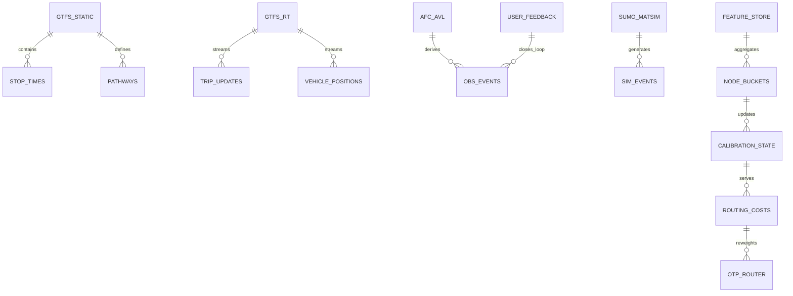
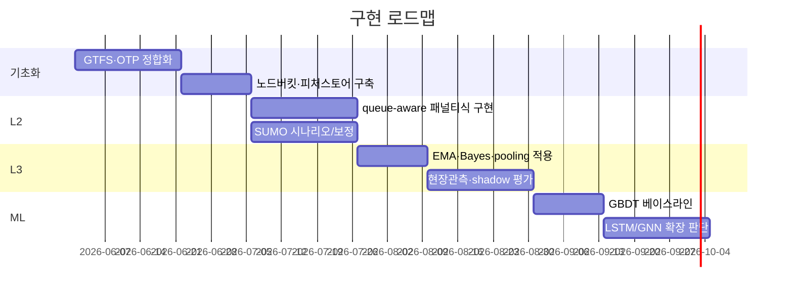

# 심층 고도화 보고서

## 요약

교수 대담과 v5 초안이 공통으로 강조한 축은 **L1 규칙기반 후보생성 → L2 queue-aware 시간의존 패널티 → L3 feedback calibration → 충분 조건에서만 ML 전환**이다. 현재 단계의 최적해는 “곧바로 DNN”이 아니라, **GTFS·OTP 기반 경로생성, 노드별 대기·탑승실패·환승실패 패널티의 확률모형화, SUMO·MATSim 반사실 검증, EMA·Bayesian·hierarchical pooling 보정**을 먼저 굳히는 것이다. 이유는 현재 문제의 핵심이 이미지 인식이 아니라 **희소하고 편향된 운영 이벤트를 안정적으로 추정·보정하는 것**이기 때문이다. 구조화된 표형(tabular) 데이터에서는 여전히 LightGBM/XGBoost류가 강하고, 신경망은 **대규모 시계열·다중해상도·그래프/격자 표현학습**에서 강점을 보인다. 따라서 본 프로젝트의 “ML 전환 조건”은 데이터량보다도 **이벤트 수, 라벨 품질, 외부검증 체계, 보정 안정성**이 먼저다. fileciteturn0file1 fileciteturn0file2 citeturn22view0turn24view1turn33academia0turn33academia3turn31academia0

## 핵심 출처와 기여

| 출처 | 유형 | 핵심 기여 | 본 과제 함의 |
|---|---|---|---|
| Mo et al. *Robust Path Recommendations…* | 학술 | 혼잡·left-behind가 있는 대중교통 교란 상황에서 경로추천을 강건최적화와 시뮬레이션 근사로 다룸 | L2에서 “탑승실패 패널티”를 링크가 아니라 **노드/차량용량 제약**으로 넣어야 함 |
| Feng et al. *Enforcing Priority…* | 학술 | 혼잡 대중교통에서 continuance priority와 FCFS boarding이 평형 해석의 핵심임을 정식화 | “먼저 와서 못 탐/다음 차” 규칙을 명시적으로 모델링해야 함 |
| Patzner & Müller-Hannemann *Dynamic Traffic Assignment for Public Transport with Vehicle Capacities* | 학술 | capacity-feasible assignment, denied boarding, dwell delay, 승객 학습까지 포함 | L2.5~L3의 시뮬레이션형 동적배정 백본 |
| Mo et al. *Evaluation of Public Transit Systems under Short Random Service Suspensions* | 학술 | bulk-service queue로 정류장 대기열의 평균·분산·안정조건 도출, 시뮬레이션으로 검증 | 노드 대기패널티의 1차 근사식 근거 |
| Zhang et al. *Network-wide link travel time and station waiting time estimation using AFC data* | 학술 | AFC로 링크시간·역대기시간을 computational graph로 추정 | proxy label이 약해도 역대기시간 추정 가능 |
| Zhao et al. *Estimation of Passenger Route Choice Pattern Using Smart Card Data* | 학술 | AFC만으로 경로·열차 선택확률 추정 | 관측되지 않은 실제 경로를 weak label로 만들 수 있음 |
| Witt *Trip-Based Public Transit Routing* | 학술 | Pareto-optimal journey를 trip/transfer 중심으로 고속 탐색 | OTP 외 보조 연구선으로 활용 가능 |
| Sauer et al. *T-REX* | 학술 | 대륙 규모에서도 실시간 업데이트를 반영하는 초고속 journey planning | 장기적으로 대규모 확장 가능성 |
| GTFS Schedule / Realtime Reference | 공공표준 | static는 routes/stops/trips/stop_times/pathways/transfers, realtime은 disruptions/vehicle positions/arrival predictions 정의 | 데이터 스키마의 정석. L1·L2 입력 표준 |
| OTP *Empirical Delay* / *In-station navigation* | 구현문서 | p50/p90 지연, GTFS pathways·OSM·slack 기반 환승시간 계산 | L2 노드 패널티를 OTP에 얹기 가장 쉬움 |
| SUMO docs + GTFS import | 구현문서 | GTFS→pt import, intermodal routing, stop/output/calibrator 제공 | L2 패널티와 L3 추정치를 시뮬레이터로 검증 |
| MATSim docs + MATSim-NYC | 구현문서·학술 | agent-based PT simulation과 실측속도·카운트 검증 사례 제시 | 정책/수요반응까지 보는 반사실 실험용 | 
|  |  |  |  |

출처: citeturn1academia5turn18academia0turn9academia1turn25academia1turn28academia2turn18academia3turn13academia2turn8academia2turn4view0turn7view7turn22view0turn24view1turn7view0turn35academia1

## Queue-aware routing 수식과 node penalty

시간의존 경로비용은 다음처럼 두는 것이 가장 자연스럽다.

\[
C(P,\tau)=\sum_{e\in P} c_e(t_e)\;+\;\sum_{v\in P}\pi_v(t_v)
\]

여기서 링크비용 \(c_e\)는 주행시간, 노드패널티 \(\pi_v\)는 정류장·역·환승노드의 체류위험이다. 실무적으로는

\[
\pi_v(t)=\beta_w \mathbb{E}[W_{q,v}(t)] + \beta_b p^{\text{denied}}_v(t)\cdot H_v(t)
+ \beta_m p^{\text{miss}}_v(t)\cdot H'_v(t)
+ \beta_x T^{walk}_v(t)+\beta_c \text{crowd}_v(t)
\]

로 두면 된다. \(\mathbb{E}[W_q]\)는 M/M/1 또는 변동성이 큰 경우 Kingman형 G/G/1 근사로 시작하고, \(p^{denied}\)는 용량·혼잡·헤드웨이·이벤트 변수의 함수, \(p^{miss}\)는 “도착+보행+buffer가 다음 출발시각을 넘을 확률”로 정의한다. 이 구조는 queueing, denied boarding, FCFS priority, empirical delay를 하나의 노드비용으로 통합한다. citeturn25academia1turn18academia0turn12search1turn22view0turn24view1

| 방법 | 필요 데이터 | 장점 | 한계 | 권고 |
|---|---|---|---|---|
| 큐잉 근사 | 승객도착률, 서비스율, 헤드웨이 | 해석가능, 초기구축 빠름 | FCFS/다문·대형환승역 비선형성 제한 | **최우선** |
| OTP empirical delay + slack | GTFS/GTFS-RT, 역사내 경로 | 바로 구현 가능, p50/p90 사용 가능 | 탑승실패 직접모형은 약함 | **최우선** |
| SUMO/MATSim 시뮬레이션 | 네트워크·수요·차량·스케줄 | 반사실·교란·정책실험 강함 | 보정비용 큼 | **중앙 검증축** |
| AFC/AVL proxy label | 교통카드·차량위치 | 실제 운영상태 반영 | 경로·실패 이벤트 라벨 불완전 | **병행** |
| Bayesian partial pooling | 노드×시간 버킷 통계 | 희소버킷 안정화 | 사전분포 설계 필요 | **L3 핵심** |
| EMA online update | 피드백 이벤트 로그 | 실시간 적응, 구현 단순 | 급격한 드리프트에 민감 | **L3 핵심** |

출처: citeturn25academia1turn22view0turn24view1turn28academia2turn42view1turn7view2turn35academia1

## 시뮬레이터와 데이터 파이프라인

OTP는 GTFS·OSM으로 그래프를 만들고, GTFS-RT/SIRI updater를 통해 실시간 변경을 덧입히며, pathways·OSM·board/transfer/alight slack을 이용해 환승시간을 계산한다. 또 empirical delay 모듈은 stop 단위 p50/p90 지연 CSV를 읽어 GraphQL로 노출하므로, **L1 후보경로 생성기 + L2 신뢰도 보정 레이어**로 가장 적합하다. SUMO는 `gtfs2pt.py`로 GTFS를 가져오고, 정류장·스케줄·intermodal routing·출력 XML/CSV·calibrator를 제공하므로 **노드패널티의 미시 검증기**에 가깝다. MATSim은 agent-based 수요반응과 정책비교에 강하고, 실제 사례에서 속도·카운트·역 유입을 실측과 비교해 검증되었다. citeturn7view6turn24view0turn24view1turn22view0turn7view0turn41view2turn7view1turn7view2turn7view5turn35academia1

iturn21image5

혼잡 heatmap은 **CNN의 후보 입력 표현**이 될 수 있지만, 역간 위상과 환승구조가 중요한 본 문제에서는 그래프/시계열 손실이 크다. 따라서 heatmap은 주로 시각화·탐색·보조특징으로 쓰고, 본선 모델은 GBDT→LSTM/GNN 순서가 더 타당하다. citeturn34academia0turn34academia2turn31academia0



## L3 calibration과 ML 전환

초기 L3는 “학습모형”보다 **보정계층**이어야 한다. 확률예측은 훈련점수 그대로 쓰면 편향되기 쉽고, calibrator는 독립 데이터에서 맞춰야 하며, 신경망은 특히 miscalibration 문제가 빈번하다. 따라서 1차 운영안은 EMA+Baysian+partial pooling의 혼합이 적합하다. citeturn11view0turn38view2turn42view1

```text
for each bucket b=(station, line, tod, dow):
    observe exposure n_b and failures y_b
    r_raw = y_b / max(n_b,1)

    ema_b = (1-α)*ema_b + α*r_raw

    a_b = a_b + y_b
    b_b = b_b + (n_b - y_b)
    bayes_b = a_b / (a_b + b_b)

    w = n_b / (n_b + κ)
    pooled_b = w*bayes_b + (1-w)*parent_rate(group_b)

    p_hat_b = clip(γ1*ema_b + γ2*pooled_b + γ3*sim_prior_b, ε, 1-ε)
```

권장 시작값은 **α=0.05~0.2, κ=20~100, ε=1e-4**다. 이는 보수적 시작점이며, 주 단위로 calibration curve와 Brier/ECE를 보고 재조정하는 것이 맞다. isotonic/Platt/temperature scaling은 **독립 검증셋**이 확보된 뒤 적용한다. citeturn11view0turn38view0turn38view1

| 전환 조건 | 권장 모델 | 이유 |
|---|---|---|
| 실패 이벤트가 희소하고 양성사건 < 수백 건 | 큐잉+OTP+EMA/Bayes | 규칙·보정이 더 안정적 |
| 구조화 피처, 수천~수만 샘플, 불규칙 분포 | Logistic / LightGBM / XGBoost | 표형 데이터에서 GBDT가 대체로 강하고 튜닝 부담이 낮음 |
| 시계열 윈도·다중해상도 세그먼트가 대량 축적 | LSTM/TCN/DNN 회귀 | 지연의 시간의존성 학습에 강함 |
| 역×시간 격자/heatmap 표현이 유의미 | CNN | “traffic as image” 표현학습 가능 |
| 노드·링크·환승 위상이 핵심 | GNN / multi-graph RNN | 네트워크 전파와 상호의존성 반영 |

이 표의 임계치는 **보편법칙이 아니라 본 보고서의 운영 제안**이다. 다만 “작은 tabular 문제는 GBDT 우선, 대규모 시공간·그래프 문제에서 NN 우위 가능”이라는 방향은 대규모 벤치마크와 교통 GNN 연구가 일관되게 지지한다. citeturn33academia0turn33academia3turn34academia0turn34academia2turn31academia0turn44academia0turn43academia3

## 검증 프레임워크와 로드맵

성능 평가는 **분류·회귀·랭킹·보정**을 분리해야 한다. 탑승실패/환승실패는 AUC와 함께 **Brier, reliability diagram, calibration slope/ECE**를 보고, 대기·지연시간은 MAE/RMSE와 p50/p90 오차를 본다. 경로추천은 NDCG@K, regret, 실제 on-time arrival rate를 봐야 한다. 검증설계는 반드시 **time split walk-forward**, **route/station holdout**, **현장관측**, **shadow A/B**의 네 축으로 가야 한다. 시뮬레이터는 실측 카운트·속도·역유입과 비교해 calibration하고, 반사실 실험은 별도 단계로 분리한다. citeturn40view0turn40view1turn11view0turn38view0turn40view3turn35academia1



| 단계 | 산출물 | 우선순위 | 필요 데이터 |
|---|---|---|---|
| OTP/GTFS 정합화 | 후보경로 API, transfer baseline | 최상 | GTFS static, OSM, GTFS-RT |
| L2 패널티화 | node penalty engine | 최상 | 헤드웨이, 용량, AVL/AFC |
| 시뮬레이션 검증 | SUMO/MATSim 시나리오, count fit | 높음 | O/D, 스케줄, 실측카운트 |
| L3 calibration | online posterior state | 최상 | feedback, exposure/failure 로그 |
| ML 전환 | GBDT baseline, 이후 LSTM/GNN | 중간 | 충분한 라벨·검증셋 |

가장 큰 리스크는 **탑승실패 라벨 부재, GTFS pathways 품질 부족, 시뮬레이터 보정 드리프트, 그리고 NN의 과적합·오보정**이다. 대응은 각각 현장샘플링·proxy label 병합, 역사 micromapping, 주기적 recalibration, 그리고 “GBDT 우선·NN 후행” 원칙이다. 아직 부족한 것은 한국 공개데이터의 직접 연결 범위와, 실제 교수 대담에서 언급된 각 노드유형의 운영정의 세분화다. 그러나 지금의 의사결정에는 충분하다: **다음 버전의 핵심은 L2 수식화와 L3 보정 구현이지, L4급 고차원 NN 채택이 아니다.** citeturn24view1turn7view2turn35academia1turn33academia0turn38view2