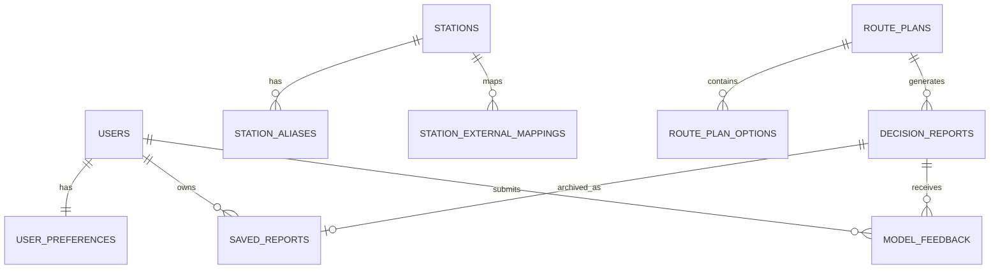

# 탈수있나 아키텍처와 계약 최종화 리서치 보고서

## Executive Summary

현재 탈수있나는 frontend draft 단계다. FE는 `activeTab` 기반 내부 라우팅(`map/archive/settings`), full strategic report, 지도 위 AI chat overlay, `localStorage` 기반 `talsu.preferences.v1`, `talsu.savedReports.v1`를 사용한다. `talsu.onboarding.v1`는 key만 선언되어 있고 현재 온보딩 완료 상태에는 아직 연결되지 않았다. 실제 구현 엔드포인트는 `POST /api/chat`뿐이며, DB는 아직 없다. 따라서 지금의 핵심 과제는 UI 재설계가 아니라 계약, 식별자, 트랜잭션 경계, 저장 모델의 조기 고정이다.

최종 권고는 다음과 같다.

| 항목 | 최종 결정 |
|---|---|
| Public API | Spring Boot가 `/api/v1/...`를 일원화해서 소유한다. |
| AI API | FastAPI는 Cloud Run 내부 전용 Decision API다. Browser는 직접 호출하지 않는다. |
| Station ID | 내부 PK와 별도로 불변 공개 식별자인 `canonical_station_id VARCHAR(40)`를 둔다. |
| Provider ID | 외부 provider ID는 `station_external_mappings`로 분리한다. |
| Route 저장 | `route_plans`와 `route_plan_options`로 요청/옵션을 저장한다. |
| Saved Report | `saved_reports`는 immutable archive이며 route snapshot, provider snapshot, model metadata, evidence를 함께 보존한다. |
| Error | Spring `ProblemDetail`/RFC 9457 계열과 Cariv식 `code/message/status`를 합친 hybrid envelope를 쓴다. |
| Auth | Authorization Code + PKCE + state/nonce, refresh rotation, logout refresh invalidation을 기준으로 한다. |
| Write safety | 중복 저장/생성에는 `Idempotency-Key`와 필요한 경우 비관적 락을 적용한다. |
| Transaction | 외부 route provider 호출과 AI inference는 DB transaction 밖에 둔다. |
| AI | LLM은 decision engine이 아니라 explanation layer다. |
| Calibration | `modelVersion`, `featureSchemaVersion`, `calibrationVersion`, `confidence`, `evidence[]`, `fallback`을 모든 decision response와 saved snapshot에 남긴다. |
| Infra | Vercel FE, Cloud Run Spring Boot, Cloud Run FastAPI, Cloud SQL MySQL 8, Secret Manager, BigQuery, Cloud Storage, Pub/Sub, Vertex AI를 target으로 한다. |

## Baseline And Assumptions

고정 입력값:

| 항목 | 값 |
|---|---|
| GCP project id | `bigdata-transportation` |
| GCP project number | `583933438413` |
| Frontend URL | 목표 후보: `https://bigdata-transportation-front.vercel.app/`. live URL은 Vercel 배포/health smoke 통과 후 확정 |
| Public health path | `GET /api/v1/health` |
| Internal Spring health | `/actuator/health`, `/actuator/health/liveness`, `/actuator/health/readiness` |
| Internal FastAPI health | `GET /internal/health` |

미정 항목은 구현 문서에서 권고로 분리한다. 대표적으로 auth go-live 시점, guest persistence 서버 동기화 시점, 지도 provider binding, SK 데이터 계약, Redis 사용 여부가 있다.

## Public ID Policy

공개 ID는 pure ULID가 아니라 domain prefix를 붙인 문자열을 기준으로 한다. 예: `stn_01J...`, `rpln_01J...`, `ropt_01J...`, `drpt_01J...`, `srpt_01J...`, `fb_01J...`.

따라서 DB public ID 컬럼은 fixed-length pure ULID 타입이 아니라 `VARCHAR(40)` 이상을 사용한다. 내부 join은 `BIGINT` PK를 사용하고, API/FE/로그에는 prefixed public ID만 노출한다.

## ERD Finalization

현재 FE draft의 약점은 station identity, provider mapping, model/evidence reproducibility가 분리되지 않았다는 점이다. 최종 ERD는 외부 provider ID에 잠기지 않는 canonical ID와 immutable saved report snapshot을 중심으로 한다.

### Entity Principles

1. `canonical_station_id`는 공개 불변 식별자다. 외부 provider ID로 대체하지 않는다.
2. 외부 ID는 `station_external_mappings`에만 둔다.
3. `route_plans`는 route request 단위다.
4. `route_plan_options`는 provider가 반환한 후보 option 단위다.
5. `decision_reports`는 route option에 대한 AI/ML 판단 결과다.
6. `saved_reports`는 archive 저장 시점의 immutable snapshot이다.
7. FastAPI는 canonical DB owner가 아니다. DB write는 Spring Boot가 담당한다.

### Core Tables

| Table | Purpose |
|---|---|
| `users` | 로그인 도입 후 사용자 canonical record |
| `user_preferences` | 서버 저장 설정 SSOT |
| `stations` | 내부 station master |
| `station_aliases` | 검색/자동완성 alias |
| `station_external_mappings` | provider별 external ID mapping |
| `route_plans` | route request unit |
| `route_plan_options` | candidate route option unit |
| `decision_reports` | model/rule decision result |
| `saved_reports` | immutable saved report archive |
| `model_feedback` | model calibration/feedback loop |

### Recommended ERD



### Storage Rule

`saved_reports`는 `decision_report_id`만 참조하지 않는다. 과거 archive 재현성을 위해 `route_snapshot_json`, `provider_snapshot_json`, `decision_snapshot_json`, `model_metadata_json`, `evidence_json`을 함께 저장한다. provider, model, calibration이 변경되어도 과거 리포트의 의미가 흔들리지 않게 하기 위함이다.

## API Contract Finalization

공개 API는 Spring Boot가 `/api/v1/...`로 소유한다. `POST /api/chat`은 legacy alias이며 장기적으로 `/api/v1/decision/chat`으로 이동한다.

### Required Public Endpoints

| Method | Path | Owner | Cache |
|---|---|---|---|
| GET | `/api/v1/health` | Spring Boot | `no-store` |
| GET | `/api/v1/stations/search` | Spring Boot | short public cache + ETag |
| GET | `/api/v1/stations/{canonicalStationId}` | Spring Boot | short public cache + ETag |
| POST | `/api/v1/route-plans` | Spring Boot | `private, no-store` |
| POST | `/api/v1/decision/route-report` | Spring Boot -> FastAPI | `private, no-store` |
| POST | `/api/v1/decision/chat` | Spring Boot -> FastAPI/LLM | `private, no-store` |
| GET | `/api/v1/reports` | Spring Boot | `private, no-store` |
| GET | `/api/v1/reports/{savedReportId}` | Spring Boot | `private, no-store` |
| POST | `/api/v1/reports` | Spring Boot | `private, no-store` |
| DELETE | `/api/v1/reports/{savedReportId}` | Spring Boot | `private, no-store` |
| GET | `/api/v1/preferences` | Spring Boot | `private, no-store` |
| PUT | `/api/v1/preferences` | Spring Boot | `private, no-store` |
| POST | `/api/v1/feedback/model` | Spring Boot | `private, no-store` |

### Required Internal Endpoints

| Method | Path | Owner |
|---|---|---|
| GET | `/internal/health` | FastAPI |
| POST | `/internal/decision/route-report` | FastAPI |
| POST | `/internal/decision/chat` | FastAPI |

### Hybrid Error Envelope

신규 API는 RFC 9457/Spring `ProblemDetail` 계열 shape를 따른다. Cariv식 `code/message/status` 관례를 유지하되 확장 필드를 포함한다.

```json
{
  "type": "https://api.talsuinna.com/problems/route-plan-invalid",
  "title": "Route plan request is invalid",
  "status": 400,
  "detail": "출발역과 도착역이 필요합니다.",
  "instance": "/api/v1/route-plans",
  "code": "TSL-ROUTE-001",
  "message": "출발역과 도착역이 필요합니다.",
  "requestId": "req_01J...",
  "retryable": false,
  "details": [
    { "field": "originStationId", "message": "required" }
  ]
}
```

### Route Plan Request

```json
{
  "originCanonicalStationId": "stn_01J...",
  "destinationCanonicalStationId": "stn_01K...",
  "requestedDepartureAt": "2026-05-30T20:10:00+09:00",
  "deadlineAt": "2026-05-30T21:00:00+09:00",
  "preferences": {
    "walkingSpeedMps": 1.2,
    "minTransferBufferSec": 180,
    "stairsAvoid": false,
    "allowTightTransfer": false
  }
}
```

### Decision Response

```json
{
  "decisionReportId": "drpt_01J...",
  "decisionCode": "GO",
  "decisionLabel": "탈 수 있음",
  "confidence": 0.82,
  "confidenceBand": "MEDIUM",
  "modelVersion": "decision-public-v1.2.0",
  "featureSchemaVersion": "fsv_2026_06_01",
  "calibrationVersion": "temp-scale-2026-06-01",
  "dataFreshnessSeconds": 42,
  "fallback": {
    "used": false,
    "strategy": null,
    "reason": null
  },
  "summary": "환승 여유가 충분하고 마감 시각 이전 도착 가능성이 높습니다.",
  "recommendedActions": ["출발 3분 전까지 승강장 진입 권장"],
  "evidence": [
    {
      "evidenceId": "evd_01J...",
      "kind": "ROUTE_METRIC",
      "field": "transferSlackSeconds",
      "value": 240,
      "display": "환승 여유 4분",
      "provider": "maps_primary",
      "observedAt": "2026-05-30T20:10:05+09:00",
      "sourceSnapshotId": "snap_01J..."
    }
  ]
}
```

## IA And FSD Alignment

현재 FE의 `activeTab` 내부 router와 AI map overlay는 유지한다. 지금은 `react-router` 도입보다 API boundary, onboarding persistence, preview/save split, DTO adapter 정리가 우선이다.

UI/UX 규칙:

1. 지도는 primary canvas다.
2. 검색, 결과, 판단은 bottom sheet 또는 overlay로 노출한다.
3. 판단 배지는 `GO`, `TIGHT`, `NO_GO` 같은 structured decision code를 기준으로 렌더링한다.
4. Archive는 최신 재계산 결과가 아니라 저장 시점 snapshot을 보여 준다.
5. Settings는 `user_preferences`만 바꾸며 route/report를 직접 mutate하지 않는다.
6. Chat overlay는 explanation layer이며 structured report decision을 덮어쓰지 못한다.

## AI Modeling And FastAPI Inference

FastAPI는 public API가 아니라 internal scorer다. 모델 또는 rule engine이 numeric/probabilistic decision을 만들고, LLM은 explanation만 생성한다.

Decision response는 다음 필드를 반드시 포함한다.

| Field | Required | Note |
|---|---|---|
| `modelVersion` | yes | model artifact/version |
| `featureSchemaVersion` | yes | feature schema compatibility |
| `calibrationVersion` | yes | calibration strategy/version |
| `confidence` | yes | calibrated confidence |
| `confidenceBand` | yes | `LOW`, `MEDIUM`, `HIGH` |
| `fallback` | yes | used/strategy/reason |
| `evidence[]` | yes | explainability and saved snapshot |

Calibration은 public baseline 단계부터 시작한다. `confidence_raw`와 calibrated `confidence`를 분리하고, reliability diagram, Brier score, log loss를 모니터링한다. 초기 보정은 temperature scaling을 우선 검토하고, 데이터가 충분해지면 isotonic regression을 검토한다.

Fallback order:

1. SK-enhanced model
2. public baseline model
3. deterministic heuristic
4. user-facing degraded explanation/error

LLM failure는 decision failure가 아니라 explanation failure로 처리한다.

## Infra, Security, And Compliance

Target infra:

| Component | Target |
|---|---|
| FE | Vercel. 목표 URL 후보는 `https://bigdata-transportation-front.vercel.app/`, live 여부는 smoke로 확정 |
| Core API | Spring Boot on Cloud Run |
| AI API | FastAPI on private/internal Cloud Run |
| DB | Cloud SQL for MySQL 8.0 |
| Analytics | BigQuery for raw events, feature snapshots, inference logs, labels, offline evaluation |
| Artifact/Event | Cloud Storage, Pub/Sub, Eventarc |
| ML Ops | Vertex AI Experiments, Pipelines, Model Registry |
| Secret | GCP Secret Manager |
| Observability | Cloud Logging/Trace with JSON structured logs |

FastAPI는 unauthenticated public access를 열지 않는다. Spring Boot service account만 Cloud Run invoker 권한으로 호출한다. 사용자 인증의 `Authorization` header와 내부 Cloud Run auth header를 분리해야 할 경우 `X-Serverless-Authorization` 사용을 고려한다.

Auth는 Authorization Code + PKCE + state/nonce를 기준으로 한다. Refresh token은 rotation하고, logout 시 서버측 refresh state를 무효화한다. JWT 검증 시 expected algorithm을 명시한다.

Rate limit은 필수다. 특히 station search, maps/route, route-plans, decision/route-report, feedback/model에 per-IP/per-device/per-user 제한을 둔다.

Observability는 `requestId`, `traceId`, `spanId`, `routePlanId`, `decisionReportId`, `savedReportId`, `modelVersion`, `featureSchemaVersion`, `calibrationVersion`, `fallback.used`를 공통 structured log field로 둔다.

## Implementation Skeleton

Spring Boot 권고 구조:

```text
backend/talsu-core-api
├─ src/main/java/com/talsu
│  ├─ common
│  │  ├─ api
│  │  ├─ error
│  │  ├─ security
│  │  ├─ logging
│  │  ├─ tracing
│  │  └─ cache
│  ├─ auth
│  ├─ station
│  ├─ route
│  ├─ decision
│  ├─ report
│  ├─ preference
│  ├─ feedback
│  ├─ external
│  │  ├─ maps
│  │  ├─ transit
│  │  └─ ai
│  └─ config
└─ openapi
   └─ talsu-openapi-v1.yaml
```

FastAPI 권고 구조:

```text
ai/talsu-decision-ai
├─ app
│  ├─ api
│  ├─ schemas
│  ├─ services
│  ├─ models
│  ├─ llm_gateway
│  ├─ core
│  └─ tests
└─ Dockerfile
```

## Action Checklist

1. `canonical_station_id`와 provider mapping schema부터 migration으로 고정한다.
2. ProblemDetail hybrid error envelope를 Spring common layer에 만든다.
3. `/api/v1/health`, `/api/v1/stations/search`, `/api/v1/route-plans` skeleton을 먼저 만든다.
4. FastAPI `/internal/health`, `/internal/decision/route-report` skeleton을 만든다.
5. `route_plans`, `route_plan_options`, `decision_reports`, `saved_reports`를 migration으로 만든다.
6. `POST /api/v1/reports`에 immutable snapshot 저장을 구현한다.
7. Auth 도입 전에는 guest/localStorage를 유지하되, server schema는 auth-ready로 둔다.
8. Phase 7 smoke는 health, route plan, decision report, save/read/delete cycle, FastAPI outage fallback, traceId log를 포함한다.
