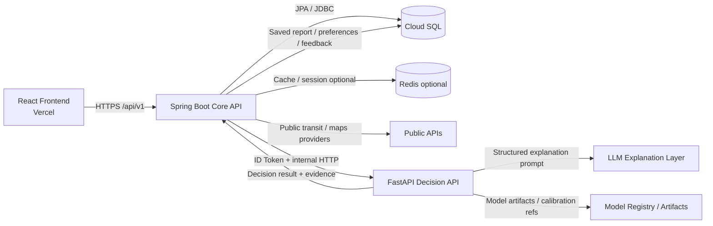
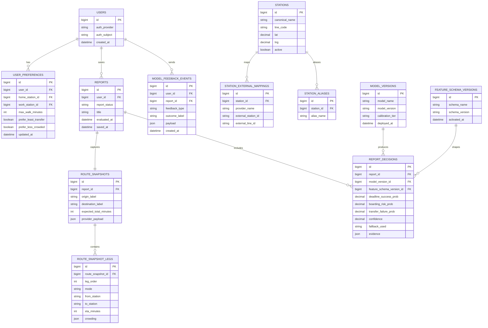
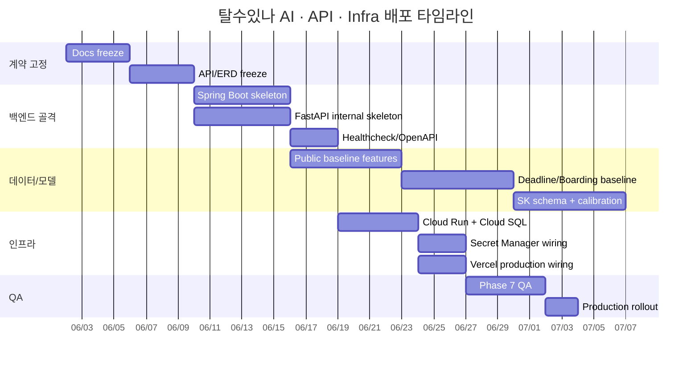

# 탈수있나 통합 설계 리서치 보고서

## 요약

현재 `탈수있나`는 문서 체계는 stable filename 기준 8개 초안으로 정리되기 시작했지만, 실제 런타임 기준으로는 `activeTab` 기반 내부 라우팅, 지도 위 AI overlay, `POST /api/chat` 단일 구현 엔드포인트, localStorage 기반 상태 보관, 그리고 “frontend-derived draft ERD” 상태에 머물러 있습니다. 즉, 프론트는 빠르게 진척됐지만 BE·DB·AI·Infra의 계약을 아직 고정하지 못한 상태입니다. fileciteturn0file10

카리브 레퍼런스는 이 상태를 정리하는 데 유용한 세 가지 패턴을 제공합니다. 첫째, Swagger/OpenAPI와 공통 에러 코드 문서를 중심으로 계약을 먼저 잠그는 방식입니다. 둘째, `lookup → OCR/compare preview → final save`처럼 “조회/비교/확정 저장”을 단계적으로 분리하는 흐름입니다. 셋째, OAuth 일회성 코드 교환, `Authorization` 과 `X-Signup-Token`의 역할 분리, refresh/logout 분리, 공통 에러 코드 레지스트리처럼 보안·상태 전이 규칙을 명시하는 방식입니다. fileciteturn0file3 fileciteturn0file4 fileciteturn0file6 fileciteturn0file7 fileciteturn0file8 fileciteturn0file9

MiriArt 레퍼런스는 `탈수있나`의 AI/BE 분리에 직접적인 힌트를 줍니다. MiriArt FSD는 FE가 `VITE_API_BASE_URL`로 **BE만 호출**하고, BE가 `miriart.fastapi.internal-url`을 통해 외부 AI 서비스를 호출하는 원칙을 명확히 둡니다. MiriArt AI 문서는 FastAPI를 `/internal/ai/*` 아래에 두고, Cloud Run IAM으로 보호하며, AI 서비스는 **stateless**로 유지하고, 세션·히스토리·영속성은 BE가 소유하는 구조를 사용합니다. 또한 chat 응답은 `text`, `summary`, `sections`, `groundingUrls`, `quickReplies`처럼 구조화되어 있습니다. fileciteturn0file0 fileciteturn0file1 fileciteturn0file2

이 보고서의 결론은 명확합니다. `탈수있나`는 **React/Vercel → Spring Boot Core API → FastAPI Decision API** 구조로 고정하는 것이 가장 안정적입니다. Spring Boot는 정합성·영속성·외부 대중교통 API orchestration·권한·보고서 저장을 맡고, FastAPI는 **모델 추론과 설명용 structured response**만 담당해야 합니다. DB는 “route plan 전체를 매번 저장”하는 방식이 아니라, 계산은 ephemeral하게 두고 **사용자가 저장한 report에만 snapshot을 남기는 canonical schema**로 재설계하는 편이 맞습니다. AI는 **공공데이터 baseline → SK 보정·calibration → 필요 시 fine-tune** 순서로 가고, 모든 추론 응답에는 `modelVersion`, `featureSchemaVersion`, `confidence`, `fallbackUsed`, `evidence`를 포함해야 합니다. fileciteturn0file0 fileciteturn0file1 fileciteturn0file2 fileciteturn0file10

아래 표는 본 보고서의 핵심 의사결정만 압축한 것입니다.

| 항목 | 최종 권고안 | 근거 레퍼런스 |
|---|---|---|
| BE 구조 | Spring Boot Core API + FastAPI internal Decision API | MiriArt FE→BE→AI 호출 원칙, stateless AI, current talsu unresolved item |
| DB 방향 | frontend draft ERD 폐기 아님, canonical schema로 재정렬 | current talsu “DB 없음”, route/result/report 중심 재정의 필요 |
| API 버전 | `/api/v1/...` 즉시 도입, 기존 `/api/chat`은 임시 alias | current single endpoint 문제, cariv/MiriArt contract-first 패턴 |
| 저장 전략 | route plan은 계산 결과, report 저장 시 snapshot만 영속화 | cariv lookup/preview/save 분리 패턴 |
| FE 규칙 | activeTab 유지, AI는 map overlay 유지, deep-link 요구 전 router 미도입 | current IA/FSD 상태 |
| AI 배포 | public baseline → SK calibration → fine-tune | user requirement + MiriArt structured AI contract |
| Infra | FE는 Vercel, BE/FastAPI는 GCP Cloud Run, DB는 Cloud SQL, secrets는 Secret Manager | official Cloud Run/Cloud SQL/Secret Manager docs |

이 압축안은 현재 프로젝트 상태와 레퍼런스를 동시에 반영한 것입니다. fileciteturn0file0 fileciteturn0file2 fileciteturn0file4 fileciteturn0file10 citeturn15view2turn15view6turn18view0

## 조사 기반과 현재 상태 정리

`탈수있나`의 현황을 해석할 때 가장 중요한 점은 “프론트 앱 모델이 이미 사용자 흐름을 거의 정의해버렸지만, 서버와 데이터 레이어는 그것을 아직 제도화하지 못했다”는 사실입니다. 업로드된 현재 프로젝트 정리 문서에 따르면, docs는 stable filename 기준 8개 타깃 문서로 재배치되었고, 현재 앱은 `App.tsx`/`useAppController.ts` 조합, `activeTab: map/archive/settings` 기반 내부 라우터, 지도 컨텍스트 기반 AI overlay, `POST /api/chat` 단일 구현, `talsu.preferences.v1`·`talsu.savedReports.v1`·`talsu.onboarding.v1` localStorage 키, 그리고 아직 확정 스키마가 아닌 frontend-derived ERD를 갖고 있습니다. fileciteturn0file10

반면 카리브는 “문서-계약-상태전이”를 먼저 잠그는 저장소 패턴을 보여줍니다. 업로드된 카리브 OpenAPI/Swagger 및 회원·차량등록 명세는 서버 URL, 공통 인증 헤더, 공통 에러 응답 `{code, message, status}`, OAuth code 교환, refresh/logout, 회원가입 단계별 토큰, 차량 등록의 lookup/parse/save 단계를 모두 계약 레벨에서 선언합니다. 특히 차량등록은 `POST /vehicle/registration/lookup`으로 사전 조회를 하고, `POST /vehicle/registration/document-parse`에서 OCR 결과와 외부 `car365` 값을 비교한 뒤, 마지막에 `POST /vehicle/registration`으로 확정 저장합니다. 이 패턴은 `탈수있나`의 “경로 탐색 → 탑승/도착 판단 preview → 리포트 저장” 흐름에 거의 그대로 옮길 수 있습니다. fileciteturn0file4 fileciteturn0file6 fileciteturn0file7 fileciteturn0file8

MiriArt는 FE/BE/AI 경계 설계에서 더욱 직접적인 레퍼런스입니다. FSD가 기능별 API, 우선순위, 인수 조건, FE 경로를 문서화하고 있고, FE는 `VITE_API_BASE_URL`로 BE만 호출하며, BE는 FastAPI internal URL로 AI를 호출합니다. AI는 `/internal/ai/*`와 `/health`를 갖는 별도 서비스이며, Cloud Run IAM 보호, stateless 유지, structured response, Redis 또는 DB에 대한 ownership을 BE 쪽에 남기는 설계를 사용합니다. `탈수있나`는 이 패턴을 거의 손실 없이 재사용할 수 있습니다. fileciteturn0file0 fileciteturn0file1 fileciteturn0file2

문서 운영 역시 고정이 필요합니다. 현재 docs inventory는 “기준 3문서 + target 8문서 + 구버전/흡수 후보 + raw inventory + Windows metadata”가 혼재된 상태이므로, 운영 기준은 target 8문서로 확정하고, 기존 기준 문서와 v1/v2 문서는 archive로 이동시키는 편이 맞습니다. 이 결정은 문서 수를 줄이기 위한 것이 아니라, **운영 기준 문서와 원천/reference 문서를 분리**하기 위한 것입니다. 특히 AI 쪽은 `talsu_inna_ai_modeling_plan.md`를 운영계획 SSOT로, `talsu_inna_ai_python_modeling_v5.md`를 원천 연구 문서로 유지하는 이원화가 가장 적절합니다. fileciteturn0file10

아래 표는 현재 문서 구조와 제안 구조를 비교한 것입니다.

| 구분 | 현재 상태 | 제안 상태 |
|---|---|---|
| 프론트/앱 기준 문서 | `talsu_inna_fsd_current.md`, `talsu_inna_architecture_rules.md`, `talsu_inna_refactor_plan.md`가 기준 문서 역할 | `talsu_inna_frontend_fsd.md`, `talsu_inna_ia.md`, `talsu_inna_frontend_data_schema_cache.md`를 운영 SSOT로 승격 |
| BE/API 문서 | 구상 단계, current summary 중심 | `talsu_inna_api_contract.md`, `talsu_inna_api_endpoints.md`, `talsu_inna_erd.md`를 합의 선행 문서로 고정 |
| Infra/AI 문서 | 계획 산재, Vercel/Maps/AI 문서가 흩어짐 | `talsu_inna_infra.md`, `talsu_inna_ai_modeling_plan.md` 운영 문서화 |
| 원천/reference | PRD/FSD/IA/API/infra/modeling v1/v2/v5와 raw inventory 혼재 | `docs/archive/`와 `docs/reference/`로 분리, v5 AI 문서는 보존 |
| 폐기 | `*.md:Zone.Identifier`, `docs/.md` 등 metadata/비정상 파일 | 즉시 삭제 |

이 표의 current 측 값은 업로드된 프로젝트 정리 문서를 기준으로 했고, proposed 측 값은 그 문서를 운영체계로 마감한 결과입니다. fileciteturn0file10

## 백엔드 구조와 트랜잭션 설계

### 최종 BE 아키텍처

최종 아키텍처는 **Spring Boot Core API + FastAPI internal Decision API**로 확정하는 것이 가장 일관됩니다. 이 구조는 `탈수있나`의 unresolved item 가운데 “FastAPI를 브라우저에 직접 노출할지, Spring Boot 내부 API로 둘지”를 명확히 끝내고, 동시에 MiriArt가 실제로 사용한 FE→BE→AI 경계를 그대로 재사용할 수 있습니다. FE가 BE만 호출한다는 원칙은 MiriArt FSD의 핵심이고, AI 서비스가 stateless이며 Cloud Run IAM으로 보호된 internal API라는 점도 MiriArt AI 문서와 잘 맞습니다. fileciteturn0file0 fileciteturn0file1 fileciteturn0file2 fileciteturn0file10

이때 Spring Boot는 다음 책임을 가져야 합니다. 사용자·선호도·station catalog·외부 대중교통 API orchestration·route plan request 조립·report 저장·feedback 저장·공통 에러 envelope·인증을 Spring Boot가 소유해야 합니다. FastAPI는 장거리 책임을 갖지 말고, **특징량을 받아 decision score와 evidence를 계산하는 추론 계층**만 맡아야 합니다. 이 분리는 MiriArt AI의 “DB/Redis 없음, 세션·히스토리는 BE가 관리”라는 규칙을 직접 가져온 것입니다. fileciteturn0file0 fileciteturn0file1

카리브 패턴과 `탈수있나`의 기능을 연결하면 다음처럼 정리됩니다.

| 카리브 패턴 | 카리브 예시 | 탈수있나 대응 설계 |
|---|---|---|
| 사전 조회 | `/vehicle/registration/lookup` | `GET /api/v1/stations/search`, `POST /api/v1/route-plans` |
| 비교/preview | `/vehicle/registration/document-parse` | `POST /api/v1/decision/route-report` |
| 최종 저장 | `/vehicle/registration` | `POST /api/v1/reports` |
| 공통 에러 레지스트리 | Common/Auth/Signup/Vehicle 코드 집합 | Common/Station/Route/Decision/Report/Auth 코드 집합 |
| 토큰 역할 분리 | `Authorization` vs `X-Signup-Token` | 인증 도입 시 access token vs short-lived onboarding/session token 분리 |
| Swagger 우선 | OpenAPI/Swagger가 실제 스펙 | `/v3/api-docs` 생성 및 contract-first 운영 |

이 표는 카리브의 저장소 패턴을 `탈수있나` 도메인으로 재배치한 것입니다. 특히 `lookup → compare → save`의 단계 분리는 route plan을 무조건 저장하지 않고, preview/report 저장을 분리하려는 현재 `탈수있나` 운영 방향과 매우 잘 맞습니다. fileciteturn0file4 fileciteturn0file6 fileciteturn0file8 fileciteturn0file10

아래 다이어그램은 이 구조를 시각화한 것입니다.



이 그림에서 핵심은 **FE가 FastAPI나 외부 교통 API를 직접 호출하지 않는다**는 점입니다. MiriArt도 FE는 BE만 호출하고, AI는 internal URL로 분리했습니다. Cloud Run의 서비스 간 호출은 `roles/run.invoker`와 ID token을 기반으로 구성할 수 있으며, 요청에는 `Authorization: Bearer ID_TOKEN` 또는 `X-Serverless-Authorization: Bearer ID_TOKEN`을 사용할 수 있습니다. fileciteturn0file2 citeturn15view1turn15view2

### 패키지 구조와 모듈 경계

Spring Boot 쪽 패키지는 기술 계층 중심보다 **도메인 중심 모듈**로 설계하는 편이 좋습니다. 카리브 문서가 `Auth`, `Signup`, `Vehicle Registration`, `Terms`, `Deal`처럼 도메인 기준으로 OpenAPI를 나누고, MiriArt FSD도 기능 ID와 도메인 단위로 흐름을 문서화하기 때문입니다. `탈수있나`에서는 최소한 `common`, `station`, `route`, `decision`, `report`, `preference`, `feedback`, `auth`, `provider`, `infra` 정도로 나누는 편이 좋습니다. 이 구분은 Swagger/OpenAPI 태그와도 자연스럽게 일치합니다. fileciteturn0file2 fileciteturn0file4

구체적으로는 다음 경계가 적절합니다.

```text
com.talsuinna
  common
    api
    error
    security
    config
  station
  route
  decision
  report
  preference
  feedback
  auth
  provider
    publictransit
    maps
    sk
  infra
    fastapi
    cache
    persistence
```

이 구조는 “카리브처럼 contract-first 태그 구조를 유지”하고, “MiriArt처럼 external AI client를 별도 infra/client 계층으로 둔다”는 두 레퍼런스를 합친 것입니다. 이 부분은 설계 제안이지만, 제안의 근거는 카리브와 MiriArt 모두가 도메인별 API 계약과 외부 서비스 호출 경계를 문서상에서 먼저 나누었다는 점입니다. fileciteturn0file0 fileciteturn0file2 fileciteturn0file4

### 보안과 트랜잭션 권고안

보안에서 가장 먼저 가져와야 할 카리브 패턴은 **JWT를 URL에 싣지 않고, redirect 시 one-time code만 전달한 후 토큰 교환 API를 호출하는 방식**입니다. 또한 refresh와 logout을 명시적으로 분리하고, 회원가입 단계에는 별도 short-lived token을 쓰는 흐름은 나중에 `탈수있나`가 회원 저장 기능과 onboarding을 도입할 때 그대로 참고할 수 있습니다. 다만 카리브 OpenAPI 일부 deal 계열 엔드포인트는 Bearer JWT와 별도로 `memberId`를 query parameter로 받는데, `탈수있나`에서는 이 패턴을 그대로 가져오면 안 됩니다. `memberId`나 `userId`는 **무조건 서버에서 Principal/JWT subject로 해석**하고, 클라이언트 입력값으로 받지 않는 편이 더 안전합니다. fileciteturn0file3 fileciteturn0file4 fileciteturn0file7 fileciteturn0file8

FastAPI는 internal-only로 두는 것이 맞습니다. MiriArt는 `/internal/ai/*`를 Cloud Run IAM으로 보호하고, Cloud Run 공식 문서도 서비스 간 호출 시 수신 서비스에 `roles/run.invoker`를 부여하고 ID token 기반으로 호출하는 방식을 제시합니다. 따라서 `탈수있나`도 Spring Boot 서비스 계정만 FastAPI 서비스에 invoker 권한을 주고, 브라우저에서는 절대 FastAPI URL을 알 필요가 없도록 해야 합니다. fileciteturn0file0 citeturn15view1turn15view2

비밀값 관리도 분리해야 합니다. Vercel 문서는 환경변수가 암호화되어 저장되지만 프로젝트 접근권한이 있는 사용자에게는 보일 수 있다고 설명합니다. 반면 Google Secret Manager 문서는 IAM 최소권한, direct client library 사용, 그리고 가능하면 파일 시스템이나 환경변수로 직접 secret을 전달하지 말라고 권고합니다. 따라서 FE에 필요한 공개값만 Vercel Project Env에 두고, Google Maps server key, SK credential, FastAPI/LLM key, DB credential 같은 민감값은 GCP Secret Manager 쪽으로 보내는 것이 맞습니다. citeturn15view7turn15view8turn18view0

트랜잭션은 “계산”과 “영속화”를 분리해야 합니다. route plan 생성, decision inference, chat explanation은 **비영속 계산 트랜잭션**으로 보고, `POST /api/v1/reports`나 `POST /api/v1/feedback/model` 같은 저장성 작업만 DB 트랜잭션을 잡는 편이 맞습니다. 카리브의 차량등록도 조회/비교 단계는 저장으로 간주하지 않고 최종 저장에서만 Vehicle + VehicleRegistration을 생성합니다. `탈수있나`도 이 흐름을 따라 `route-plans`와 `decision/route-report`는 저장하지 않고, 저장 버튼을 누른 경우에만 snapshot과 report를 만들도록 설계하는 것이 올바릅니다. fileciteturn0file6 fileciteturn0file10

## ERD 재설계와 마이그레이션 노트

### ERD 원칙

`탈수있나`의 현재 ERD는 “실제 DB 스키마”가 아니라 프론트 entity/model/mock에서 출발한 draft입니다. 이 점이 중요합니다. 즉, 지금 필요한 것은 “draft ERD를 그대로 DB로 굳히는 일”이 아니라, **프론트의 화면 모델을 영속 모델과 계산 모델로 분리하는 일**입니다. route plan, overlay state, chat UI state 같은 것은 화면 모델로 남겨두고, station master·preferences·saved report·feedback·model version 같은 것만 canonical schema로 옮겨야 합니다. fileciteturn0file10

또한 카리브와 MiriArt 모두 실제 DB 쪽에서는 영속화 대상이 분명합니다. MiriArt AI 문서는 `analyses`, `analysis_usage_logs`, `chat_sessions` 등의 테이블 대응을 분명히 두고, AI 서비스는 stateless로 분리합니다. 이 패턴을 `탈수있나`에 적용하면, canonical DB는 **Spring Boot 전용**이고, FastAPI는 DB owner가 아니어야 합니다. fileciteturn0file0

따라서 canonical ERD의 핵심 원칙은 다음 네 가지입니다. station은 canonical ID를 별도로 가지고 외부 API ID는 mapping table로 분리합니다. route plan은 계산 결과로 보고 저장하지 않되, 저장된 report에는 route snapshot을 남깁니다. preferences와 feedback은 별도 테이블로 관리합니다. model metadata는 inference reproducibility를 위해 최소한 model version 단위로 남깁니다. 이 원칙은 현재 unresolved item인 station ID 정책, route_plan 저장 여부, feedback 저장 여부를 한 번에 정리해줍니다. fileciteturn0file10

### 현재 draft ERD와 제안 canonical schema 비교

아래 표는 “현재 draft 개체”와 “제안 canonical schema”를 1:1 또는 1:n으로 대응시킨 것입니다. current 측은 업로드된 프로젝트 정리 문서가 지목한 draft ERD/FE mock 중심 상태를 기준으로 정리했고, proposed 측은 카리브의 단계형 저장 패턴과 MiriArt의 ownership 분리를 반영한 결과입니다. fileciteturn0file0 fileciteturn0file6 fileciteturn0file10

| 현재 draft 개체 | 현재 문제 | 제안 canonical schema | 마이그레이션 노트 |
|---|---|---|---|
| `station` | mock id 기준, 외부 provider id와 canonical id가 혼재 | `stations`, `station_external_mappings`, `station_aliases` | 기존 FE id는 `ui_station_key`로 남기고, canonical PK를 신설 |
| `route_plan` | 화면 모델/계산 결과/저장 대상을 분리하지 못함 | 저장하지 않음. 대신 `route_snapshots`, `route_snapshot_legs` | 저장 버튼 시점에만 snapshot 생성 |
| `saved_report` | report 본문과 route 근거가 한 덩어리일 가능성 | `reports`, `report_decisions`, `route_snapshots` | 화면용 summary와 재현용 snapshot 분리 |
| `user_preferences` | localStorage 중심, 서버 owner 부재 | `user_preferences`, `user_preferred_station_pairs` | guest 단계에서는 localStorage 유지, 로그인 도입 시 동기화 |
| `chat / ai overlay state` | UI 상태와 대화 히스토리의 경계 불명확 | DB 비필수. 선택 시 `decision_chat_sessions` | MVP에서는 Redis 또는 client-only, canonical 필수 아님 |
| `feedback/model` | 미정 | `model_feedback_events` | thumbs up/down, report usefulness, outcome feedback부터 저장 |
| `model meta` | 없음 | `model_versions`, `feature_schema_versions` | inference response와 FK/문자열 버전 동시 기록 |
| `user/auth` | current draft 부재 또는 미확정 | `users`, `refresh_sessions` | auth 도입 시점까지 nullable/feature-flag 전략 가능 |
| `provider cache` | current draft 부재 | `provider_cache_entries` 또는 Redis | station master 외에 route decision은 긴 캐시 금지 |

이 표에서 의도적으로 `route_plan`을 정규 테이블로 두지 않은 이유는 현재 프로젝트 상태와 가장 잘 맞기 때문입니다. 지금 `탈수있나`는 DB가 없고, FE model이 화면-계산-저장을 한꺼번에 표현하고 있습니다. 이 상태에서 `route_plan`을 canonical table로 먼저 고정하면 오히려 스키마가 흔들립니다. 카리브도 최종 저장 이전 단계는 lookup/parse로 남겨두고, MiriArt도 AI 요청/응답 전체를 영속 Table로 만들지 않고 필요한 스냅샷만 남깁니다. fileciteturn0file0 fileciteturn0file6 fileciteturn0file10

### 제안 ERD

아래 ERD는 P0~P1 기준 canonical schema를 그린 것입니다.



이 ERD의 핵심은 `REPORTS`가 사용자 저장 행위를 대표하고, `ROUTE_SNAPSHOTS`와 `REPORT_DECISIONS`가 재현성과 설명가능성을 보장한다는 점입니다. 저장 전의 route calculation은 여기에 들어오지 않습니다. 그 결과 schema churn을 줄이면서도, 나중에 “왜 이 판단이 나왔는가”를 재현할 수 있습니다. 이는 AI 응답과 DB 정합을 대응시킨 MiriArt의 `analyses`/`chat_sessions` 설계와 같은 논리입니다. fileciteturn0file0

### DB 마이그레이션 순서

DB 마이그레이션은 한 번에 크게 하지 말고, 다음 순서로 끊는 편이 안전합니다.

| 배치 | 테이블 | 목적 |
|---|---|---|
| 초기 배치 | `stations`, `station_external_mappings`, `station_aliases` | station canonicalization |
| 초기 배치 | `reports`, `route_snapshots`, `route_snapshot_legs`, `report_decisions` | 저장 리포트와 근거 snapshot |
| 다음 배치 | `model_versions`, `feature_schema_versions`, `model_feedback_events` | 추론 재현성과 학습 피드백 |
| 선택 배치 | `users`, `user_preferences`, `refresh_sessions` | auth/go-live 시점에 활성 |
| 선택 배치 | `decision_chat_sessions` 또는 Redis | overlay chat persistence 필요 시 |

마이그레이션 관점에서 중요한 것은 “current FE localStorage 구조를 그대로 DB에 복사하지 않는다”는 점입니다. localStorage는 캐시/guest UX 목적으로 유지하되, 서버에 올라가는 시점에 canonical schema로 재매핑해야 합니다. fileciteturn0file10

## API 계약과 프론트 규칙

### 최종 API 계약

현재 `탈수있나`의 구현 엔드포인트는 `POST /api/chat` 하나뿐이므로, 이제는 계약 재정비가 필요합니다. MiriArt는 기능별 API와 인수 조건을 FSD에서 명시했고, 카리브는 OpenAPI/Swagger와 공통 에러 문서로 계약을 굳혔습니다. `탈수있나`도 즉시 `/api/v1/...`로 버전 prefix를 도입하고, current FE와의 호환을 위해 `POST /api/chat`은 일시적 alias로만 유지하는 것이 맞습니다. fileciteturn0file2 fileciteturn0file4 fileciteturn0file10

아래 표는 current vs proposed endpoint를 압축한 것입니다.

| 구분 | 현재 | 제안 `/api/v1/...` |
|---|---|---|
| Health | 없음 | `GET /api/v1/health` |
| Station master | 없음 | `GET /api/v1/stations`, `GET /api/v1/stations/search` |
| Route preview | 없음 | `POST /api/v1/route-plans` |
| Decision preview | 없음 | `POST /api/v1/decision/route-report` |
| Decision chat | `POST /api/chat` | `POST /api/v1/decision/chat`, legacy alias로 `/api/chat` 유지 |
| Reports | 없음 | `GET /api/v1/reports`, `GET /api/v1/reports/{id}`, `POST /api/v1/reports`, `DELETE /api/v1/reports/{id}` |
| Preferences | 없음 | `GET /api/v1/preferences`, `PUT /api/v1/preferences` |
| Feedback | 없음 | `POST /api/v1/feedback/model` |
| Internal AI | FE에 노출되면 안 됨 | `POST /internal/decision/route-report`, `POST /internal/decision/chat`, `GET /internal/health` |

current 측은 업로드된 current summary를 기준으로 했고, proposed 측은 카리브의 preview/save 패턴과 MiriArt의 internal AI 패턴을 결합한 결과입니다. fileciteturn0file0 fileciteturn0file2 fileciteturn0file6 fileciteturn0file10

권장 endpoint 목록은 다음과 같습니다.

| Method | Path | Owner | 설명 | Cache |
|---|---|---|---|---|
| GET | `/api/v1/health` | Spring Boot | 앱 공개 healthcheck | `no-store` |
| GET | `/api/v1/stations` | Spring Boot | station catalog | `public, max-age=300, stale-while-revalidate=600` |
| GET | `/api/v1/stations/search?q=` | Spring Boot | station 검색 | `public, max-age=60, stale-while-revalidate=120` |
| POST | `/api/v1/route-plans` | Spring Boot | 출발/도착/시간 기준 route preview | `private, no-store` |
| POST | `/api/v1/decision/route-report` | Spring Boot → FastAPI | boarding/deadline/transfer 판단 preview | `private, no-store` |
| POST | `/api/v1/decision/chat` | Spring Boot → FastAPI | overlay형 explanation/chat | `private, no-store` |
| GET | `/api/v1/reports` | Spring Boot | 저장 리포트 목록 | `private, no-store` |
| GET | `/api/v1/reports/{id}` | Spring Boot | 저장 리포트 단건 | `private, no-store` |
| POST | `/api/v1/reports` | Spring Boot | 현재 preview 저장 | `private, no-store` |
| DELETE | `/api/v1/reports/{id}` | Spring Boot | 저장 리포트 삭제 | `private, no-store` |
| GET | `/api/v1/preferences` | Spring Boot | 사용자 선호도 조회 | `private, no-store` |
| PUT | `/api/v1/preferences` | Spring Boot | 사용자 선호도 갱신 | `private, no-store` |
| POST | `/api/v1/feedback/model` | Spring Boot | 리포트 유용성/결과 피드백 | `private, no-store` |

이 캐시 정책은 current draft의 route/decision/chat이 빠르게 변하고, station master만 비교적 안정적인 데이터라는 점을 반영한 것입니다. station catalog에만 짧은 shared cache를 걸고, user-private 데이터와 실시간 판단 결과는 `no-store`가 맞습니다. current project summary도 cache 정책이 아직 미확정이라고 분명히 적고 있습니다. fileciteturn0file10

### 에러 envelope

카리브는 공통 에러 응답으로 `code`, `message`, `status`를 사용하고, MiriArt AI는 `code`, `message`, `errors[]`를 사용합니다. `탈수있나`는 이를 합쳐 아래 형태로 고정하는 편이 좋습니다. 이 구조는 BE와 FastAPI 모두 공통으로 사용할 수 있습니다. fileciteturn0file0 fileciteturn0file8

```json
{
  "code": "ROUTE_PLAN_INVALID",
  "message": "출발역과 도착역이 필요합니다.",
  "status": 400,
  "details": [
    { "field": "originStationId", "message": "required" },
    { "field": "destinationStationId", "message": "required" }
  ],
  "requestId": "req_01J..."
}
```

이때 에러 코드는 카리브처럼 도메인 prefix를 두는 편이 좋습니다. 예를 들면 `C001`, `AUTH004`, `V002` 대신 `TSL-COMMON-001`, `TSL-AUTH-004`, `TSL-ROUTE-002`, `TSL-DECISION-003`처럼 구분할 수 있습니다. 중요한 점은 **HTTP status와 code registry를 둘 다 유지**하는 것입니다. 카리브와 MiriArt 모두 이중 구조를 씁니다. fileciteturn0file0 fileciteturn0file8

성공 응답은 아래처럼 통일하는 것이 무난합니다.

```json
{
  "data": {},
  "meta": {
    "requestId": "req_01J...",
    "servedAt": "2026-05-30T19:00:00+09:00"
  }
}
```

이 성공 envelope는 current project가 아직 단일 `/api/chat` 구현체밖에 없고 앞으로 multi-endpoint 체계로 갈 예정인 점을 고려한 통합안입니다. 카리브와 MiriArt가 모두 response contract를 문서로 먼저 고정했다는 점에서, `탈수있나`도 envelope를 먼저 고정해야 후속 개발 비용이 줄어듭니다. fileciteturn0file2 fileciteturn0file4 fileciteturn0file10

### 프론트 FSD 규칙

MiriArt FSD를 `탈수있나`에 적용할 때 가장 먼저 가져와야 할 것은 “기능별로 Trigger, I-P-O-E, 연결 API, 구현 상태, 인수 조건을 문서화한다”는 원칙입니다. MiriArt는 로그인, 온보딩, 업로드, AI chat, archive, plan 조회까지 모두 이 포맷으로 정리하고 있습니다. `탈수있나`도 동일하게 `Station Search`, `Route Preview`, `Decision Preview`, `Decision Chat`, `Report Save`, `Preference Edit`를 기능 단위로 FSD에 써야 합니다. fileciteturn0file2

라우팅은 당장 바꾸지 않는 편이 맞습니다. current summary에 따르면 현재 앱은 `activeTab` 기반 내부 라우터이며, 페이지 엔트리는 props forwarding 중심입니다. 지금 router를 크게 재편하면 Phase 7 QA 이전에 구조 비용이 커집니다. 따라서 P0에서는 `map/archive/settings` 탭 구조를 유지하고, deep-link, 외부 링크 공유, SEO, 웹 단독 유입 같은 요구가 실제로 생길 때 `react-router`로 가는 편이 합리적입니다. AI chat은 지금처럼 map overlay로 유지하는 것이 제품 정체성과 가장 잘 맞습니다. fileciteturn0file10

아래 표는 MiriArt FSD에서 가져올 규칙과 `탈수있나` 적용안을 정리한 것입니다.

| 규칙 | MiriArt 패턴 | 탈수있나 적용안 |
|---|---|---|
| FE 호출 경계 | FE는 `VITE_API_BASE_URL`로 BE만 호출 | FE는 Spring Boot만 호출, FastAPI/외부 대중교통 API 직접 호출 금지 |
| 기능 문서 포맷 | 기능 ID + API + 인수 조건 | `ROUTE`, `DECISION`, `REPORT`, `PREFERENCE` 기능별 FSD 템플릿 도입 |
| 에러 UX | 401 refresh 후 재로그인, 402/404별 UX 분기 | guest mode 유지 중에는 soft fallback, auth 도입 후 refresh 전략 추가 |
| 채팅 구조 | session/history 유지, structured response | overlay chat 유지, `summary/sections/quickReplies` 도입 |
| 단계 분리 | 업로드와 저장 분리 | route preview와 report save 분리 |
| 화면 경량화 | page entry는 조립, 로직은 feature/service로 | 현재 구조 유지, widget/page는 thin layer 유지 |

이 표는 MiriArt 문서와 current talsu summary를 합쳐 정리한 것입니다. fileciteturn0file2 fileciteturn0file10

추가 UI/UX 규칙은 다음처럼 정리하는 편이 좋습니다.

- onboarding 완료 상태는 이미 선언된 `talsu.onboarding.v1` 키를 실제로 사용해 persistence를 걸고, guest 모드에서도 첫 실행 UX를 줄여야 합니다. fileciteturn0file10
- 지도 화면은 항상 primary surface이고, AI는 독립 하단 탭이 아니라 “현재 경로/리포트 맥락을 설명하는 overlay”로 유지해야 합니다. fileciteturn0file10
- `route preview`와 `saved report`는 동일한 카드 UI를 쓰더라도 state source를 분리해야 합니다. preview는 ephemeral state, report detail은 saved snapshot을 읽어야 합니다. 이건 cariv의 parse preview와 final registration 구분과 같은 논리입니다. fileciteturn0file6
- boundary validation은 지금처럼 schema 기반으로 유지하되, `/api/v1/*` 전환 시 station/route/report 모델에도 동일한 response validation을 도입해야 합니다. current summary는 이미 chat response validation과 safe markdown rendering 경계를 갖고 있다고 적고 있습니다. fileciteturn0file10

## AI 배포 계획과 인프라 정리

### AI 모델링과 추론 계약

AI 배포 계획은 user requirement에 맞춰 **public baseline → SK calibration → fine-tune** 순서로 가는 것이 맞고, 구현 디테일은 MiriArt AI의 structured contract를 거의 그대로 차용하는 것이 효율적입니다. MiriArt AI는 internal endpoint, structured request/response schema, stateless FastAPI, BE-owned history, structured error code 체계를 이미 갖추고 있습니다. `탈수있나`도 이 설계를 따라야 합니다. fileciteturn0file0 fileciteturn0file1

우선순위는 `Deadline Success`를 가장 먼저 두는 편이 좋습니다. 제품 데모에서 “이 시간까지 탈 수 있나/도착할 수 있나”가 가장 직접적인 가치이기 때문입니다. 그 다음이 `Boarding Risk`, `Transfer Failure`, `ETA Error`, 그리고 그 이후에 `Car Guide Ranker`나 차량/칸 혼잡 추천입니다. 이 순서는 current project가 아직 지도 overlay와 route/report 중심 UX에 머물러 있고, DB와 API가 정리되지 않은 상태라는 점과도 잘 맞습니다. 즉, 먼저 생성해야 하는 것은 복잡한 LLM형 대화가 아니라, **재현 가능한 구조화된 decision**입니다. fileciteturn0file10

FastAPI inference response는 아래처럼 고정하는 것을 권합니다.

```json
{
  "requestId": "req_01J...",
  "reportId": "rpt_preview_01J...",
  "modelVersion": "deadline-success-public-v1",
  "featureSchemaVersion": "route-report-v1",
  "confidence": 0.84,
  "fallbackUsed": "PUBLIC_BASELINE",
  "decision": {
    "deadlineSuccessProbability": 0.87,
    "boardingRiskProbability": 0.23,
    "transferFailureProbability": 0.15,
    "recommendedBoardingStrategy": "WAIT_NEXT_TRAIN",
    "recommendedCarIndex": 4,
    "expectedArrivalMinutes": 36
  },
  "evidence": {
    "topFactors": [
      "최근 3개 열차 간격 증가",
      "환승 버퍼 2분 미만",
      "목적지 도착 한계시각까지 여유 6분"
    ],
    "missingSignals": [
      "실시간 칸별 혼잡도 없음"
    ],
    "providerFreshnessSec": 41,
    "providerSnapshotAt": "2026-05-30T19:00:00+09:00"
  },
  "alternatives": [
    {
      "routeOptionId": "opt_2",
      "deadlineSuccessProbability": 0.91,
      "tradeoff": "도보 4분 증가"
    }
  ]
}
```

이 스키마는 MiriArt AI의 `text/summary/sections/groundingUrls/quickReplies`처럼 구조화된 응답 철학을 따르면서, user requirement에 명시된 `modelVersion`, `featureSchemaVersion`, `confidence`, `fallbackUsed`, `evidence`를 포함합니다. 또한 FastAPI 공식 문서가 설명하듯 `response_model`은 반환 데이터 검증, OpenAPI 문서화, 그리고 **정의된 필드만 외부로 내보내는 filtering**을 제공하므로, 위 구조는 FastAPI `response_model`로 고정하는 편이 안전합니다. fileciteturn0file0 citeturn17view0turn17view1turn17view2

LLM은 decision generator가 아니라 **explanation layer**로 제한해야 합니다. MiriArt도 BE가 sticky context와 history를 조립해 AI로 보내고, 응답을 structured chat로 받습니다. `탈수있나`에서는 numeric/probabilistic decision은 FastAPI decision model이 만들고, LLM은 그 결과를 natural language로 정리하는 역할만 해야 합니다. 즉, “판단”은 모델, “설명”은 LLM으로 분리합니다. fileciteturn0file0 fileciteturn0file1

### AI 배포 타임라인



이 타임라인은 “문서/계약 고정 → skeleton → baseline model → 인프라 결선 → QA” 순으로 가야 한다는 뜻입니다. current project 상태를 감안하면 AI calibration보다 API/ERD freeze가 먼저입니다. fileciteturn0file10

### 인프라와 배포 체크리스트

인프라는 다음 구조를 권합니다. 프론트는 사용자 요구대로 `https://bigdata-transportation-front.vercel.app/`를 프론트 URL로 사용하고, Spring Boot Core API와 FastAPI Decision API는 GCP 프로젝트 `bigdata-transportation (583933438413)` 아래 Cloud Run 서비스로 분리합니다. DB는 Cloud SQL을 사용하고, 비밀값은 Secret Manager에 둡니다. 캐시는 P0에서 optional이며, chat/session 또는 provider cache 필요 시 Redis를 붙입니다. 이 구성은 MiriArt의 Cloud Run + internal AI 구조와 GCP 공식 문서의 서비스 간 인증/Cloud SQL 연결 방식과 정합적입니다. fileciteturn0file0 citeturn15view1turn15view2turn15view5turn15view6

카리브 OpenAPI/Swagger path inventory에서는 별도 health endpoint가 드러나지 않으므로, user requirement대로 `GET /api/v1/health`를 앱 healthcheck endpoint로 두는 것이 맞습니다. 동시에 Spring Boot Actuator는 기본적으로 `/actuator/health`를 제공하므로, 내부 운영자는 deeper health를 여기서 보고, 외부/LB/Cloud Run probe는 `/api/v1/health`를 사용하도록 나누는 편이 실용적입니다. Cloud Run은 startup/liveness probe에서 설정된 health endpoint에 HTTP GET을 보내고, 2XX/3XX를 성공으로 간주합니다. fileciteturn0file4 fileciteturn0file9 citeturn15view3turn15view4turn16view0

아래 표는 infra current vs proposed를 정리한 것입니다.

| 항목 | 현재 해석 | 제안안 |
|---|---|---|
| Front | Vercel 프론트, current docs에 billing/scope/URL 불확실성 언급 | 사용자 제공 URL을 production front URL로 사용 |
| API | current `/api/chat` 중심, BE 미고정 | Spring Boot Cloud Run 서비스 1개 |
| AI | 미고정 | FastAPI Cloud Run private service 1개 |
| DB | 없음, frontend-derived draft ERD | Cloud SQL MySQL 8 기본 제안 |
| Health | 명시 없음 | 공개 `/api/v1/health`, 내부 `/actuator/health` |
| Secret | current 미정 | Secret Manager, FE 공개값만 Vercel env |
| Cache | current 미정 | station short cache, decision/report/chat no-store |
| AI internal auth | 미정 | `roles/run.invoker` + ID token |
| Cloud SQL 연결 | 미정 | Cloud Run ↔ Cloud SQL connection 사용 |

이 표의 current 측은 current summary와 cariv path inventory의 부재 정보를, proposed 측은 MiriArt/공식 클라우드 문서를 반영한 결과입니다. MySQL 8 선택은 MiriArt가 Cloud SQL 기준 DB 설계를 사용했다는 점과 Cloud SQL for MySQL 공식 연결 문서를 그대로 재사용할 수 있다는 점을 근거로 한 **운영상 추론**입니다. 만약 이후 station geometry나 공간 질의가 커지면 PostgreSQL/PostGIS 재검토가 가능합니다. fileciteturn0file0 fileciteturn0file10 citeturn15view5turn15view6

배포 체크리스트는 아래처럼 잡는 것이 좋습니다.

| 체크 항목 | 권고 |
|---|---|
| Front env | `NEXT_PUBLIC_`류의 공개값만 Vercel, 민감값 금지 |
| Spring env | DB, provider, FastAPI internal URL, Secret Manager reference |
| FastAPI env | model artifact path, LLM config, Secret Manager reference |
| Cloud Run auth | Spring SA만 FastAPI invoker 허용 |
| Cloud SQL | Spring 중심 연결, FastAPI는 DB owner 아님 |
| OpenAPI | Spring `/v3/api-docs`, FastAPI `/openapi.json` 유지 |
| Health | `/api/v1/health` + Actuator 내부 health |
| Logging | requestId 전파, BE↔FastAPI correlation ID |
| Rollback | modelVersion과 featureSchemaVersion 단위로 롤백 가능하게 설계 |

이 체크리스트는 Vercel 환경변수 스코프, Secret Manager least privilege, Cloud Run service-to-service, Cloud SQL 연결 방식 공식 문서를 반영합니다. citeturn15view7turn15view8turn18view0turn15view1turn15view6

## 실행 지시와 Phase 7 QA

### 개발자에게 바로 줄 수 있는 실행 지시

가장 먼저 해야 할 일은 “문서 동결 → skeleton 구현 → 저장과 계산 분리”입니다. 구현 순서는 다음이 가장 안전합니다. 먼저 docs target 8개를 운영 SSOT로 확정하고 구버전은 archive로 이동합니다. 그 다음 Spring Boot에 `/api/v1/health`, `/api/v1/stations`, `/api/v1/route-plans`, `/api/v1/decision/route-report`, `/api/v1/reports`, `/api/v1/preferences`를 순서대로 skeleton으로 세웁니다. 동시에 FastAPI에는 `/internal/decision/route-report`, `/internal/decision/chat`, `/internal/health`를 만들되 stateless 원칙을 고수합니다. 그 뒤 DB는 station master와 report snapshot부터 만들고, auth/users는 feature flag 또는 뒤 배치로 둡니다. fileciteturn0file0 fileciteturn0file6 fileciteturn0file10

아래 지시문은 바로 개발 이슈로 쪼갤 수 있는 수준입니다.

1. **문서 고정**
   - target 8문서를 운영 SSOT로 승격한다.
   - 기존 current/v1/v2/raw 문서는 `docs/archive/` 또는 `docs/reference/`로 이동한다.
   - `*.md:Zone.Identifier`, `docs/.md`는 삭제한다. fileciteturn0file10

2. **BE skeleton**
   - Spring Boot에 `/api/v1/health`, `/api/v1/stations`, `/api/v1/stations/search`, `/api/v1/route-plans`, `/api/v1/decision/route-report`, `/api/v1/reports`, `/api/v1/preferences`, `/api/v1/feedback/model`를 생성한다.
   - 기존 `POST /api/chat`는 `POST /api/v1/decision/chat`으로 옮기되 alias를 남긴다. fileciteturn0file10

3. **FastAPI skeleton**
   - `/internal/decision/route-report`, `/internal/decision/chat`, `/internal/health`를 만든다.
   - FastAPI는 `response_model`로 응답 shape를 고정하고, canonical DB write는 하지 않는다. fileciteturn0file0 citeturn17view0turn17view1

4. **DB 초기 배치**
   - `stations`, `station_external_mappings`, `station_aliases`, `reports`, `route_snapshots`, `route_snapshot_legs`, `report_decisions`, `model_versions`, `feature_schema_versions`, `model_feedback_events`를 우선 생성한다.
   - `route_plan` 정규 테이블은 만들지 않는다. preview는 저장하지 않는다. fileciteturn0file10

5. **보안**
   - FE는 Spring Boot만 호출한다.
   - Spring Boot→FastAPI는 Cloud Run service-to-service auth로 호출한다.
   - 민감 secret은 Secret Manager로 옮기고, Vercel에는 FE 공개값만 둔다. fileciteturn0file2 citeturn15view1turn15view2turn18view0turn15view7

6. **프론트**
   - activeTab router는 유지한다.
   - AI chat은 지도 overlay를 유지한다.
   - `talsu.onboarding.v1`을 실제 persistence로 사용한다.
   - page entry는 얇게 유지하고, API/schema/state 로직은 feature/entity/model로 밀어 넣는다. fileciteturn0file10

### Phase 7 QA 체크리스트

Phase 7 QA는 “구조 변경이 사용자 흐름을 깨지 않았는가”를 확인하는 단계여야 합니다. 현재 앱 상태와 proposed contract를 동시에 검증하는 짧은 체크리스트는 아래 정도가 적절합니다. fileciteturn0file10

- 앱 최초 진입 시 onboarding이 한 번만 노출되고, 이후 `talsu.onboarding.v1` 기준으로 재노출되지 않는지 확인한다. fileciteturn0file10
- `map / archive / settings` 탭 전환이 유지되고, AI overlay가 지도 컨텍스트를 잃지 않는지 확인한다. fileciteturn0file10
- station 검색 → route preview → decision preview가 “저장 없이도” 끝까지 동작하는지 확인한다. 이 흐름은 카리브의 lookup/preview/final-save 패턴을 따른다. fileciteturn0file6
- report 저장 시 snapshot이 생성되고, archive/detail에서 동일한 판단 근거를 다시 볼 수 있는지 확인한다. fileciteturn0file10
- decision chat이 `summary`, `sections`, `quickReplies`를 포함한 structured response를 받아 overlay에서 렌더링되는지 확인한다. fileciteturn0file0
- `GET /api/v1/health`가 200을 반환하고, Cloud Run probe와 smoke test가 이를 정상 health endpoint로 사용할 수 있는지 확인한다. citeturn15view3turn15view4turn16view0
- FE가 FastAPI나 외부 provider를 직접 호출하지 않고, 모든 네트워크 요청이 Spring Boot base URL로 집계되는지 확인한다. fileciteturn0file2 fileciteturn0file10

### 아직 명시가 필요한 미확정 항목

마지막으로, 아래 항목은 구현 전에 한 번 더 명시되어야 합니다. current summary가 이미 일부를 unresolved로 적고 있습니다. fileciteturn0file10

| 항목 | 현재 상태 | 권고 |
|---|---|---|
| 인증 도입 시점 | 미정 | P0는 guest/localStorage 유지, P1에서 auth 활성화 |
| Cloud SQL 엔진 | 명시 없음 | MySQL 8 기본, 공간질의 확대 시 Postgres 재검토 |
| SK 데이터 계약 | 미정 | ingestion schema와 calibration split부터 먼저 고정 |
| Redis 사용 여부 | 미정 | P0 optional, chat/session 필요 시만 도입 |
| Maps provider | 미정 | adapter 인터페이스 먼저, vendor binding은 후행 |
| health endpoint | current 명시 없음 | 공개 `/api/v1/health`, 내부 `/actuator/health` 병행 |

이 항목들은 “모르면 못 시작하는 것”이 아니라 “안 정하면 나중에 되돌리는 비용이 큰 것”들입니다. 그래서 문서 동결 전에 짧게 결론을 내려두는 편이 좋습니다. fileciteturn0file10