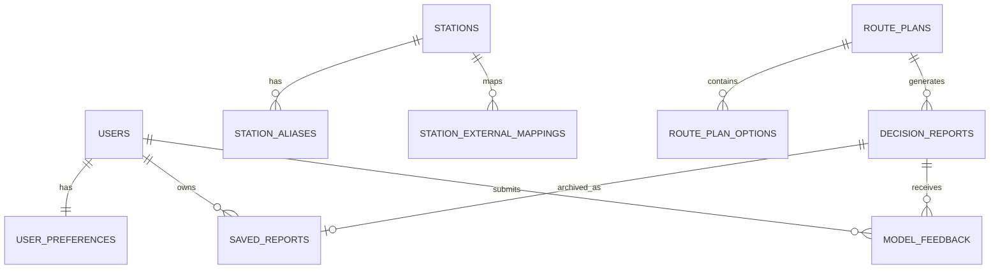
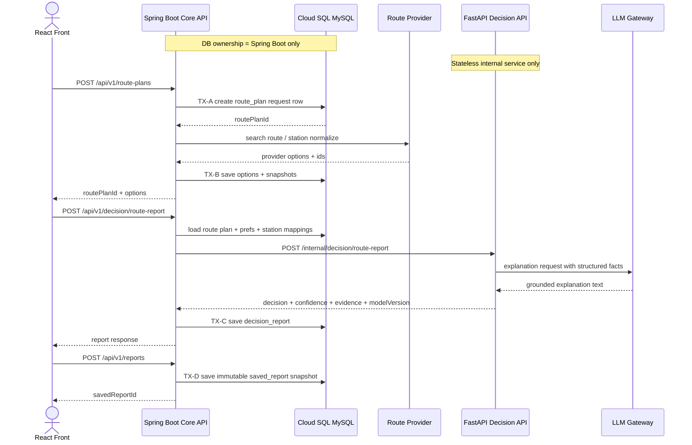
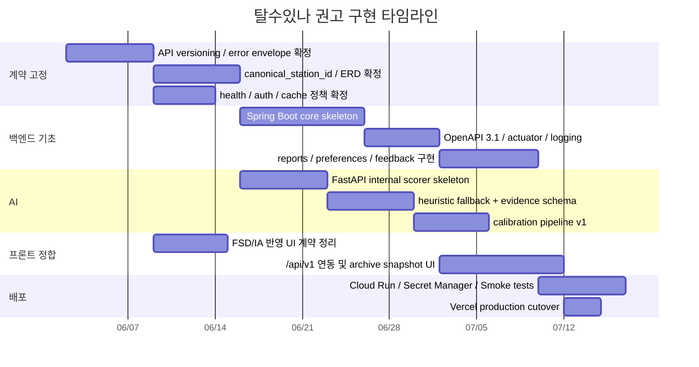

# 탈수있나 아키텍처와 계약 최종화 리서치 보고서

> [SUPERSEDED / REFERENCE ONLY]
> 이 문서는 과거 연구용 참고 자료다.
> 현재 public ID 정책은 prefixed public ID + `VARCHAR(40)` 이상이며,
> 운영 기준은 `docs/deep-research-report.md`와 `docs/talsu_inna_erd.md`를 따른다.

## Executive summary

현재 탈수있나는 **프론트엔드 중심 draft 단계**에 가깝습니다. 정리 메모상 현재 FE는 `activeTab` 기반의 내부 라우팅(`map/archive/settings`), 지도 위 `AI chat overlay`, `localStorage` 기반의 `talsu.preferences.v1`, `talsu.savedReports.v1`, `talsu.onboarding.v1` 키를 사용하고 있으며, 실제 구현된 엔드포인트는 `POST /api/chat`뿐이고, DB는 아직 없어서 ERD도 **frontend-derived draft**로 간주해야 합니다. 다시 말해, 지금의 핵심 과제는 UI 재설계가 아니라 **계약·식별자·트랜잭션 경계·저장 모델의 조기 고정**입니다. fileciteturn0file10

본 보고서의 최종 권고는 다음과 같습니다. 공용 외부 API는 **Spring Boot가 `/api/v1/...`를 일원화**해서 소유하고, **FastAPI는 Cloud Run 내부 전용 “Decision API”**로만 두며 브라우저에서 직접 호출하지 않습니다. 역/정류장 식별자는 외부 provider ID를 그대로 공개하지 않고 **불변의 `canonical_station_id`**를 두며, 외부 API 식별자는 별도 **mapping 테이블**로 분리합니다. 저장 가능한 리포트는 현재 결과를 다시 계산해 재생성하는 방식이 아니라, **route snapshot + provider snapshot + model metadata + evidence**를 함께 보존하는 **immutable `saved_report` 스냅샷** 방식으로 가야 합니다. 오류 응답은 Cariv식 `code/message/status` 관례를 살리되, Spring의 `ProblemDetail`과 RFC 9457을 받아들여 확장 필드 `requestId`, `details`, `retryable`를 붙이는 **hybrid envelope**가 가장 맞습니다. MiriArt 문서는 “FE는 BE만 호출하고, BE가 내부 AI를 호출한다”는 경계와, 내부 AI를 **stateless structured service**로 두는 패턴을 이미 보여 주고 있어 이 프로젝트에 거의 그대로 맞아 떨어집니다. fileciteturn0file2turn0file0turn0file1turn0file10 citeturn19view3turn13view2turn12view3turn13view4

인증은 Cariv의 **일회성 code 교환, refresh rotation, logout 시 refresh 무효화** 패턴을 참고하되, SPA 보안 기준에 맞게 **Authorization Code + PKCE + state/nonce**를 명시하는 것이 좋습니다. 중복 저장·중복 생성과 같은 쓰기 작업에는 Cariv 결제 검증의 **idempotency + 비관적 락** 원칙을 축소 적용하고, 외부 라우팅 조회나 AI 추론처럼 지연이 긴 구간은 **DB 트랜잭션 밖**으로 분리해야 합니다. AI 응답은 반드시 `modelVersion`, `confidence`, `calibrationVersion`, `evidence[]`, `fallback`을 포함해야 하며, LLM은 **결정 엔진**이 아니라 **설명 계층**으로 제한하는 편이 안전합니다. 확률 보정은 공개 baseline 단계부터 **reliability diagram, Brier/log loss, temperature scaling 또는 isotonic**으로 시작하고, 이후 SK 데이터가 연결되면 재보정 버전만 올리는 식이 운영상 가장 깔끔합니다. fileciteturn0file4turn0file5turn0file8 citeturn21view1turn20view0turn15view0turn16view2

## Baseline and assumptions

이번 분석의 직접 근거는 **현재 세션에 제공된 repo-derived 문서 아티팩트**입니다. 즉, MiriArt 쪽의 FSD와 internal AI 계약 문서, Cariv 쪽의 OpenAPI/Swagger/PDF 명세, 그리고 탈수있나 docs 정리 메모를 우선 사용했습니다. 따라서 **repo HEAD와 상충하면 repo HEAD를 SSOT**로 봐야 하지만, 현재 의사결정에 필요한 대부분의 아키텍처 단서는 이 아티팩트만으로도 충분히 도출됩니다. 특히 MiriArt는 FSD에서 **FE 라우트·화면·인수조건·에러 플로우**를 분리해 관리하고, AI 문서에서 **Cloud Run IAM 보호, stateless internal API, structured response**를 명확히 하고 있습니다. Cariv는 OpenAPI 3.1, 공통 에러 형식, OAuth token exchange, refresh rotation, staged token(`X-Signup-Token`) 같은 운영형 계약 패턴을 보여 줍니다. fileciteturn0file2turn0file0turn0file1turn0file3turn0file4turn0file8turn0file9

고정 입력값도 분명합니다. GCP 프로젝트는 **`bigdata-transportation`**, 프로젝트 번호는 **`583933438413`**, 프론트 URL은 **`https://bigdata-transportation-front.vercel.app/`**로 확정되었고, healthcheck의 공개 경로는 아직 **미지정**입니다. 반대로 아직 미정인 영역은 인증 범위, guest persistence, station canonical ID 정책, FastAPI를 브라우저에 직접 노출할지 여부, React Query/Zod 도입 여부, 실제 운영 키·쿼터·비용 정책 등입니다. docs 정리 메모도 이 점을 명확히 적고 있으므로, 아래 권고안은 **미지정 항목을 모두 “가정” 또는 “권고”로 분리**해 제안합니다. fileciteturn0file10

MiriArt의 운영 원칙은 탈수있나에 거의 그대로 적용 가능합니다. 예컨대 MiriArt FSD는 **FE는 `VITE_API_BASE_URL`로 BE만 호출하고, BE는 내부 AI URL을 통해 외부 AI 서비스를 호출**한다고 전제하며, AI 서비스는 `/health`와 `/internal/...`를 분리하고, DB/Redis를 직접 소유하지 않는 **stateless** 구조를 택하고 있습니다. 이 패턴은 탈수있나에서 “React → Spring Boot → FastAPI → LLM Gateway” 경계를 설정하는 데 가장 적합합니다. fileciteturn0file2turn0file0turn0file1

## ERD finalization

현재 draft의 약점은 세 가지입니다. 첫째, **station identity가 외부 provider ID나 FE mock ID에 잠길 위험**이 큽니다. 둘째, `RoutePlan`, `SavedReport`, `UserPreferences` shape는 FE 관점에서는 충분하지만, **provider mapping·모델 버전·근거(evidence)·재현 가능성**을 담기에는 너무 얇습니다. 셋째, 저장 리포트를 “현재 외부 API와 현재 모델로 재생성”하게 되면, 나중에 provider 또는 model이 바뀐 뒤 과거 리포트의 의미가 흔들립니다. docs 정리 메모가 이미 “station ID 정책”, “route_plan 저장 여부”, “saved_report 근거 저장 여부”, “model feedback 저장 여부”를 의사결정 항목으로 올린 이유가 바로 이것입니다. fileciteturn0file10

아래 표의 **현재 draft** 열은 현재 정리 메모와 FE 상태를 요약한 것이고, **권고 스키마** 열은 이번 보고서의 최종안입니다. MiriArt가 분석 결과를 DB 컬럼 + JSON으로 함께 관리하고, chat/session은 별도 엔티티로 관리하며, Cariv가 Google Place ID나 car365 비교처럼 **외부 식별자와 내부 엔티티를 분리**하는 패턴을 쓰는 점이 이 권고의 출발점입니다. fileciteturn0file10turn0file0turn0file5turn0file6turn0file8

| 설계 축 | 현재 draft | 권고 스키마 |
|---|---|---|
| 역/정류장 ID | FE mock id 또는 provider id 가능성 | 내부 PK(`id BIGINT`) + 외부 공개용 `canonical_station_id CHAR(26)` 이중 구조 |
| 외부 API ID | 명시적 분리 없음 | `station_external_mappings(provider, external_station_id, provider_meta_json)` |
| 역 이름/검색 | 화면 표시용 수준 | `station_aliases(normalized_alias, locale, source)` 분리 |
| route plan | FE shape 중심 | `route_plans` + `route_plan_options`로 요청과 옵션을 분리 저장 |
| 저장 리포트 | localStorage 중심 | `saved_reports`에 immutable snapshot 저장 |
| AI 결과 | 현재 `/api/chat` 중심 | `decision_reports`에 `decision`, `confidence`, `model_version`, `calibration_version`, `evidence_json` 저장 |
| 사용자 선호 | localStorage only | `user_preferences` 서버 저장 + local merge 전략 |
| 피드백 | 미정 | `model_feedback` 도입, 추론 품질 회수 루프 확보 |

권고 ERD의 핵심 엔티티는 아래와 같습니다. DB 엔진은 **Cloud SQL for MySQL 8.0**를 1차 권고합니다. 이유는 Cariv/MiriArt 레퍼런스와 팀의 자바 JPA 친화성을 살리면서도, MySQL의 JSON 컬럼으로 snapshot과 evidence를 충분히 담을 수 있기 때문입니다. 단, 장기적으로 고급 공간질의가 많아지면 PostGIS 전환 검토가 가능합니다. 이 선택 자체는 설계 inference입니다. 다만 MiriArt가 실제로 AI 결과와 세션 메타를 DB 컬럼 + JSON으로 저장하는 운영 패턴을 이미 갖고 있다는 점은 중요한 선행 근거입니다. fileciteturn0file0



권고 테이블의 상세 구조는 아래 정도면 MVP와 확장성을 모두 잡습니다.

| 테이블 | 핵심 컬럼 | 비고 |
|---|---|---|
| `users` | `id`, `public_user_id`, `oauth_provider`, `oauth_subject`, `status`, `created_at` | 로그인 도입 시 사용 |
| `user_preferences` | `user_id`, `walking_speed_mps`, `min_transfer_buffer_sec`, `stairs_avoid`, `allow_tight_transfer`, `locale` | 화면 설정 SSOT |
| `stations` | `id`, `canonical_station_id`, `display_name`, `lat`, `lng`, `region_code`, `active` | 공개 식별자 보유 |
| `station_aliases` | `id`, `station_id`, `normalized_alias`, `locale`, `source` | 검색/자동완성 |
| `station_external_mappings` | `id`, `station_id`, `provider`, `external_station_id`, `external_parent_id`, `provider_meta_json`, `last_synced_at` | 외부 API 매핑 |
| `route_plans` | `id`, `route_plan_id`, `user_id nullable`, `origin_station_id`, `destination_station_id`, `requested_departure_at`, `deadline_at nullable`, `request_snapshot_json`, `provider_snapshot_hash` | 요청 단위 |
| `route_plan_options` | `id`, `route_plan_id`, `option_rank`, `provider`, `provider_option_id`, `duration_sec`, `walk_sec`, `transfer_count`, `fare`, `option_snapshot_json` | 옵션 단위 |
| `decision_reports` | `id`, `decision_report_id`, `route_plan_id`, `selected_option_id`, `decision_code`, `confidence`, `confidence_band`, `model_version`, `calibration_version`, `fallback_json`, `evidence_json`, `summary_text`, `llm_explanation_json` | 추론 결과 |
| `saved_reports` | `id`, `saved_report_id`, `user_id`, `decision_report_id`, `title`, `summary_card_json`, `route_snapshot_json`, `decision_snapshot_json`, `model_metadata_json`, `created_at` | immutable archive |
| `model_feedback` | `id`, `decision_report_id`, `user_id nullable`, `ground_truth_outcome`, `helpful`, `confidence_was_right`, `comment`, `submitted_at` | 학습/보정용 |

이 중 **`canonical_station_id`는 한 번 공개되면 절대 재사용·변경하지 않는 불변 키**로 두는 것이 좋습니다. 외부 provider가 station ID 체계를 바꾸거나, 동일 역을 다른 코드로 분기하더라도, 외부 변화는 전부 `station_external_mappings`에서 흡수해야 합니다. Cariv 문서에서 주소에 Google Place ID를 두고, 차량 등록에서 car365/OCR 결과를 비교하는 패턴은 “외부 원천 식별자와 내부 도메인 식별자를 일치시키지 않는다”는 좋은 선례입니다. fileciteturn0file5turn0file6turn0file8

`saved_report`는 반드시 **snapshot-first**로 설계해야 합니다. 단순히 `decision_report_id`만 참조하면, 나중에 TTL·모델 재학습·provider 스키마 변경 때문에 과거 Archive 보기가 불안정해집니다. 따라서 `saved_reports`에는 최소한 `route_snapshot_json`, `decision_snapshot_json`, `model_metadata_json`을 함께 저장해, “당시 어떤 경로 옵션을 근거로 어떤 모델 버전이 어떤 confidence와 evidence로 이 결론을 냈는가”를 복원 가능하게 만들어야 합니다. MiriArt가 AI 결과를 DB에 매핑하면서 JSON 필드를 함께 두고, structured response를 별도 문서로 고정한 이유와 같은 맥락입니다. fileciteturn0file0

## API contract and backend architecture

현재 문서 상태를 기준으로 보면, 탈수있나는 아직 `/api/...`와 `/api/v1/...` 사이에서 확정이 없고, 오류 envelope도 미정입니다. 반면 MiriArt는 FSD와 API contract를 별도 SSOT로 관리하고 있고, Cariv는 공통 에러 형식과 OpenAPI 3.1 계약을 정리해 두었습니다. Spring Framework는 이제 요청 버전을 **header, query, media type, URL path** 중 어느 방식으로든 해석할 수 있고, `ProblemDetail`에 custom field를 붙이는 확장도 지원합니다. 또한 OWASP는 API inventory와 버전 관리 미흡 자체를 보안 리스크로 봅니다. 그래서 탈수있나는 **처음부터 `/api/v1/...`를 path prefix로 고정**하는 것이 가장 운영 친화적입니다. fileciteturn0file2turn0file4turn0file8turn0file10 citeturn19view3turn13view2turn22view0

성공 응답은 `data`와 `meta`를 갖는 경량 envelope를 권고합니다. 이유는 이 프로젝트가 일반 CRUD보다 **`requestId`, `apiVersion`, `cache`, `modelVersion`, `calibrationVersion`** 같은 메타데이터를 많이 다루기 때문입니다. 오류 응답은 아래처럼 **ProblemDetail + domain code** 구조가 적합합니다. Spring 공식 문서는 `ProblemDetail` 확장과 `@ControllerAdvice` 기반 중앙 처리, RFC 9457은 HTTP API용 problem detail 표준을 제공합니다. Cariv의 공통 에러 형식은 `code/message/status`를 이미 쓰고 있으므로, 탈수있나는 이를 버리지 말고 위로 감싸기보다 **같은 필드명을 유지하면서 표준 필드를 추가**하는 것이 좋습니다. fileciteturn0file8 citeturn13view2turn12view3

```json
{
  "type": "https://api.talsu/errors/STA404",
  "title": "Station not found",
  "status": 404,
  "detail": "canonicalStationId does not exist",
  "code": "STA404",
  "requestId": "req_01J....",
  "retryable": false,
  "details": [
    { "field": "canonicalStationId", "reason": "NOT_FOUND" }
  ],
  "timestamp": "2026-05-30T20:00:00+09:00"
}
```

우선순위가 높은 외부 계약은 아래 순서가 적절합니다. 이 순서는 docs 메모에 적힌 `station/route/report/preferences/decision` 우선순위 고민을 해소하는 방향이며, 실제 사용자 흐름인 “역 검색 → 경로 조회 → 판단 생성 → 저장 → 회고/피드백”과도 일치합니다. fileciteturn0file10

| 우선순위 | Method | Path | 인증 | 권고 캐시 | 목적 |
|---|---|---|---|---|---|
| 최고 | `GET` | `/api/v1/stations/search` | 무인증 | `public, max-age=60, ETag` | 자동완성/검색 |
| 최고 | `GET` | `/api/v1/stations/{canonicalStationId}` | 무인증 | `public, max-age=300, ETag` | 역 상세 |
| 최고 | `POST` | `/api/v1/maps/route` | 무인증 | `private, max-age=15` | 지도/라우팅 proxy |
| 최고 | `POST` | `/api/v1/route-plans` | 무인증 or guest | `no-store` | 요청 컨텍스트 + 옵션 정규화 |
| 높음 | `GET` | `/api/v1/route-plans/{routePlanId}` | 동일 주체 | `private, max-age=30` | route plan 상세 |
| 최고 | `POST` | `/api/v1/decision/route-report` | 무인증 or guest | `no-store` | 선택 옵션에 대한 판단·리포트 생성 |
| 높음 | `GET` | `/api/v1/preferences` | 로그인 | `private, no-store` | 선호 불러오기 |
| 높음 | `PUT` | `/api/v1/preferences` | 로그인 | `private, no-store` | 선호 저장 |
| 높음 | `POST` | `/api/v1/reports` | 로그인 | `private, no-store` | 리포트 저장 |
| 높음 | `GET` | `/api/v1/reports` | 로그인 | `private, no-store` | Archive 목록 |
| 높음 | `GET` | `/api/v1/reports/{reportId}` | 로그인 | `private, no-store` | Archive 상세 |
| 보통 | `DELETE` | `/api/v1/reports/{reportId}` | 로그인 | `private, no-store` | soft delete |
| 높음 | `POST` | `/api/v1/feedback/model` | 로그인 or guest | `no-store` | 결과 피드백/ground truth 수집 |
| 필수 | `GET` | `/api/v1/health` | 무인증 | `no-store` | 공개 healthcheck 권고안 |
| 보조 | `POST` | `/api/v1/auth/oauth/token` | 무인증 | `no-store` | OAuth code 교환 |
| 보조 | `POST` | `/api/v1/auth/refresh` | refresh cookie | `no-store` | refresh rotation |
| 보조 | `POST` | `/api/v1/auth/logout` | 로그인 | `no-store` | refresh revoke |

대표 스키마는 아래처럼 두는 것이 좋습니다.

```json
POST /api/v1/route-plans
{
  "origin": { "canonicalStationId": "stn_01J..." },
  "destination": { "canonicalStationId": "stn_01J..." },
  "requestedDepartureAt": "2026-05-30T20:10:00+09:00",
  "deadlineAt": "2026-05-30T20:45:00+09:00",
  "preferences": {
    "walkingSpeedMps": 1.1,
    "minTransferBufferSec": 180,
    "stairsAvoid": false,
    "allowTightTransfer": false
  }
}
```

```json
200 OK
{
  "data": {
    "routePlanId": "rpln_01J...",
    "origin": { "canonicalStationId": "stn_01J...", "displayName": "..." },
    "destination": { "canonicalStationId": "stn_01J...", "displayName": "..." },
    "options": [
      {
        "optionId": "ropt_01J...",
        "rank": 1,
        "provider": "maps_primary",
        "durationSec": 1860,
        "walkSec": 420,
        "transferCount": 1,
        "fare": 1450,
        "providerOptionId": "ext_...",
        "providerSnapshotAt": "2026-05-30T20:10:05+09:00"
      }
    ]
  },
  "meta": {
    "requestId": "req_01J...",
    "apiVersion": "v1",
    "servedAt": "2026-05-30T20:10:06+09:00",
    "cache": { "hit": false }
  }
}
```

```json
POST /api/v1/decision/route-report
{
  "routePlanId": "rpln_01J...",
  "selectedOptionId": "ropt_01J...",
  "explain": true
}
```

```json
200 OK
{
  "data": {
    "decisionReportId": "drpt_01J...",
    "decisionCode": "GO",
    "decisionLabel": "탈 수 있음",
    "confidence": 0.82,
    "confidenceBand": "MEDIUM",
    "modelVersion": "decision-public-v1.2.0",
    "calibrationVersion": "temp-scale-2026-06-01",
    "fallback": {
      "used": false,
      "strategy": null,
      "reason": null
    },
    "summary": "환승 여유가 충분하고 마감 시각 이전 도착 가능성이 높습니다.",
    "recommendedActions": [
      "출발 3분 전까지 승강장 진입 권장"
    ],
    "evidence": [
      {
        "evidenceId": "evd_01J...",
        "kind": "ROUTE_METRIC",
        "field": "transferSlackSeconds",
        "value": 240,
        "display": "환승 여유 4분",
        "provider": "maps_primary",
        "observedAt": "2026-05-30T20:10:05+09:00",
        "sourceSnapshotId": "snap_01J..."
      }
    ]
  },
  "meta": {
    "requestId": "req_01J...",
    "apiVersion": "v1",
    "servedAt": "2026-05-30T20:10:07+09:00"
  }
}
```

`/api/v1/health`는 **권고 경로**입니다. 현재 사용자 입력상 공개 healthcheck 경로는 미지정이므로, 외부 계약은 `/api/v1/health`로 통일하고, 내부 운영은 Spring Boot Actuator의 `"/actuator/health"`, `"/actuator/health/liveness"`, `"/actuator/health/readiness"`를 별도로 둬야 합니다. Spring Boot는 liveness/readiness probe를 기본 actuator와 함께 제공하고, Cloud Run은 startup/liveness/readiness probe에서 `/health` 같은 HTTP endpoint를 사용하도록 안내합니다. 다만 Cloud Run readiness probe는 현재 Preview이므로, 운영 1단계에서는 **startup + liveness**를 우선 사용하는 편이 현실적입니다. citeturn13view3turn24view0turn24view1turn24view2turn24view4turn24view5

캐시 정책은 “일반 성능 최적화”와 “교통 데이터 신선도”를 함께 봐야 합니다. Spring은 `Cache-Control`, `ETag`, `Last-Modified`, 304 응답을 공식적으로 지원하므로, 정적인 역 메타데이터에는 **ETag + 짧은 public cache**, 개인화된 판단 결과에는 **`no-store`**를 적용하는 것이 맞습니다. exact TTL 값은 권고치이지만, 기술적으로는 다음 운영이 가장 무난합니다. `stations/search`와 `stations/{id}`는 짧은 public cache와 ETag, `maps/route`와 `route-plans/{id}`는 매우 짧은 private cache, `decision/route-report`, `reports`, `preferences`, `feedback/model`은 `no-store`가 좋습니다. citeturn28view3turn28view2

아키텍처와 트랜잭션 경계는 아래처럼 제안합니다. 핵심 원칙은 **DB ownership = Spring Boot only**, **FastAPI = stateless internal scorer**, **LLM Gateway = explanation only**입니다. 긴 외부 호출을 DB 트랜잭션 안에 넣지 않고, 쓰기 엔드포인트에는 `Idempotency-Key`를 지원합니다. Cariv 결제 검증이 같은 주문 중복 처리를 위해 DB-level pessimistic lock을 쓴 점은, 탈수있나에서도 quota 차감이나 동일 request 중복 저장 방지에 좁게 재활용할 수 있습니다. Spring은 `@Transactional`을 concrete class 메서드에 두는 것을 권장합니다. fileciteturn0file5 citeturn13view0turn13view1



## IA and FSD alignment

현재 프론트 구조는 생각보다 잘 정리되어 있습니다. `src/App.tsx`가 shell/router/overlay/chrome host 역할을 하고, `useAppController`가 상태를 조립하며, `AppRouter`는 URL router가 아니라 `activeTab` 기반 내부 router입니다. 또한 AI chat은 하단 독립 탭이 아니라 **지도 layer 위 overlay**이고, `pages/*/index.tsx`는 widget props forwarding 역할을 합니다. 이는 “탈수있나의 기본 워크스페이스는 지도”라는 제품 방향과 잘 맞습니다. 즉, 지금 당장 `react-router`로 크게 갈아엎기보다, 이 구조를 계약 중심으로 안정화하는 편이 낫습니다. fileciteturn0file10

MiriArt FSD가 주는 가장 중요한 규칙은 다섯 가지입니다. **FE는 BE만 호출**, **기능별 FE route·화면을 문서화**, **인수조건과 검증 포인트를 기능 단위로 정의**, **에러/인증 플로우를 FSD에 포함**, **세부 스키마와 토큰 전제는 별도 API 계약 문서에서 관리**하는 방식입니다. MiriArt는 실제로 기능별 FE route와 화면 컴포넌트를 대응시키고, `needsProfile`, 401 처리, credit 부족 등 사용자의 에러 체감 흐름까지 FSD에 넣고 있습니다. 탈수있나도 이 패턴을 그대로 가져오는 편이 맞습니다. fileciteturn0file2

아래 매핑이 가장 실무적입니다.

| MiriArt식 규칙 | 탈수있나 적용안 |
|---|---|
| FE는 BE만 호출 | Vercel FE는 Spring Boot `VITE_API_BASE_URL`만 호출, FastAPI 직접 호출 금지 |
| 기능별 FE route·화면 표 | `MapTab`, `ArchiveTab`, `SettingsTab`, `RouteResultSheet`, `DecisionOverlay`를 명시 |
| 기능별 인수조건 | 역 검색/경로 선택/판단 생성/저장/피드백 각각 success criteria 정의 |
| 전역 에러 플로우 | 401 refresh 재시도, 429/503 fallback, `code` 기반 메시지 |
| 별도 API contract SSOT | `talsu_inna_api_contract.md`와 OpenAPI 3.1 동기화 |

구체적인 UI/UX 규칙도 고정하는 것이 좋습니다. 첫째, **지도는 primary canvas**이며, 검색·결과·판단은 bottom sheet 또는 overlay로만 노출합니다. 둘째, 판단 배지는 **“GO / TIGHT / NO_GO”** 같은 구조화된 decision code를 기준으로 칠하고, 자연어 설명은 그 아래에 둡니다. 셋째, Archive는 “다시 계산한 최신 결과”가 아니라 **저장 시점 snapshot**을 보여 줍니다. 넷째, Settings는 오직 `user_preferences`만 바꾸고, route 결과나 report 데이터는 절대 mutate하지 않습니다. 다섯째, chat overlay가 존재하더라도 **source of truth는 structured report**이고, chat은 explanation layer일 뿐 report decision을 덮어쓰지 못하게 해야 합니다. 이 원칙은 현재 overlay 구조와도 충돌하지 않고, MiriArt structured chat 응답의 `summary`, `sections`, `quick_replies` 같은 설명형 UI 패턴과도 잘 맞습니다. fileciteturn0file10turn0file0

문서 운영도 FSD 관점에서 정리해야 합니다. 정리 메모는 이미 stable filename 기준으로 `talsu_inna_frontend_fsd.md`, `talsu_inna_ia.md`, `talsu_inna_frontend_data_schema_cache.md`, `talsu_inna_api_contract.md`, `talsu_inna_erd.md`, `talsu_inna_infra.md`, `talsu_inna_ai_modeling_plan.md`를 타깃 구조로 제안하고 있습니다. 이 구조는 계속 유지하는 것이 좋고, 앞으로는 v1/v2 파일을 늘리기보다 **stable filename + changelog** 방식으로 바꾸는 편이 운영 비용이 낮습니다. fileciteturn0file10

## AI modeling and FastAPI inference

MiriArt AI 문서는 탈수있나의 FastAPI 서비스를 설계하는 데 직접적인 선례를 제공합니다. MiriArt는 `/internal/ai/*` 엔드포인트를 **Cloud Run IAM 보호** 아래 두고, `/health`를 별도로 두며, request/response를 structured schema로 고정하고, 에러를 `code/message` 중심으로 정리합니다. 또한 AI 서비스는 **DB/Redis를 직접 가지지 않는 stateless 구조**이고, 세션·히스토리·DB 저장은 모두 BE가 관리합니다. 탈수있나도 이 패턴을 그대로 채택하는 것이 맞습니다. 즉, FastAPI는 **public API가 아니라 internal scorer**여야 합니다. fileciteturn0file0turn0file1

권고 internal API는 아래처럼 단순하게 두는 것이 좋습니다.

```json
POST /internal/decision/route-report
{
  "traceId": "req_01J...",
  "routePlanId": "rpln_01J...",
  "selectedOptionId": "ropt_01J...",
  "featureVector": {
    "requestedDepartureAt": "2026-05-30T20:10:00+09:00",
    "deadlineAt": "2026-05-30T20:45:00+09:00",
    "travelSec": 1860,
    "walkSec": 420,
    "transferCount": 1,
    "minTransferSlackSec": 240,
    "providerSnapshotAgeSec": 2,
    "originCanonicalStationId": "stn_01J...",
    "destinationCanonicalStationId": "stn_01J...",
    "stairsAvoid": false,
    "allowTightTransfer": false
  },
  "explain": true
}
```

```json
200 OK
{
  "decisionCode": "GO",
  "confidence": 0.82,
  "confidenceBand": "MEDIUM",
  "modelVersion": "decision-public-v1.2.0",
  "calibrationVersion": "temp-scale-2026-06-01",
  "fallback": {
    "used": false,
    "strategy": null,
    "reason": null
  },
  "summary": "마감 시각 전에 도착 가능성이 높습니다.",
  "evidence": [
    {
      "kind": "ROUTE_METRIC",
      "field": "minTransferSlackSec",
      "value": 240,
      "display": "최소 환승 여유 4분",
      "weight": 0.23
    }
  ],
  "llmExplanation": {
    "summary": "환승 여유와 총 이동시간을 기준으로 보면 여유가 있습니다.",
    "sections": [
      { "type": "reason", "title": "왜 가능한가", "text": "..." },
      { "type": "risk", "title": "주의할 점", "text": "..." },
      { "type": "action", "title": "권장 행동", "text": "..." }
    ]
  }
}
```

feature schema는 네 묶음으로 나누면 좋습니다. **검색 컨텍스트**(`requestedDepartureAt`, `deadlineAt`, 요일/시간대), **경로 구조**(`travelSec`, `walkSec`, `transferCount`, `headwayEstimateSec`, `minTransferSlackSec`, 각 leg type), **사용자 선호/상태**(`walkingSpeedMps`, `stairsAvoid`, `allowTightTransfer`), **신선도/품질 메타**(`providerSnapshotAgeSec`, `routeProvider`, `providerCoverageScore`). 여기서 중요한 점은, MiriArt처럼 응답을 그냥 텍스트로 끝내지 않고 **기계 판독 가능한 evidence**를 같이 반환해야 한다는 것입니다. MiriArt가 structured chat response와 `grounding_urls`, `sections`, `quick_replies`를 실은 것은 설명을 구조화하려는 의도였고, 탈수있나는 이를 더 엄격하게 **decision evidence** 형태로 끌고 가야 합니다. fileciteturn0file0

모델링 전략은 **두 단계**가 현실적입니다. 공개 baseline 단계에서는 “실제 탑승 성공”을 정확하게 라벨링하기 어려우므로, 모델의 1차 목표를 **마감시각 도달 확률**, **환승 실패 위험**, **경로 안정성 점수** 같은 proxy task로 두는 것이 낫습니다. 이 단계에서 “탈 수 있음”이라는 문구는 실제 탑승 성공 확률이 아니라 **현재 공개 정보 기반의 추정 확률**임을 명시해야 합니다. 이후 SK 운영 데이터가 연결되면, 실측 혼잡·지연·탑승 실패/성공 이벤트를 라벨로 붙여 **actual boarding feasibility**로 확장하면 됩니다. docs 정리 메모가 “public baseline 우선순위”, “SK API 전략”, “fallback 기준”을 따로 분리한 것도 이 두 단계 전환을 염두에 둔 것으로 읽는 것이 타당합니다. fileciteturn0file10

confidence는 반드시 **보정된 신뢰도**여야 합니다. scikit-learn 문서는 calibration이 “예측 확률을 실제 정답 빈도와 맞추는 작업”이며 reliability diagram과 Brier/log loss를 활용해 상태를 확인할 수 있다고 설명합니다. Guo 등의 원 논문은 현대 신경망이 대체로 **poorly calibrated**하다고 보고했고, 많은 데이터셋에서 **temperature scaling**이 surprisingly effective하다고 제안했습니다. 따라서 탈수있나는 공개 baseline 단계부터 `confidence_raw`와 `confidence`를 구분하고, `calibrationVersion`을 응답과 저장소에 함께 남겨야 합니다. 초기에는 temperature scaling, 데이터가 충분해지고 비선형 왜곡이 크면 isotonic regression으로 가는 순서를 권합니다. citeturn15view0turn16view1turn16view2

fallback은 반드시 계층화해야 합니다. 권고 순서는 **ML 모델 → deterministic heuristic → 사용자 안내 오류**입니다. 여기서 LLM failure는 decision failure로 승격시키지 말고 **설명 누락**으로만 처리하는 것이 좋습니다. 즉, FastAPI 내부에서 모델 점수 산출은 규칙/ML이 하고, LLM Gateway는 그 결과를 한국어로 설명하는 역할만 합니다. MiriArt도 structured text를 제공하되, 실제 저장과 세션은 BE가 관리합니다. 이 패턴대로 가면 model outage와 explanation outage를 분리할 수 있습니다. fileciteturn0file0turn0file1

## Infra, security, and compliance

고정 인프라는 명확합니다. 프론트는 Vercel의 `https://bigdata-transportation-front.vercel.app/`를 사용하고, 백엔드와 AI는 GCP 프로젝트 `bigdata-transportation` 아래 배치하면 됩니다. 프로젝트 ID와 프로젝트 번호는 GCP에서 서로 다른 식별자이며, project number는 자동 생성되는 고유 식별자입니다. 인프라 배치는 **Vercel Front / Cloud Run Spring Boot / Cloud Run FastAPI / Cloud SQL / Secret Manager / Cloud Logging·Trace** 조합이 가장 단순하고 운영비 예측도 쉽습니다. citeturn13view7turn13view8

FastAPI를 외부에 직접 열지 말아야 하는 이유는 기술적으로도 분명합니다. Cloud Run은 서비스 간 호출 시 **ID token**을 `Authorization: Bearer ID_TOKEN` 또는 `X-Serverless-Authorization: Bearer ID_TOKEN` 헤더로 전달하는 방식을 공식 지원합니다. 이 방식이면 Spring Boot가 자신의 `Authorization` 헤더를 사용자 인증에 쓰더라도, 내부 FastAPI 호출은 `X-Serverless-Authorization`으로 분리할 수 있습니다. MiriArt의 Cloud Run IAM 보호 internal endpoint 패턴과도 일치합니다. fileciteturn0file0 citeturn13view4

비밀값 관리는 Vercel과 GCP를 구분해야 합니다. Vercel 환경변수는 **encrypted at rest**이며, **Production / Preview / Development** 환경별로 별도 적용할 수 있습니다. 따라서 프론트에는 공개 가능한 `NEXT_PUBLIC_` 또는 `VITE_` 계열만 두고, 진짜 비밀은 GCP Secret Manager에 두는 이중 구조가 좋습니다. Cloud Run은 Secret Manager 비밀을 환경변수로 주입하거나 volume으로 참조할 수 있습니다. 즉, `MAPS_PROVIDER_API_KEY`, `JWT_SIGNING_KEY`, `AI_INTERNAL_AUDIENCE`, `DB_PASSWORD`는 Secret Manager, 프론트에는 `VITE_API_BASE_URL`과 공개 지도 client key 정도만 두는 쪽이 맞습니다. citeturn17view3turn17view4turn13view5

관측성은 **traceId 중심**으로 설계하는 것이 좋습니다. Spring Boot Actuator는 Micrometer Tracing을 통해 기본 correlation ID를 `traceId`와 `spanId`로 로그에 포함할 수 있고, 자동 구성된 HTTP client builder를 쓸 때만 trace propagation이 제대로 동작합니다. Cloud Logging은 JSON structured log를 공식 지원하고, `severity`, `httpRequest`, `trace`, `spanId`, `labels` 같은 필드를 검색 가능한 형태로 저장할 수 있습니다. 따라서 Spring Boot와 FastAPI 모두 **JSON structured log**를 출력하고, `requestId`, `routePlanId`, `decisionReportId`, `userId nullable`, `modelVersion`, `fallback.used`를 공통 필드로 넣는 것이 좋습니다. citeturn31view3turn31view1turn30view3turn30view5

인증은 **Authorization Code + PKCE**를 명시해야 합니다. OWASP는 SPA와 네이티브 앱을 포함해 모든 client type에서 **Authorization Code Grant with PKCE**를 사용해야 하고, implicit grant는 deprecated라고 정리합니다. Cariv 문서는 이미 **로그인 후 프론트 리다이렉트 URL에 one-time code를 붙이고**, FE가 `POST /auth/oauth/token`으로 JWT를 교환하며, `POST /auth/refresh`는 refresh token rotation을 하고, `POST /auth/logout`은 서버측 refresh를 삭제해 이후 갱신을 막는 패턴을 제공합니다. 탈수있나는 이 흐름을 계승하되, PKCE·state·nonce·secure cookie를 명시적으로 추가하는 것이 좋습니다. JWT 검증 시에는 OWASP JWT for Java cheat sheet에 따라 **expected algorithm을 명시적으로 검증**해야 합니다. fileciteturn0file3turn0file4 citeturn21view1turn20view0

rate limit은 선택이 아니라 필수입니다. OWASP API Security 2023은 **Unrestricted Resource Consumption**을 상위 리스크로 보고, execution timeout, page size, third-party spend limit, request 수 제한이 없으면 운영비 폭증과 DoS로 이어질 수 있다고 지적합니다. 탈수있나는 특히 외부 지도·교통 API 호출과 AI 호출이 모두 비용/리소스를 먹는 구조이므로, 최소한 `stations/search`, `maps/route`, `decision/route-report`, `feedback/model`에 per-IP/per-device/per-user 제한을 둬야 합니다. 페이지 크기와 검색 limit도 상한을 강제해야 합니다. citeturn22view0turn22view1

데이터 보존은 법 해석이 아니라 **운영 정책 권고**로 정리하는 것이 좋습니다. 추천 보존 기간은 다음 정도가 무난합니다.

| 데이터 | 권고 저장소 | 권고 보존 |
|---|---|---|
| station metadata | DB | 장기 보존 |
| station/provider mapping | DB | 장기 보존 |
| route provider short cache | Redis | 수 초~수 분 |
| unsaved route plans | DB | 7일 이내 정리 |
| saved reports | DB | 사용자 삭제 전까지 |
| model feedback raw | DB | 180일 후 집계만 보존 |
| refresh token state | Redis | 만료 시 자동 삭제 |
| audit/security logs | Cloud Logging sink | 1년 권고 |

공개 smoke test도 분명히 해 둘 필요가 있습니다. 최소 리스트는 `GET /api/v1/health`, actuator liveness, station search 200, route provider dry-run, FastAPI internal auth success, FastAPI outage 시 heuristic fallback, report save/read/delete cycle, refresh rotation, structured log에 traceId 표시 확인입니다. Spring Boot Actuator와 Cloud Run health probe 문서가 이 런북 구성을 뒷받침합니다. citeturn13view3turn24view0turn24view4turn24view5

## Implementation skeleton and action checklist

문서 정리 메모가 제안한 stable docs 구조는 유지하되, 이제는 **문서와 코드 골격을 동시에 맞추는 단계**로 가야 합니다. MiriArt처럼 FSD와 API contract를 분리하고, Cariv처럼 Swagger/OpenAPI를 운영 계약으로 삼으려면 코드 레이아웃도 그 책임 구분을 드러내야 합니다. 현재 미확정 항목이 API versioning, error envelope, station canonical ID, FastAPI 노출 방식, guest persistence 등에 몰려 있으므로, 구현 순서 역시 그 순서대로 가야 합니다. fileciteturn0file10

권고 Java Spring Boot 폴더 구조는 아래와 같습니다.

```text
backend/talsu-core-api
├─ src/main/java/com/talsu
│  ├─ app
│  ├─ common
│  │  ├─ api
│  │  ├─ error
│  │  ├─ security
│  │  ├─ logging
│  │  ├─ tracing
│  │  └─ cache
│  ├─ auth
│  ├─ station
│  │  ├─ api
│  │  ├─ domain
│  │  ├─ infra
│  │  └─ service
│  ├─ route
│  ├─ decision
│  ├─ report
│  ├─ preference
│  ├─ feedback
│  ├─ external
│  │  ├─ maps
│  │  ├─ transit
│  │  └─ ai
│  └─ config
├─ src/main/resources
│  ├─ application.yml
│  └─ db/migration
└─ openapi
   └─ talsu-openapi-v1.yaml
```

권고 FastAPI 폴더 구조는 아래가 적절합니다. MiriArt처럼 **stateless internal API**를 유지하되, 탈수있나는 inference와 explanation을 더 분리하는 편이 좋습니다. fileciteturn0file0turn0file1

```text
ai/talsu-decision-ai
├─ app
│  ├─ api
│  │  ├─ internal_routes.py
│  │  └─ health.py
│  ├─ schemas
│  │  ├─ features.py
│  │  ├─ decision.py
│  │  └─ feedback.py
│  ├─ services
│  │  ├─ pipeline.py
│  │  ├─ heuristic_fallback.py
│  │  ├─ explanation_service.py
│  │  └─ calibration_service.py
│  ├─ models
│  │  ├─ public_baseline
│  │  └─ sk_finetuned
│  ├─ llm_gateway
│  ├─ core
│  │  ├─ auth.py
│  │  ├─ settings.py
│  │  └─ error_handler.py
│  └─ tests
└─ Dockerfile
```

샘플 contract stub도 미리 고정하는 것이 좋습니다.

```java
@RestController
@RequestMapping("/api/v1/decision")
@RequiredArgsConstructor
class RouteDecisionController {

    private final RouteDecisionAppService appService;

    @PostMapping("/route-report")
    ResponseEntity<ApiResponse<RouteDecisionReportResponse>> generate(
            @RequestHeader(value = "Idempotency-Key", required = false) String idempotencyKey,
            @Valid @RequestBody RouteDecisionReportRequest request) {
        return ResponseEntity.ok(appService.generate(idempotencyKey, request));
    }
}
```

```python
class RouteDecisionInternalRequest(BaseModel):
    trace_id: str = Field(alias="traceId")
    route_plan_id: str = Field(alias="routePlanId")
    selected_option_id: str = Field(alias="selectedOptionId")
    feature_vector: dict = Field(alias="featureVector")
    explain: bool = True

class RouteDecisionInternalResponse(BaseModel):
    decision_code: str = Field(alias="decisionCode")
    confidence: float
    confidence_band: str = Field(alias="confidenceBand")
    model_version: str = Field(alias="modelVersion")
    calibration_version: str = Field(alias="calibrationVersion")
    fallback: dict
    summary: str
    evidence: list[dict]
    llm_explanation: dict | None = Field(default=None, alias="llmExplanation")
```

CI/CD는 세 갈래로 끊는 것이 좋습니다. 프론트는 Vercel preview/production 분리, Spring Boot와 FastAPI는 각각 container build 후 Cloud Run 배포, DB migration은 Spring Boot deploy 직전 단계에서 실행하는 방식입니다. Vercel의 env는 Development/Preview/Production으로 분리할 수 있고, Cloud Run은 revision 단위 배포와 probe 구성이 가능합니다. citeturn17view3turn24view0

우선순위 action checklist는 아래와 같습니다. 노력 추정은 일수 대신 상대 크기만 표기합니다.

| 우선순위 | 작업 | Owner | Effort |
|---|---|---|---|
| 가장 높음 | `/api/v1` path, error envelope, success meta envelope 확정 | BE Lead | M |
| 가장 높음 | `canonical_station_id`와 mapping table 스키마 확정 | BE Lead + Data | M |
| 가장 높음 | `saved_report` snapshot 필드 확정 | BE Lead + FE Lead | M |
| 가장 높음 | FastAPI direct exposure 금지, internal-only 원칙 확정 | Architect | S |
| 가장 높음 | `decision/route-report` 응답의 `modelVersion/confidence/evidence/fallback` 고정 | AI Lead | M |
| 높음 | station/route/report/preferences OpenAPI 3.1 초안 작성 | BE | M |
| 높음 | 프론트 `Map/Archive/Settings/Overlay` 화면 계약서 확정 | FE Lead | S |
| 높음 | healthcheck 공개 경로와 actuator probe 분리 | Infra | S |
| 높음 | OAuth + PKCE + refresh rotation 상세 설계 | BE + Security | M |
| 높음 | structured logging + trace correlation 적용 | BE + Infra | S |
| 보통 | baseline heuristic/ML 파이프라인 구현 | AI | L |
| 보통 | feedback/model 회수 루프와 calibration batch 설계 | AI + Data | M |
| 보통 | guest localStorage → account merge 정책 결정 | Product + BE + FE | M |
| 보통 | smoke test suite와 release checklist 자동화 | QA + Infra | M |



최종적으로, 탈수있나의 설계는 “새로운 대형 시스템”으로 갈 필요가 없습니다. 오히려 **현재 FE draft의 워크스페이스 구조는 유지**하고, MiriArt의 **FE→BE→internal AI 경계**, Cariv의 **운영형 계약·인증·락 패턴**, Spring/GCP/Vercel 공식 문서가 뒷받침하는 **버전·에러·헬스체크·환경변수·관측성 표준**을 조합하면 충분히 안정적인 v1을 만들 수 있습니다. 지금 가장 중요한 것은 기능 추가가 아니라 **식별자, snapshot, 내부 AI 경계, 버전, 에러 envelope**를 먼저 고정하는 것입니다. fileciteturn0file10turn0file2turn0file0turn0file4turn0file5turn0file8 citeturn19view3turn13view2turn13view3turn13view4turn17view3turn31view3turn16view2
