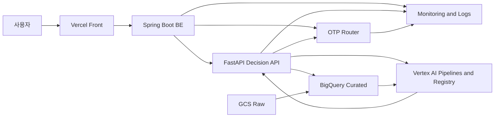
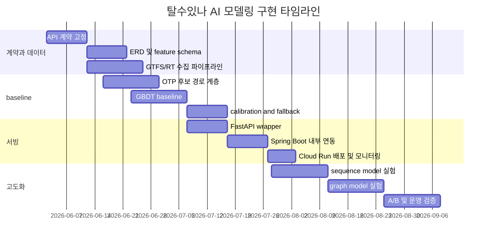

# 탈수있나 AI 모델링 심층 설계

## 요약

본 연구의 결론은 단순합니다. **탈수있나의 파이썬 모델은 단일 “AI 채팅 모델”이 아니라, 실시간 대중교통 의사결정을 위한 다단계 Decision Engine으로 재설계하는 것이 맞습니다.** 현재 참조한 문서군을 보면, MiriArt 쪽은 이미 **Spring Boot가 외부/프론트 계약을 가지면서 내부 FastAPI AI 서비스를 호출하는 구조**, GCS·Redis·비동기 AI 플로우·내부 전용 API 패턴을 갖고 있고, Cariv 쪽은 **명시적인 계약 중심 API, 단계 토큰, OCR-비교-사용자확인-최종저장 흐름, 표준 에러 코드**를 갖고 있습니다. 반면 탈수있나 현 상태는 프런트 주도 구조가 강하고, 현재 구현된 실동작 엔드포인트는 `POST /api/chat`뿐이며, DB도 확정되지 않은 초안 수준입니다. 즉, 이번 py v5 고도화의 본질은 “채팅 강화”가 아니라 **실시간 노선/환승/탑승 가능성 판단을 위한 의사결정 엔진 구축**입니다. fileciteturn0file3 fileciteturn0file4 fileciteturn0file10 fileciteturn0file11 fileciteturn0file12

알고리즘적으로는 **후보 경로 생성 엔진**과 **후보 경로 점수화 엔진**을 분리해야 합니다. 후보 생성은 GTFS/GTFS-RT와 OTP류 라우팅 엔진을 활용하고, 파이썬 AI는 그 위에서 **도착 지연 분포, 환승 성공 확률, 혼잡/탑승 실패 확률, 역사 내 보행 시간, 대체안 순위**를 추론하는 구조가 가장 현실적입니다. 특히 OTP 문서는 GTFS pathways, transfers, in-station navigation, GTFS-RT updaters, 그리고 최신 버전의 **empirical delay p50/p90**를 직접 지원하고 있어, 탈수있나가 추구하는 “탈 수 있나” 판단에 필요한 입력층이 이미 잘 맞아떨어집니다. citeturn11view0turn12view0turn13view0turn13view1turn13view2turn13view4turn7view0turn8view0turn8view1turn8view2

모델 전략은 **규칙 기반 + GBDT 기반 + 시계열/그래프 기반**을 한 번에 다 도입하는 것이 아니라, **단계적으로 겹겹이 쌓는 방식**이 적절합니다. 초기 운영형은 “OTP/규칙 기반 후보 생성 + XGBoost/LightGBM류 탭уляр 모델”이 가장 좋은 정확도/운영비 균형을 줍니다. 이후 데이터가 충분히 쌓이면 글로벌 LSTM/ConvLSTM, DCRNN, STGCN, Graph WaveNet 등으로 확장할 수 있습니다. 최근 대중교통 지연 예측 연구에서는 시내 전체 단위에서 생성한 대규모 시공간 특징 위에 **글로벌 LSTM이 transformer보다 더 나은 정확도-효율 균형**을 보였고, 혼잡·left-behind·denied boarding까지 고려하는 연구들은 추천 전략을 **강건 최적화**나 **capacity-aware assignment**로 다루고 있습니다. citeturn22academia0turn22academia3turn29academia0turn29academia2turn29academia3turn24academia1turn23academia1turn25academia0turn23academia0turn23academia2

인프라는 GCP 우선 원칙에 맞춰 **GCS raw + BigQuery curated + Vertex AI Pipelines/Custom Job/Model Registry + Cloud Run FastAPI** 조합을 기본값으로 두는 것이 가장 합리적입니다. Cloud Run은 같은 리전 내 Google Cloud 자원 간 전송비가 없고, 서비스 간 인증도 `roles/run.invoker`와 서비스 계정 기반으로 정리됩니다. Vertex AI는 custom job, custom service account, model registry, pipelines, lineage, model monitoring을 제공하므로, py 모델의 학습·서빙·거버넌스를 올리기에 적합합니다. BigQuery는 1 TiB/월 무료 이후 온디맨드 $6.25/TiB이며, partitioning·clustering·maximum bytes billed로 비용을 제어할 수 있습니다. Cloud Run은 request-based 기준 2M requests free tier와 vCPU/RAM free tier가 있어, 초중기 트래픽의 Decision API 비용은 대체로 낮게 유지될 가능성이 큽니다. citeturn6view0turn5view3turn15view2turn21view3turn18view0turn19view4turn5view2turn18view1turn18view2turn17view0

본 보고서는 제약이 명시되지 않은 항목에 대해 다음을 기본 가정으로 둡니다.

| 항목 | 현재 가정 |
|---|---|
| 학습 데이터 규모 | no specific constraint |
| 온라인 SLO | no specific constraint |
| GPU 사용 가능성 | 허용되나 초기 운영형은 CPU 친화 우선 |
| LLM 역할 | 설명 생성 전용, 의사결정 엔진 비핵심 |
| 프론트 기준 | `https://bigdata-transportation-front.vercel.app/` 고정 |
| GCP 기준 | project id `bigdata-transportation`, number `583933438413` 고정 |

## 현재 상태와 기준 문서

직접 인용 가능한 결과가 노출된 문서군을 기준으로 보면, **MiriArt 참조 구조의 핵심은 “정통 BE가 외부 계약을 담당하고, 내부 AI는 FastAPI가 전담”하는 패턴**입니다. 내부 AI 서비스는 분석, 대화, 이미지 편집, 요약, 초안 작성 등 AI 전용 엔드포인트를 별도로 갖고, GCS 객체 입출력과 Redis 세션/대화 관리가 결합된 형태로 운영됩니다. 또한 프런트는 AI를 직접 호출하지 않고 자바 백엔드만 호출하며, 자바 백엔드는 `miriart.fastapi.internal-url` 같은 내부 설정으로 AI 서비스를 붙입니다. 이 구조는 탈수있나에서도 그대로 재사용 가치가 큽니다. AI는 “내부 판단 엔진”, Spring Boot는 “공식 계약/권한/트랜잭션 엔진”으로 두는 것이 맞습니다. fileciteturn0file3 fileciteturn0file4

탈수있나 현 상태는 훨씬 초기 단계입니다. 문서 정리 산출물 기준으로 보면, 현재 앱 셸은 `src/App.tsx`와 `useAppController` 중심의 프런트 조립 구조이고, AppRouter는 URL router라기보다 `map/archive/settings` 중심 내부 라우터입니다. AI chat은 하단 독립 화면이 아니라 **지도 overlay**이며, 현재 구현된 엔드포인트는 `POST /api/chat` 하나이고, localStorage 키가 일부 존재하나 DB는 아직 없으며 ERD 역시 “frontend-derived draft”로 취급됩니다. 다시 말해, 지금의 py v5는 제품 핵심 판단 엔진이라기보다 **프런트 보조 AI**에 가까운 상태라고 보는 편이 정확합니다. fileciteturn0file12

Cariv 문서군은 탈수있나에 바로 가져다 쓸 수 있는 운영 패턴을 제공합니다. OpenAPI/Swagger 기준으로 인증·회원가입·차량등록·OCR 파싱·거래 처리 엔드포인트가 체계적으로 정리되어 있고, 공통 에러 코드 체계도 분리돼 있습니다. 특히 차량 등록 플로우는 **차량번호 조회 → OCR 파싱 및 외부 API 비교 → mismatch/ocrEmpty/pendingReasons 노출 → 사용자 확인/수정 → 최종 저장**의 흐름을 갖고 있으며, 이는 탈수있나에서도 **모델 판단 결과(evidence)와 사용자 확인(override)**을 설계할 때 매우 좋은 선례입니다. AI 결과를 단순 점수 하나로 끝내지 않고, “왜 low confidence인지”, “어떤 입력이 부족한지”, “무엇이 fallback 근거인지”를 구조화해서 반환하는 방식으로 확장하기 쉽습니다. fileciteturn0file6 fileciteturn0file8 fileciteturn0file10 fileciteturn0file11

이 문서군을 종합하면, 탈수있나의 기준 문서 체계도 이미 방향은 잡혀 있습니다. 새 target 문서로 `talsu_inna_api_contract.md`, `talsu_inna_api_endpoints.md`, `talsu_inna_erd.md`, `talsu_inna_infra.md`, `talsu_inna_ai_modeling_plan.md` 등이 생성되어 있고, 백엔드 작업 전 이 문서들을 먼저 합의해야 한다는 메모가 남아 있습니다. 이번 py 재설계는 반드시 그 문서 체계에 맞물려 들어가야 하며, 특히 **API contract, ERD, infra 문서와 모델링 문서가 분리되지 않도록** 해야 합니다. fileciteturn0file12

## 갭 분석

현재와 목표 상태의 차이는 “기술 선택의 차이”보다 **문제 프레이밍의 차이**가 큽니다. 현재는 채팅 중심 애플리케이션이고, 목표는 **실시간 대중교통 의사결정 시스템**입니다. 이 차이를 해결하려면 py 레이어를 “답변 생성기”가 아니라 **Decision API**로 재정의해야 합니다. GTFS와 GTFS-RT는 정적 스케줄과 실시간 trip updates, vehicle positions, alerts를 표준화해서 제공하고, OTP는 여기에 실제 라우팅, 실시간 업데이트, 역사 내 보행, empirical delay를 얹을 수 있습니다. 즉 **라벨링과 모델링 대상은 대화가 아니라 ‘탑승 가능성·환승 실패 위험·도착 시간 분포·대체안 우선순위’**입니다. citeturn7view0turn8view0turn8view1turn8view2turn10view2turn11view0turn12view0

아래 표는 현재와 목표 상태의 핵심 차이를 정리한 것입니다.

| 영역 | 현재 상태 | 목표 상태 |
|---|---|---|
| 파이썬 역할 | 채팅/보조 AI 중심 | 실시간 의사결정 엔진 |
| BE 연동 | 프런트 단일 `/api/chat` 위주 | Spring Boot가 공식 계약, FastAPI는 내부 Decision API |
| 데이터 계층 | 문서/프런트 상태 중심 | GTFS static/RT, OTP graph, 앱 로그, 운영 이벤트, 날씨, 혼잡/탑승 데이터 |
| 모델 산출 | 텍스트 응답 | probability, quantile ETA, risk score, ranked alternatives, evidence |
| 운영 거버넌스 | 미약 | Model Registry, lineage, monitoring, calibrated confidence |
| 사용자 신뢰장치 | 부족 | confidence, fallbackUsed, evidence, human override |

구조적으로도 목표 아키텍처는 다음처럼 바뀌어야 합니다.



이 아키텍처가 타당한 이유는 세 가지입니다. 첫째, OTP는 GTFS·GTFS-RT·역사 내 경로·실시간 업데이트를 반영하는 **후보 경로 생성 엔진**으로 적합합니다. 둘째, py 모델은 그 후보들에 대해 **불확실성을 포함한 점수화**를 담당하는 것이 더 효율적입니다. 셋째, Spring Boot는 인증·권한·외부 계약·감사·트랜잭션을 유지하고, 내부 Cloud Run/FastAPI는 서비스 간 인증으로 안전하게 호출하는 편이 운영상 안정적입니다. Cloud Run은 receiving service에 calling service의 service account를 principal로 추가하고 `Cloud Run Invoker` 역할을 부여하는 방식으로 service-to-service 인증을 구성하며, 같은 리전 Google Cloud 자원 간 데이터 전송 비용도 없습니다. citeturn10view2turn11view0turn12view0turn5view3turn6view0

문제의 본질을 더 분해하면, 탈수있나가 풀어야 할 AI 태스크는 하나가 아니라 최소 네 개입니다. **도착/출발 지연 예측**, **환승 보행/버퍼 시간 추정**, **혼잡·denied boarding 위험 추정**, **대체 경로 ranking**입니다. 혼잡과 탑승 실패를 무시한 단순 ETA 모델은 “버스/열차는 왔지만 못 탔음”을 설명하지 못하고, 역사 내 이동을 무시한 단순 routing은 “시간상 가능하지만 실제로는 승강장 이동이 불가능함”을 설명하지 못합니다. 최근 연구들은 exactly 이 문제를 crowding, left-behind, FCFS queuing, capacity-feasible assignment, robust recommendation의 문제로 다루고 있습니다. citeturn24academia1turn23academia1turn25academia0turn25academia2turn23academia0turn23academia2

## 파이썬 모델 재설계

재설계된 py v6의 핵심 원칙은 **“생성보다 예측, 단일 모델보다 계층 모델, point estimate보다 distribution + confidence”**입니다. 즉, FastAPI가 직접 “답을 만들어내는” 구조가 아니라, **후보 경로를 받아서 각 경로의 성공 확률과 위험 요인을 계산하고, 마지막에만 설명 레이어를 붙이는 구조**가 되어야 합니다. 이것이 LLM을 설명 전용으로 한정하라는 요구와도 정확히 맞습니다. 연구적으로도, 대규모 도시 단위의 transit delay는 대량의 시공간 특징과 글로벌 sequence 모델이 강점을 보였고, disruption 상황의 추천은 robust path recommendation이나 capacity-aware assignment처럼 **예측 + 최적화/순위화** 조합이 더 적합합니다. citeturn22academia0turn24academia1turn23academia1

권장하는 문제 정의는 다음과 같습니다.

| 하위 문제 | 타입 | 기본 라벨 |
|---|---|---|
| target departure를 탈 수 있는가 | 이진 분류 | boarded / missed |
| 특정 itinerary를 제시간 내 완수 가능한가 | 이진 분류 | success / failure |
| stop/segment별 지연은 얼마인가 | 회귀/분포 예측 | actual delay seconds |
| 혼잡/탑승 실패 가능성은 얼마인가 | 분류/회귀 | load factor, left-behind count |
| 여러 대체 경로 중 무엇이 가장 안전한가 | ranking | observed best choice / outcome-aware relevance |

데이터 입력은 표준 입력과 운영 입력을 분리해 설계해야 합니다. 표준 입력층은 **GTFS static**의 `stops`, `trips`, `stop_times`, `transfers`, `pathways`와 **GTFS-RT**의 `TripUpdate`, `VehiclePosition`, `Alert`입니다. OTP 문서는 GTFS pathways가 OSM-generated instructions를 override하고, transfer time은 실제 station 이동 경로와 walk speed, slack 파라미터에 의해 결정된다고 설명합니다. GTFS-RT 문서와 OTP 설정은 alerts, trip updates, vehicle positions, occupancy 관련 필드를 모두 반영할 수 있음을 보여줍니다. 따라서 탈수있나의 핵심 특징량은 크게 **스케줄 기반 특징, 실시간 운영 특징, 역사/환승 구조 특징, 수요/혼잡 특징, 사용자 컨텍스트 특징**으로 나눌 수 있습니다. citeturn11view0turn8view0turn8view1turn8view2turn13view0turn13view1turn13view2turn13view4turn7view0

권장하는 특징량은 다음과 같습니다. 스케줄 기반으로는 `scheduled_headway`, `transfer_slack`, `planned_walk_time`, `pathway_count`, `stairs/escalator/elevator usage`, `route_frequency`, `time_of_day`, `day_of_week`, `holiday`, `origin/destination station complexity`가 필요합니다. 실시간 운영층으로는 `current_delay`, `upstream_delay_propagation`, `vehicle_position_age`, `alert_severity`, `alert_effect`, `last_update_staleness`, `trip_update completeness`, `realtime occupancy`가 필요합니다. OTP empirical delay는 stop-level `p50`, `p90` historical delay를 공급할 수 있으므로 fallback feature로 매우 유용합니다. 문서상 empirical delay는 별도 CSV 두 파일로 graph build 시 로드되며, stop별 p50/p90를 GraphQL `EstimatedCall.empiricalDelay`로 노출할 수 있습니다. citeturn12view0turn8view0turn8view2turn13view1

추천 모델 아키텍처는 **계층형 4단 모델**입니다.  
첫째, **Candidate Generator**는 OTP 또는 유사 timetable router가 맡습니다. 여기서는 가능한 경로들을 다수 생성합니다.  
둘째, **Edge/Stop Delay Model**은 stop 혹은 segment 단위 ETA 분포를 예측합니다.  
셋째, **Boarding and Transfer Risk Model**은 혼잡, FCFS queuing, denied boarding, 역사 내 이동 실패 가능성을 추정합니다.  
넷째, **Itinerary Reranker**는 위 두 결과를 합쳐 최종 대안 순위를 만듭니다.  
이 구조가 중요한 이유는, path recommendation 연구와 queueing 연구가 보여주듯 “실시간 추천의 품질”은 단순 지연 예측이 아니라 **capacity와 uncertainty를 포함한 전체 여정 리스크**에 의해 결정되기 때문입니다. citeturn24academia1turn23academia1turn25academia0turn23academia0

모델 후보 비교는 아래와 같이 운영하는 것이 좋습니다.

| 모델군 | 주 용도 | 장점 | 한계 | 권장 시점 |
|---|---|---|---|---|
| 규칙 기반 + OTP + empirical delay | 초기 fallback, 서비스 기동 최소선 | 해석 쉬움, 즉시 운영 가능 | 학습 적응력 낮음 | 즉시 |
| XGBoost/GBDT | catchability, reranking, crowding risk | 탭ুল러 특징에 강함, 빠름, 운영 쉬움 | 장기 시계열·그래프 표현 한계 | 1차 운영형 |
| LSTM / ConvLSTM / TFT 계열 | stop/route delay forecasting | 시계열 패턴 강함 | 피처 관리와 drift 대응 필요 | 데이터 축적 후 |
| DCRNN / STGCN / Graph WaveNet | 네트워크 전역 지연/혼잡 예측 | 공간-시간 의존성 반영 | 운영 복잡도 높음 | 고도화 단계 |
| robust optimization / capacity assignment | disruption 대응 추천 | crowding·left-behind 반영 | 시뮬레이션/최적화 비용 | 혼잡 데이터 확보 후 |

초기 1차 운영형의 **최우선 추천은 GBDT + rules**입니다. 이유는 단순합니다. 대중교통 실시간 추천은 대부분 구조화 피처의 품질이 성능을 좌우하고, 탑승 가능성/환승 성공 여부는 tabular decision problem으로 먼저 푸는 편이 빠릅니다. XGBoost는 희소 데이터와 대규모 학습에 강한 scalable tree boosting 시스템으로 알려져 있고, 최신 도시 규모 transit delay 연구에서도 시공간 특징 engineering이 성능의 핵심임을 보여줍니다. 딥러닝은 두 번째 계층에서 들어가는 것이 맞습니다. 특히 STM 사례 연구는 global LSTM + cluster-aware feature가 transformer보다 18–52% 더 나은 정확도-효율 균형을 보였다고 보고합니다. citeturn26academia0turn22academia0

손실함수는 단일 loss 하나로 끝내지 않는 것이 좋습니다. ETA 회귀는 **Huber + Quantile loss** 조합을 권장합니다. p50/p90/p95를 함께 예측하면 서비스 UI와 risk control에 유리합니다. 실제로 OTP empirical delay도 p50/p90 중심으로 설계되어 있어 운영적 해석이 직관적입니다. catchability와 itinerary success는 **class-weighted BCE 또는 focal loss**를 추천합니다. 혼잡/left-behind는 카운트 기반이면 **Poisson/Negative Binomial**, 등급 기반이면 **ordinal loss**가 적합합니다. 최종 reranking은 pairwise ranking loss나 LambdaMART 방식이 무난합니다. robust recommendation 단계에서는 기대 generalized cost뿐 아니라 **missed-transfer probability, denied-boarding probability, CVaR 지연 위험**을 함께 최적화해야 합니다. citeturn12view0turn24academia1turn23academia1turn25academia0

평가 지표는 오프라인 정확도와 온라인 안전성을 분리해야 합니다. ETA는 MAE, RMSE, pinball loss, prediction interval coverage를 기본으로 두고, catchability는 AUROC보다 **AUPRC, Brier score, ECE, recall at high-risk**가 더 중요합니다. ranking은 NDCG@k, top-1 success rate, rerank uplift를 사용해야 합니다. 그리고 무엇보다 calibration을 별도 트랙으로 관리해야 합니다. 신경망 confidence는 잘 보정되지 않는 경우가 많고, temperature scaling 같은 post-hoc calibration이 매우 효과적이라는 고전 논문이 있습니다. conformal prediction 계열은 distribution-free interval을 주기 때문에 ETA/리스크 응답에 적합합니다. 따라서 **모델 학습과 calibration artifact를 분리 버전 관리**하는 것이 좋습니다. citeturn26academia1turn26academia2

불확실성과 fallback은 서비스 성공의 핵심입니다. OTP와 GTFS-RT 입력이 빈번히 흔들리는 도메인인 만큼, **low confidence를 정상 상태로 인정하는 설계**가 필요합니다. 예를 들어 `GTFS-RT age > 120s`, `vehicle position missing`, `alert present but trip update absent`, `pathway 불완전`, `crowding label unavailable` 같은 경우에는 fallback을 발동해야 합니다. 권장 순서는 `graph+sequence model → GBDT → empirical delay baseline → static schedule heuristic`입니다. OTP empirical delay가 p50/p90를 제공하므로, live data가 약할 때도 “정시”가 아니라 “역사적 지연 분포” 기반 판단으로 후퇴할 수 있습니다. citeturn12view0turn13view0turn13view1turn13view2

설명가능성은 모델군마다 다르게 가야 합니다. 트리 모델은 **SHAP**이 가장 실용적이고, 그래프 모델은 GNNExplainer류 기법이 적절합니다. 다만 서비스 응답에서는 연구용 설명을 그대로 노출하지 말고, **운영형 evidence schema**로 번역하는 것이 더 낫습니다. 예컨대 “실시간 TripUpdate 지연 + 역사 내 예상 보행 4분 + p90 historical delay 3분 + 현재 alert severity WARNING” 식으로 구조화된 evidence를 반환하고, **LLM은 이 evidence를 자연어 문장으로만 풀어주는 역할**에 머물러야 합니다. 결정 점수와 ranking은 LLM이 직접 만들지 않는 것이 맞습니다. citeturn28academia0turn28academia1

## GCP 및 FastAPI 서빙 설계

GCP 기준 권장 데이터 파이프라인은 **GCS를 raw zone, BigQuery를 curated/serving mart, Vertex AI를 training/governance layer**로 두는 형태입니다. GTFS static 원본, GTFS-RT snapshot, 날씨/이벤트 수집 데이터, 앱 telemetry 원본은 GCS에 적재하고, 정규화된 stop/trip/update/event/decision/fact 테이블은 BigQuery에 적재하는 것이 가장 무난합니다. BigQuery는 온디맨드로 1 TiB/월 무료 후 $6.25/TiB이고, columnar 구조라 선택한 컬럼만 과금되며, partitioning과 clustering으로 스캔량을 줄일 수 있습니다. 또한 과금 폭주 방지를 위해 `maximum bytes billed`를 반드시 걸어야 합니다. citeturn15view2turn21view3

학습 레이어는 가볍게 시작하고 점진적으로 올리는 편이 좋습니다. 공식 문서 기준으로 Vertex AI custom job은 worker pool, distributed training, custom service account, VPC peering 같은 옵션을 포함할 수 있고, Vertex AI Pipelines는 서버리스로 ML workflow를 orchestrate하면서 lineage와 experiment tracking까지 연결됩니다. Model Registry는 model/version/alias/deployable endpoint를 관리하는 중앙 저장소 역할을 합니다. 따라서 **초기에는 Vertex AI custom job + Pipelines + Model Registry**를 표준으로 삼고, 그래프 모델이나 대규모 GPU 분산 학습이 꼭 필요해질 때만 GKE나 더 무거운 서빙 옵션을 도입하는 것이 낫습니다. citeturn19view1turn18view0turn19view4turn5view2

서빙은 아래처럼 분리하는 것을 권합니다.

| 서빙 컴포넌트 | 권장 GCP 런타임 | 역할 | 추천 여부 |
|---|---|---|---|
| Spring Boot BE | Cloud Run 또는 GKE | 외부 계약, 인증, 트랜잭션, orchestration | 강력 추천 |
| FastAPI Decision API | Cloud Run | 후보 경로 점수화, risk inference, explanation assembly | 강력 추천 |
| OTP Router | GKE 또는 장기 실행 VM | 그래프 적재형 후보 경로 생성 | 조건부 추천 |
| 대형 DL/GNN 전용 endpoint | Vertex AI Endpoint 또는 GKE | GPU/고비용 모델 전용 | 후순위 |
| 배치 재학습/평가 | Vertex AI Pipelines/Custom Job | 자동 학습과 배포 승인 | 강력 추천 |

Cloud Run을 FastAPI wrapper의 기본 배포처로 추천하는 이유는 명확합니다. Cloud Run은 요청이 올 때 자동 스케일하고, 최대 동시 처리 수를 인스턴스당 설정할 수 있으며, concurrency는 최대 1000까지 가능하지만 Google은 너무 높게 잡지 말고 **낮은 값 예: 8부터 시작**해 올리라고 권고합니다. minimum instances도 실제 평시 트래픽에 맞춰야 비용이 낭비되지 않습니다. 또한 같은 리전 Cloud Run 서비스 간 전송엔 과금이 없고, 서비스 간 인증은 calling service account에 `roles/run.invoker`를 부여하면 됩니다. 탈수있나에서는 Spring Boot와 FastAPI를 같은 리전에 두고 내부 호출로 묶는 구성이 가장 깔끔합니다. citeturn18view4turn18view3turn6view0turn5view3

FastAPI 자체도 배포 관점에서 원격 서버와 적절한 서버 프로그램을 두는 전형적 웹 API 구조를 전제로 설명하고 있으므로, Cloud Run 컨테이너 실행 모델과 잘 맞습니다. 다시 말해 탈수있나에서 FastAPI는 단순 실험 서버가 아니라, **컨테이너화된 내부 prediction microservice**로 보는 것이 맞습니다. citeturn16view0

권장 API 스키마는 아래와 같습니다. Cariv의 공통 에러 envelope와 단계별 검증 흐름을 참고해, 탈수있나도 결과와 근거를 명시적으로 반환해야 합니다. fileciteturn0file8 fileciteturn0file10

```json
POST /v1/decision/itinerary

{
  "requestId": "uuid",
  "queryTime": "2026-05-30T21:00:00+09:00",
  "origin": {"type": "station", "id": "STATION_123"},
  "destination": {"type": "station", "id": "STATION_999"},
  "desiredDepartureTime": "2026-05-30T21:10:00+09:00",
  "userContext": {
    "walkingSpeedMps": 1.15,
    "mobility": "default",
    "hasLuggage": false
  },
  "options": {
    "maxAlternatives": 5,
    "preferLowRisk": true
  }
}
```

```json
200 OK

{
  "requestId": "uuid",
  "decision": {
    "canCatch": true,
    "successProbability": 0.83,
    "missedTransferProbability": 0.11,
    "expectedArrivalDelaySec": 185,
    "arrivalDelayQuantiles": {"p50": 120, "p90": 420, "p95": 560},
    "confidence": 0.78,
    "fallbackUsed": false
  },
  "ranking": [
    {
      "rank": 1,
      "itineraryId": "itin_01",
      "score": 0.91,
      "riskLevel": "LOW"
    }
  ],
  "modelMeta": {
    "modelVersion": "decision-v6.1.0",
    "featureSchemaVersion": "fs-2026-06-01",
    "calibrationVersion": "cal-2026-06-01",
    "routeGraphVersion": "otp-graph-2026-05-30"
  },
  "evidence": [
    {
      "type": "trip_update",
      "key": "upstream_delay_sec",
      "value": 140,
      "source": "GTFS_RT",
      "reliability": 0.92
    },
    {
      "type": "empirical_delay",
      "key": "p90_delay_sec",
      "value": 240,
      "source": "OTP_EMPIRICAL_DELAY",
      "reliability": 0.84
    }
  ],
  "explanation": {
    "templateVersion": "exp-v2",
    "summary": "현재 실시간 지연은 있으나 환승 버퍼가 충분해 탑승 가능성이 높습니다."
  }
}
```

추가 엔드포인트는 최소 다음 구성이 적절합니다.

| 메서드 | 경로 | 용도 |
|---|---|---|
| POST | `/v1/decision/itinerary` | 단일 여정 판단 |
| POST | `/v1/decision/recommendations` | 대체 경로 추천 |
| POST | `/v1/decision/calibrate` | 오프라인/관리자용 calibration 검증 |
| GET | `/v1/model/metadata` | modelVersion, schemaVersion, training snapshot |
| GET | `/healthz` | 프로세스 헬스 |
| GET | `/readyz` | 모델·feature cache readiness |
| GET | `/metrics` | Prometheus/OpenTelemetry 지표 |

지연 목표는 명시 제약이 없으므로 다음을 제안합니다. **캐시 hit 기준 p95 200ms 이하**, live feature 재조합이 필요한 uncached request 기준 **p95 700ms 이하**, 후보 경로 재생성까지 포함하면 **p95 1.2s 이하**가 현실적입니다. 동시성은 Cloud Run 권고에 맞춰 8에서 시작해 16, 32로 점검하고, OTP가 별도 프로세스라면 FastAPI는 pure scoring에 집중하도록 해야 합니다. 캐시는 세 층으로 두는 것이 좋습니다. **정적 topology/GTFS cache 24시간**, **stop-level live prediction cache 15–30초**, **popular OD candidate cache 1–5분**입니다. 여기서 캐시 키는 `origin,destination,time_bucket,user_profile,feed_version,model_version`의 해시로 두는 것이 안전합니다. citeturn18view4turn18view3

보안과 권한은 GCP 기본 원칙을 그대로 따르면 됩니다. Secret Manager는 최소권한 원칙을 따르고, 비밀정보를 파일시스템이나 환경변수로 넘기지 않는 것을 권장하며, secret version은 `latest`보다 **명시 버전 pinning**이 안전합니다. Vertex 계열 리소스에는 custom service account를 쓰고, Cloud Run 간 호출은 invoker role만 부여하며, 민감 데이터가 있다면 VPC Service Controls 경계를 두는 것이 좋습니다. Spring Boot용 서비스 계정, FastAPI inference용 서비스 계정, Vertex training용 서비스 계정, BigQuery read-only 서비스 계정을 분리하는 것이 바람직합니다. citeturn17view0turn19view1turn19view3turn5view3

비용은 정확한 SKU 계산 전 단계의 **운영형 ballpark** 수준으로 잡는 것이 적절합니다. Cloud Run request-based 가격표 기준으로 1M–3M requests/월 정도의 경량 inference API는 대개 소수~수십 달러대에서 출발할 가능성이 높고, BigQuery는 1 TiB/월 무료 이후 $6.25/TiB입니다. GCS Standard storage는 약 $0.02/GB-월 수준이며, T4 GPU는 공식 GPU 가격표 기준 시간당 $0.35/GPU입니다. 따라서 **초기 운영형**은 “Cloud Run + BigQuery + GCS”만으로 월 수십 달러~저수백 달러 범위에서 출발할 여지가 크고, **고급 학습형**은 GPU 학습 시간과 쿼리량에 따라 비용이 커집니다. 특히 BigQuery는 column pruning, partitioning/clustering, maximum bytes billed가 없으면 쉽게 예상치를 넘을 수 있습니다. citeturn6view0turn15view2turn14view3turn21view0turn21view3

## 실험 설계

실험 설계는 “정확도 경쟁”이 아니라 **서비스 안전성 검증** 중심으로 가야 합니다. 즉 단순 ETA MAE가 아니라, 실제 사용자 입장에서 **틀린 낙관 판단(false safe)**을 얼마나 줄이는지가 더 중요합니다. “탈 수 있다고 했는데 못 탔다”는 최악의 UX이고, 반대로 “못 탈 것 같다고 해서 대안을 추천했는데 실제로는 탈 수 있었다”는 그보다 덜 치명적입니다. 따라서 classification threshold, cost-sensitive evaluation, calibration curve를 반드시 설계에 포함해야 합니다. crowding과 left-behind를 고려한 path recommendation 연구와 queuing 연구도 이 방향성과 일치합니다. citeturn24academia1turn25academia0turn23academia0

권장 데이터셋 구성은 아래와 같습니다.

| 데이터셋 | 소스 | 역할 |
|---|---|---|
| GTFS static | 운영기관 공개 피드 | 네트워크 토폴로지, 스케줄, transfers, pathways |
| GTFS-RT trip updates | 실시간 피드 | stop-level real-time delay |
| GTFS-RT vehicle positions | 실시간 피드 | vehicle 현재 위치, stale 여부, occupancy 가능성 |
| GTFS-RT alerts | 실시간 피드 | disruption/context |
| OTP graph / empirical delay | OTP 생성 산출물 | 후보 경로, 역사 내 이동, p50/p90 fallback |
| 사용자 로그 | app telemetry | 실제 선택 경로, abandon, retry, feedback |
| 운영 실적/AFC/SK 데이터 | 확보 시 | crowding, left-behind, waiting time, calibration/도메인 적응 |
| 외부 컨텍스트 | 날씨, 이벤트 | exogenous shock 설명 변수 |

실험은 최소 세 계층으로 나누는 것이 좋습니다.  
첫째는 **baseline layer**: static schedule heuristic, OTP-only, empirical delay heuristic, GBDT baseline.  
둘째는 **temporal layer**: global LSTM, ConvLSTM/TFT 계열.  
셋째는 **network layer**: DCRNN, STGCN, Graph WaveNet, robust reranking.  
최근 연구를 보면 시공간 특징 engineering이 안정적인 baseline을 만들고, LSTM/graph 모델이 그 위에서 추가 이득을 줄 수 있습니다. 하지만 데이터와 운영난이도를 고려할 때 **GBDT baseline이 기준선**이 되어야 합니다. citeturn22academia0turn22academia3turn29academia0turn29academia2turn29academia3

권장 실험 매트릭스는 다음과 같습니다.

| 실험 축 | 설정 |
|---|---|
| 예측 과제 | ETA / catchability / missed transfer / ranking |
| 데이터 분할 | walk-forward weekly split, disruption holdout, station holdout |
| 지리 일반화 | 노선 holdout, 환승역 holdout |
| 피처 ablation | realtime 제거, pathways 제거, empirical delay 제거, alerts 제거, crowding 제거 |
| 모델 ablation | rules only, GBDT, sequence, graph |
| calibration | raw, temperature scaling, isotonic, conformal |
| 운영 검증 | stale feed, missing trip update, alert-only 상황, high crowding 상황 |

검증 전략은 **랜덤 split 금지, walk-forward 필수**가 원칙입니다. 시간축을 깨고 섞으면 실제 운영 성능을 과대평가합니다. 특히 대중교통은 계절성, 요일성, 출퇴근 패턴, 이벤트성 변동이 강하므로, `train: 과거`, `valid: 최근`, `test: 최신` 구조를 갖고, 별도로 **disruption holdout days**와 **major station holdout**을 만들어야 합니다. 최신 실무형 연구도 walk-forward validation과 multi-level evaluation이 중요하다고 강조합니다. citeturn22academia0

SK 데이터가 확보된다면, 그 데이터는 **최종 full retraining보다 calibration/fine-tune**에 먼저 쓰는 것이 좋습니다. 이유는 센서 체계나 운영 체계가 다를 경우 스키마는 비슷해도 분포가 다를 수 있기 때문입니다. 따라서 1단계로 feature schema parity를 확인하고, 2단계로 temperature/isotonic/conformal recalibration을 수행하고, 3단계로 필요한 경우만 partial fine-tuning 또는 domain adaptation을 적용하는 순서가 안전합니다. 이 접근은 training-serving skew를 줄이고, production drift를 모니터링하는 Vertex Model Monitoring 전략과도 맞습니다. Vertex Model Monitoring은 training-serving skew와 drift를 감지하며, feature attribution까지 별도 모니터링 대상으로 둘 수 있습니다. citeturn18view1turn18view2

평가 대시보드는 단일 리더보드보다 **모델판단 안전성 대시보드**가 필요합니다. 최소한 다음 네 가지 화면은 있어야 합니다.  
하나는 station/route/time-band별 calibration dashboard,  
둘은 low-confidence/fallback 발생률 dashboard,  
셋은 alert/disruption day 성능 dashboard,  
넷은 business KPI dashboard입니다.  
business KPI는 “missed-transfer complaint rate”, “reroute acceptance”, “false-safe rate”, “route refresh latency”까지 포함하는 편이 좋습니다. BigQuery 집계와 Vertex ML Metadata lineage, pipeline run metadata를 결합하면 재학습 전후 비교가 쉬워집니다. citeturn19view4turn18view0

## 구현 로드맵과 리스크

구현 순서는 **문서 계약 고정 → 데이터 계층 → baseline 모델 → 서빙 wrapper → 심화 모델**이어야 합니다. 이미 현재 문서 체계상 `talsu_inna_api_contract.md`, `talsu_inna_api_endpoints.md`, `talsu_inna_erd.md`, `talsu_inna_infra.md`, `talsu_inna_ai_modeling_plan.md`가 타깃 문서로 제시되어 있으므로, 이 순서를 거꾸로 가면 다시 문서와 코드가 분리됩니다. 특히 AI 팀이 먼저 모델부터 만들고, 나중에 API와 ERD를 맞추기 시작하면 거의 반드시 재작업이 납니다. fileciteturn0file12

권장 마일스톤은 아래와 같습니다.

| 마일스톤 | 핵심 산출물 | 연결 문서 |
|---|---|---|
| 계약 고정 | Decision API schema, error envelope, evidence schema | api_contract, api_endpoints |
| 데이터 고정 | feature tables, prediction events, feedback events | erd, infra |
| baseline 구현 | OTP + rules + GBDT v1 | ai_modeling_plan |
| 서빙 통합 | Spring Boot → FastAPI internal call, auth, cache | infra, api_contract |
| 운영 검증 | calibration, fallback, monitoring, dashboards | ai_modeling_plan, infra |
| 고도화 | sequence/graph model, robust reranker | ai_modeling_plan |

일정은 다음 정도가 현실적입니다.



리스크는 크게 다섯 가지입니다. 첫째, **실시간 데이터 품질 부족**입니다. GTFS-RT가 늦거나 빠지면 모델보다 입력이 먼저 무너집니다. OTP empirical delay와 heuristic fallback을 반드시 깔아야 하는 이유입니다. 둘째, **crowding/left-behind 라벨 부족**입니다. 이 경우 초기에는 직접 관측값이 아니라 proxy label로 시작하고, 실제 운영 로그/AFC/SK 데이터가 들어오면 점진적으로 교체해야 합니다. 셋째, **역사 내 topology 품질 문제**입니다. OTP 문서가 지적하듯 stop coordinates, pathways, OSM 연결이 부정확하면 transfer time 자체가 틀립니다. 넷째, **과신(overconfidence)**입니다. calibration과 low-confidence UX가 없으면 잘못된 “탈 수 있다” 판단이 서비스 신뢰를 무너뜨립니다. 다섯째, **비용 폭주**입니다. BigQuery 스캔과 always-warm serverless 설정, 잦은 재학습이 겹치면 예산이 빠르게 커집니다. citeturn11view0turn12view0turn26academia1turn21view3turn18view3

이 리스크들의 대응책은 비교적 명확합니다. 실시간 데이터 품질 부족에는 **data freshness gating + fallback chain**, crowding 라벨 부족에는 **proxy label + later calibration**, topology 품질에는 **station audit backlog**, 과신에는 **ECE/Brier gating + explanation + human override**, 비용 폭주에는 **partitioning/clustering + maximum bytes billed + minimum instances 절제**가 필요합니다. 운영 프로세스적으로는 Google의 MLOps maturity 문서가 말하는 수준처럼, 수동 notebook 중심 level 0에서 머무르지 말고, metadata·monitoring·continuous training을 포함한 level 1/2 방향으로 가야 합니다. 특히 production model은 accuracy보다 **retraining cadence, lineage, drift detection, reproducibility**가 더 중요합니다. citeturn21view4turn19view4turn18view1turn17view0turn21view3

우선 참고문헌은 아래 순서로 보는 것이 좋습니다. **우선순위 A**는 바로 설계에 반영해야 하는 문서와 논문입니다. OTP의 In-station navigation, GTFS-RT updater, Empirical Delay 문서와 GTFS static/realtime 표준, GCP의 Cloud Run/BigQuery/Vertex/Secret Manager 공식 문서, 그리고 robust path recommendation·capacity-aware assignment·city-scale delay prediction 논문이 여기에 해당합니다. citeturn11view0turn12view0turn13view0turn13view1turn7view0turn8view0turn8view1turn8view2turn6view0turn15view2turn18view0turn5view2turn17view0turn22academia0turn24academia1turn23academia1turn25academia0

**우선순위 B**는 모델 확장용 논문입니다. Graph WaveNet, STGCN, DCRNN은 네트워크 전역 예측으로 확장할 때 봐야 하고, AFC 기반 route choice / station waiting time 추정 논문은 crowding과 transfer risk 모듈 고도화에 필요합니다. citeturn29academia0turn29academia2turn29academia3turn22academia1turn24academia0turn23academia2

**우선순위 C**는 운영 안정화용 논문입니다. XGBoost는 초기 baseline의 실용성 근거, Guo et al.은 calibration, MAPIE는 conformal uncertainty, Lundberg & Lee는 tree explainability, GNNExplainer는 graph explainability의 기준점으로 적절합니다. 이 묶음은 “정확한 모델”을 “안전하게 운영 가능한 모델”로 바꾸는 데 필요합니다. citeturn26academia0turn26academia1turn26academia2turn28academia0turn28academia1

최종 권고를 한 문장으로 정리하면 이렇습니다. **탈수있나 py v5는 “대화형 AI”에서 “실시간 대중교통 Decision API”로 역할을 바꾸고, 1차 운영형은 OTP + GBDT + calibration + fallback으로 빠르게 만들고, 2차에서 sequence/graph/robust assignment를 얹는 방식이 가장 낫습니다.** 문서 기준으로는 MiriArt의 내부 AI 서비스 패턴과 Cariv의 계약/검증 패턴을 가져오고, 인프라는 GCP의 Cloud Run + BigQuery + GCS + Vertex AI로 정리하는 것이 본 프로젝트에 가장 핏합니다. fileciteturn0file3 fileciteturn0file4 fileciteturn0file8 fileciteturn0file10 fileciteturn0file12 citeturn6view0turn15view2turn18view0turn5view2