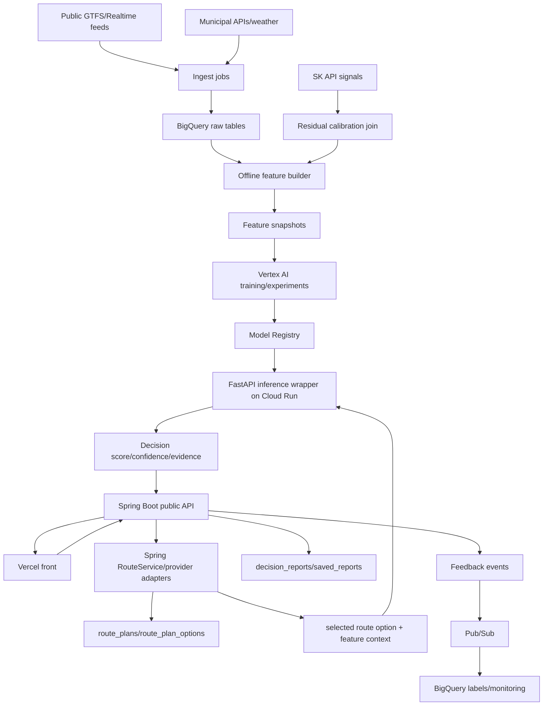

# 탈수있나 AI Modeling Plan

> 목적: `docs/reference/talsu_inna_ai_python_modeling_v5.md`의 모델링 전략을 `deep-research-report.md` 결정에 맞춰 운영 계획으로 정리한다. 이 문서는 public API contract 확정 문서가 아니다.
> SSOT: `docs/deep-research-report.md`

## 1. 범위

대상은 Python/FastAPI Decision API 내부 모델링 계획이다. 프론트/백엔드 endpoint 계약은 `talsu_inna_api_contract.md`, `talsu_inna_api_endpoints.md`에서 관리한다.

이 문서는 방금 확정한 AI 모델링 심층연구설계를 기준으로 한다. AI 쪽 SSOT는 다음 순서로 해석한다.

| 우선순위 | 아티팩트 | 역할 |
|---:|---|---|
| 1 | `docs/deep-research-report.md` | 전체 아키텍처와 계약 경계 |
| 2 | 이 문서 | AI 모델링, feature, calibration, 실험/배포 운영 |
| 3 | `docs/reference/deep-research-report_ai_final.md` | Decision Engine 심층 연구와 알고리즘 부록 |
| 4 | `docs/reference/talsu_inna_ai_python_modeling_v5.md` | 기존 Python 모델링 원천 자료 |

MiriArt/Cariv 참조 패턴과 AI 심층 연구 문서는 설계 근거로 사용하지만, 탈수있나 구현 계약은 이 repo의 stable docs를 우선한다. Reference 문서의 `/v1/decision/*`, `/healthz`, `/readyz`, `/metrics`, `itineraryId`, `modelMeta`, `fallbackUsed: boolean` 예시는 운영 계약으로 직접 채택하지 않는다. 운영 endpoint와 DTO 명칭은 `POST /api/v1/decision/route-report`, `POST /internal/decision/route-report`, `routePlanId`, `routeOptionId`, `modelVersion`, `featureSchemaVersion`, `calibrationVersion`, public `fallback.used/strategy/reason` 기준으로 정규화한다.

## 2. 핵심 전략

공공 데이터로 저비용 baseline과 feature engineering을 먼저 만들고, SK API 데이터는 고품질 teacher signal, residual calibration, hold-out test, fine-tuning에 사용한다. 운영에서는 공공 실시간값과 SK pattern/cache를 결합하고, SK 장애나 비용 제한 시 public baseline fallback을 유지한다.

Python/FastAPI 레이어의 역할은 AI chat이 아니라 internal Decision Scorer다. Candidate generation은 Spring RouteService 또는 route provider adapter가 소유하고, FastAPI는 Spring이 넘긴 `routePlanId`, `routeOptionId`, selected route option, provider freshness, transfer slack, delay/crowding feature, user preference context를 점수화한다. OTP/GTFS/GTFS-RT/empirical delay는 FastAPI의 직접 provider dependency가 아니라 Spring route domain 또는 별도 route provider service가 route candidate와 feature context를 구성할 때 사용하는 입력층이다.

현재 구현 DB는 아직 생성되지 않았을 수 있지만, 문서 기준 ERD는 frontend-derived draft 단계에서 canonical Spring Boot-owned schema로 승격되었다. FastAPI는 canonical DB owner가 아니며, 사용자 계정, preferences, route plan 저장, decision report 저장, saved report archive, feedback OLTP write를 소유하지 않는다.

모델링은 거대 end-to-end 모델 하나가 아니라 3단 계단식 전략으로 간다.

| 단계 | 역할 | 핵심 산출물 |
|---|---|---|
| 1. Public baseline | GTFS/static/RT, 공공 운행정보, 보행/환승 graph 기반 규칙형 또는 트리 기반 baseline | timetable/buffer heuristic, Logistic/GBM |
| 2. Probability calibration | Deadline/Boarding/Transfer 확률의 신뢰도 보정 | sigmoid/isotonic/temperature scaling, Brier/log loss |
| 3. Residual calibration / fine-tuning | SK API와 운영 로그를 teacher signal로 결합 | residual model, calibrated ranker, SK-enhanced model |

LLM은 어느 단계에서도 경로/도착/탑승 여부의 결정 엔진이 아니다. LLM은 structured decision과 evidence를 사용자의 언어로 설명하는 explanation layer다.

첫 릴리스 목표는 정확도 극대화가 아니라 설명 가능한 안정성, fallback 일관성, calibrated confidence 노출, 재현 가능한 실험 추적이다.

### 2-1. Reference Research Adoption

| 항목 | 판단 | 운영 반영 |
|---|---|---|
| Python AI를 Decision Engine으로 재정의 | 채택 | FastAPI는 internal Decision Scorer로 제한 |
| Candidate Generator / Scorer 분리 | 채택 | Spring RouteService는 후보 생성, FastAPI는 scoring |
| OTP / GTFS / GTFS-RT / empirical delay 입력층 | 채택 | Spring route provider adapter의 후보/feature context 입력으로 사용 |
| 1차 운영형: rules + GBDT + calibration + fallback | 채택 | P0 baseline과 fallback chain |
| sequence/graph/robust assignment | 조건부 채택 | P2/P3 실험 후보, online 로그와 혼잡 라벨 확보 후 |
| `/v1/decision/itinerary` 계열 endpoint | 거부 | canonical endpoint는 `/api/v1/decision/route-report`와 `/internal/decision/route-report` |
| FastAPI의 OTP 직접 소유 | 거부 | provider orchestration과 snapshot 경계는 Spring이 소유 |
| exact cloud pricing | reference only | 운영 문서는 cost guardrail만 고정 |
| ChatGPT filecite/webcite token | 거부 | repo 운영 문서에는 깨진 citation token을 남기지 않음 |

## 3. 모델 후보

| 모델 | Public baseline | SK 필요성 | 목적 |
|---|---|---|---|
| Boarding Risk | 가능 | 고도화 필요 | 이번 차/다음 차 탑승 가능성 |
| Transfer Failure | 가능 | 고도화 필요 | 환승 실패/지연 위험 |
| Deadline Success | 가능 | 고도화 필요 | 마감 시간 도착 가능성 |
| ETA Error Regressor | 일부 가능 | 운영 로그/SK 필요 | ETA 보정 |
| Train Congestion | 불가 | 필수 | 열차 혼잡 예측 |
| Car Congestion | 불가 | 필수 | 칸별 혼잡 예측 |
| Car Guide Ranker | 불가 | 필수 + user feedback | 생존 칸 추천 ranking |

우선순위는 `Deadline Success`와 `ETA`를 P0로 둔다. 제품 데모에서 "정해진 시간까지 도착 가능한가"가 가장 직접적인 가치이고, 라벨 재구성도 상대적으로 명확하기 때문이다. 그 다음은 `Transfer Failure`, 데이터 가용성 확인 후 `Boarding Risk`/`Congestion`, 충분한 온라인 로그 축적 후 `Car Guide Ranker` 순서로 확장한다.

## 3-1. Online Model Candidate Matrix

지연/처리량은 벤치마크 전 운영 목표값이다. CPU 기반 트리 모델은 Cloud Run에 적합하고, 시계열/그래프 딥러닝은 Vertex AI 또는 별도 추론 revision으로 분리한다.

| 후보군 | 대표 알고리즘 | 장점 | 약점 | 데이터 요구량 | 온라인 배치 | 목표 지연/처리량 |
|---|---|---|---|---|---|---|
| 규칙형 baseline | timetable + buffer heuristic | 빠르고 설명 가능, fallback 최적 | 비선형 패턴 약함 | 낮음 | Spring route domain 또는 FastAPI scorer fallback | 5-20ms, 매우 높음 |
| 트리 기반 | LightGBM/XGBoost/CatBoost | tabular, 결측, 비선형에 강함 | 장기 시계열/그래프 한계 | 중간 | Cloud Run CPU | 20-80ms, 높음 |
| 시계열 딥러닝 | TFT/LSTM/TCN | multi-horizon/covariate 반영 | 운영 복잡도 증가 | 중~높음 | Vertex AI or dedicated Cloud Run | 50-200ms, 중간 |
| 그래프 기반 | ST-GNN/dual GNN/multi-graph RNN | 네트워크 의존성과 혼잡 전파 반영 | 구축/학습/서빙 비용 큼 | 높음 | Vertex AI 우선 | 80-300ms, 중간 |
| 랭킹 전용 | LambdaMART/listwise ranker | 추천 순위 최적화 직접 가능 | feature engineering 의존 | 중간 | Cloud Run CPU | 20-60ms, 높음 |
| 확률 보정 | sigmoid/isotonic/temperature scaling | confidence 품질 향상 | 별도 calibration set 필요 | 낮음 | FastAPI 후처리 | 1-5ms 추가 |

## 3-2. Task Plan

| Task | 1차 후보 | 2차 후보 | 3차 후보 | 핵심 피처 | 목적함수 | 주평가 지표 |
|---|---|---|---|---|---|---|
| Deadline Success | Logistic, HistGBM | LightGBM/XGBoost + sigmoid/isotonic | TFT + calibration, LambdaMART rerank | 출발시각, scheduled ETA, recent delay, transfer buffer, route length, weather | BCE/focal | ROC-AUC, AP, Brier, success@1 |
| Boarding Risk | rule threshold, Logistic | CatBoost/LightGBM | graph/sequence classifier | 역 혼잡, 차량 위치, 승강장/문 위치 근사, headway, previous occupancy | BCE/ordinal CE | AP, recall@high-precision, Brier |
| Transfer Failure | timetable buffer heuristic | GBM + calibration | transfer-aware graph model | 환승보행시간, 실시간 지연, buffer, 역사 구조, vertical transfer cost | BCE | ROC-AUC, AP, Brier, missed-transfer recall |
| ETA Regressor | historical mean/median | LightGBM regressor/quantile GBM | TFT/ST-GNN/dual GNN | segments, stops, dwell, weather, peak, event, congestion | MAE/Huber/pinball | MAE, RMSE, p50/p90 pinball |
| Congestion | rule buckets | ordinal GBM | semi-supervised graph model | station demand, headway, special events, SK congestion | ordinal CE/regression | macro-F1, MAE, calibration |
| Ranker | weighted score | LambdaMART | listwise neural ranker | ETA, risk, crowd, preference, evidence quality | pairwise/listwise | NDCG, top-1 success, feedback usefulness |

## 4. Feature 전략

Public feature 후보: route id, station id, day/time bucket, headway, scheduled ETA, transfer count, walk time, buffer minutes, public delay/crowding proxy.

SK-enhanced feature 후보: train congestion, car congestion, car alighting rate, rolling congestion, station/time pattern, missing flag. SK feature가 없으면 0으로 채우지 않고 missing flag를 둔다.

Feature pipeline은 공공 데이터 -> 정규화 -> 특징 생성 -> SK 결합 -> snapshot/versioning 순서로 간다.

| Layer | Sources / Features |
|---|---|
| Public data | GTFS static, GTFS-Realtime, 지자체 도착 API, 날씨, 공휴일/학사일정, OSM 보행 network, station/승강장 metadata |
| Feature generation | 출발시각, 요일/peak flag, station/line embedding, recent delay 5/15/30m, headway irregularity, transfer buffer, walk distance, station congestion moving average, event/rain flags |
| SK enrichment | predictedTravelTime, arrivalForecast, congestion, vehiclePosition, serviceStatus 가정. 정확 schema는 계약 확인 전까지 미확정 |
| Residual inputs | publicBaseline, skSignal, sourceFreshnessSec, sourceDisagreement, missing flags |

## 4-1. Feature Schema Draft

| Field | Type | Source | Required | Note |
|---|---|---|---|---|
| `originStationId` | string | Spring station | yes | canonical id |
| `destinationStationId` | string | Spring station | yes | canonical id |
| `routePlanId` | string | Spring route preview | yes | request resource id |
| `departureTimeBucket` | string | request/context | yes | weekday/time bucket |
| `deadlineTime` | string | request | no | deadline model input |
| `routeOptionId` | string | Spring route preview | yes | candidate option id |
| `modeSequence` | string[] | Spring route preview | yes | subway/walk/bus/taxi/bike |
| `scheduledEtaMinutes` | number | public/provider | yes | baseline |
| `transferCount` | number | route preview | yes | |
| `walkMinutes` | number | route preview | yes | |
| `bufferMinutes` | number | derived | no | deadline - ETA |
| `publicDelayProxy` | number | public data | no | missing flag if absent |
| `trainCongestionPct` | number | SK | no | SK-enhanced |
| `carCongestionScore` | number | SK | no | SK-enhanced |
| `carAlightingRatePct` | number | SK | no | SK-enhanced |
| `hasSkSignals` | boolean | derived | yes | never impute SK missing as zero |

추가 feature schema:

| Field | Type | Source | Required | Note |
|---|---|---|---|---|
| `requestedDepartureAt` | datetime | request | yes | search context |
| `deadlineAt` | datetime | request | no | Deadline Success |
| `routeKey` | string | Spring route | yes | route/station/line composite key |
| `headwayEstimateSec` | number | public/derived | no | service interval |
| `minTransferSlackSec` | number | Spring route graph/provider context | no | transfer risk |
| `sourceFreshnessSec` | number | provider metadata | yes | stale detection |
| `routeProvider` | string | Spring provider adapter | yes | maps/public/SK/etc. |
| `providerCoverageScore` | number | provider/derived | no | data quality |

## 4-2. Target Schema Draft

| Target | Type | Used by | Label source |
|---|---|---|---|
| `deadlineSuccess` | binary/probability | Deadline Success | public proxy -> SK calibration |
| `boardingRisk` | probability | Boarding Risk | public proxy -> SK/crowd refinement |
| `transferFailure` | probability | Transfer Failure | buffer/proxy -> SK alighting |
| `etaErrorMinutes` | regression | ETA Error | operation logs + provider/SK |
| `recommendedCarIndex` | ranking/classification | Car Guide | SK car data + feedback |

## 5. Target 정책

| target | source | 비고 |
|---|---|---|
| public proxy labels | public schedule/API + rules | baseline용 |
| train congestion pct | SK train congestion | direct/high-quality |
| car congestion score/level | SK car-level data | 칸별 모델 |
| car alighting rate | SK alighting stats | 환승/하차 보정 |
| user feedback labels | saved report/action feedback | ranker/evaluation 후보 |

## 6. Pipeline

1. Public baseline: public data ingestion, feature build, baseline model, feature importance.
2. SK hold-out test: SK target 생성, baseline 성능 측정.
3. Calibration: public prediction을 SK true/proxy label로 보정.
4. Fine-tuning: public + SK combined dataset, hold-out 평가.
5. Production: public realtime + cached SK pattern enrichment, fallback/evidence 제공.

## 7. Calibration / Promotion / Evaluation

Promotion은 모델별 threshold를 별도 관리한다. 공통 원칙은 fallback engine보다 나빠지지 않아야 하며, calibration set과 test set은 분리한다. 모든 운영 decision은 `modelVersion`과 `calibrationVersion`을 기록한다.

Calibration은 public baseline 단계부터 시작한다. `confidenceRaw`와 calibrated `confidence`를 분리하고 reliability diagram, Brier score, log loss를 모니터링한다. 초기 보정은 temperature scaling을 우선 검토하고, 데이터가 충분해지고 비선형 왜곡이 크면 isotonic regression을 검토한다.

## 7-1. Promotion Gate Draft

| Model | Metric | Minimum gate |
|---|---|---|
| Deadline Success | calibration error, AUC/PR-AUC, false-safe rate | fallback보다 false-safe 악화 금지 |
| Boarding Risk | precision at high-risk, recall at high-risk | high-risk miss 감소 |
| Transfer Failure | recall on failure cases | fallback보다 failure miss 감소 |
| ETA Error | MAE/RMSE | public ETA baseline보다 개선 |
| Car Guide Ranker | NDCG/top-1 usefulness | rule fallback보다 사용자 피드백 악화 금지 |

`false-safe`는 실제로 늦거나 실패할 가능성이 높은데 안전하다고 판단하는 오류다. 이 제품에서는 false-safe가 false-warning보다 더 위험하다.

## 7-2. Experiment / Registry Policy

| Item | Policy |
|---|---|
| Experiment tracking | Vertex AI Experiments로 run, params, metrics, artifact URI 기록 |
| Pipeline | Vertex AI Pipelines로 feature build -> train -> evaluate -> register 자동화 |
| Registry | Vertex AI Model Registry에 `shadow`, `canary`, `prod` alias를 둔다 |
| Promotion | calibration, fallback 대비 성능, latency, false-safe gate를 통과해야 `prod` alias 승격 |
| Rollback | Spring/FastAPI config는 model alias 또는 pinned modelVersion으로 rollback 가능해야 한다 |
| Schema version | `featureSchemaVersion`이 바뀌면 offline eval과 API schema compatibility를 확인한다 |

## 8. Runtime Ownership And FastAPI Decision API 내부 책임

Runtime ownership은 다음 경계를 따른다.

```text
Route generation = Spring route domain
Decision scoring = FastAPI internal decision domain
Persistence = Spring + Cloud SQL
Analytics = Pub/Sub/BigQuery async
LLM = explanation only
```

Spring RouteService는 OTP/GTFS/GTFS-RT/Maps/SK 등 route provider adapter 호출, `route_plans`/`route_plan_options` 저장, provider freshness와 route snapshot 구성, selected route option + feature context 조립을 소유한다. FastAPI는 route provider를 직접 orchestration하지 않고, Spring이 넘긴 route option과 feature context를 받아 scoring한다.

FastAPI는 inference wrapper, model registry lookup, fallback decision, evidence generation, model log/feedback hook을 소유한다. Training/offline feature builder와 BigQuery feature snapshot 생성은 ML pipeline 영역이고, runtime route candidate generation은 Spring route domain 영역이다. 사용자 계정/저장 리포트 canonical DB는 Spring Boot 소유로 둔다.

## 8-1. Inference Response 원칙

모든 inference 응답에는 최소한 `modelVersion`, `featureSchemaVersion`, `calibrationVersion`, `confidence`, `confidenceBand`, `fallback`, `decisionCode`, `evidence[]`를 포함한다. LLM은 numeric decision을 직접 만들지 않고, decision/evidence를 설명하는 explanation layer로 제한한다.

```json
{
  "requestId": "req_01J...",
  "decisionReportId": "drpt_01J...",
  "decisionCode": "GO",
  "decisionLabel": "탈 수 있음",
  "modelVersion": "decision-public-v1.2.0",
  "featureSchemaVersion": "fsv_2026_06_01",
  "calibrationVersion": "temp-scale-2026-06-01",
  "confidenceRaw": 0.88,
  "confidence": 0.82,
  "confidenceBand": "MEDIUM",
  "fallback": {
    "used": false,
    "strategy": null,
    "reason": null
  },
  "evidence": [
    {
      "evidenceId": "evd_01J...",
      "kind": "ROUTE_METRIC",
      "field": "transferSlackSeconds",
      "value": 240,
      "display": "환승 여유 4분",
      "provider": "maps_primary",
      "observedAt": "2026-05-30T20:10:05+09:00",
      "sourceSnapshotId": "snap_01J..."
    }
  ]
}
```

## 8-2. Internal Endpoint Boundary

| Endpoint | 역할 |
|---|---|
| `GET /internal/health` | FastAPI service/model readiness |
| `POST /internal/decision/route-report` | numeric/probabilistic decision + evidence |
| `POST /internal/decision/chat` | decision/evidence를 바탕으로 structured explanation 생성 |

FastAPI는 canonical DB write를 하지 않는다. 필요한 inference log나 model feedback event는 Spring Boot가 별도 저장하거나, ML 전용 로그/feature store로 분리한다. `/healthz`, `/readyz`, `/metrics`는 reference 문서의 ops 후보일 뿐이며, canonical 문서의 health 기준은 Spring public `GET /api/v1/health`, Spring internal `/actuator/health`, FastAPI `GET /internal/health`다.

## 8-3. Fallback Order

| Priority | Fallback | Use case |
|---:|---|---|
| 1 | Calibrated ranker / SK-enhanced model | SK signals available and model healthy |
| 2 | Public baseline ranker/model | SK missing, cost cap, SK API failure |
| 3 | Deterministic heuristic timetable scorer | model artifact unavailable or schema mismatch |
| 4 | Cached last-good answer | transient provider/model outage and same route context |
| 5 | User-facing explain-only degraded response | decision unavailable |

LLM failure는 decision failure가 아니다. 모델/룰 decision은 반환하되 explanation section만 degraded 처리한다.

## 9. Inference Response Schema

FastAPI internal response는 camelCase Pydantic alias를 기준으로 한다.

```json
{
  "requestId": "req_20260530_9f1c",
  "modelVersion": "ranker-2026-06-15.prod",
  "featureSchemaVersion": "fsv_2026_06_01",
  "calibrationVersion": "temp-scale-2026-06-01",
  "confidence": 0.82,
  "fallbackUsed": "none",
  "dataFreshnessSeconds": 42,
  "generatedAt": "2026-05-30T10:15:12+09:00",
  "routeCandidates": [
    {
      "routeOptionId": "ropt_01J...",
      "rank": 1,
      "rankScore": 0.941,
      "deadlineSuccessProb": 0.87,
      "transferFailureProb": 0.08,
      "boardingRiskProb": 0.19,
      "etaMinutesP50": 23.4,
      "etaMinutesP90": 28.1,
      "congestionLevel": "MEDIUM",
      "confidence": 0.84,
      "fallbackUsed": "none",
      "evidence": [
        { "type": "delayTrend", "label": "최근 15분 평균 지연 감소", "value": -1.8 },
        { "type": "transferBuffer", "label": "환승 버퍼 충분", "value": 5.2 }
      ]
    }
  ],
  "explanations": {
    "summary": "목표 시각 내 도착 가능성이 가장 높은 경로입니다.",
    "warning": null
  }
}
```

`fallbackUsed`는 FastAPI internal enum 표현이다. Spring public API로 재포장할 때는 `fallback.used`, `fallback.strategy`, `fallback.reason` object로 정규화한다.

## 10. Feedback Event Schema

Feedback event는 추론결과와 실제결과를 다시 잇는 label reconstruction key다.

```json
{
  "eventId": "fb_20260530_af21",
  "requestId": "req_20260530_9f1c",
  "decisionReportId": "drpt_01J...",
  "userIdHash": "u_d1b8...",
  "sessionId": "sess_8c41",
  "routeOptionId": "ropt_01J...",
  "servedModelVersion": "ranker-2026-06-15.prod",
  "servedFeatureSchemaVersion": "fsv_2026_06_01",
  "servedCalibrationVersion": "temp-scale-2026-06-01",
  "fallbackUsed": "none",
  "selected": true,
  "completed": true,
  "arrivedBeforeDeadline": true,
  "observedEtaMinutes": 24.7,
  "transferFailed": false,
  "boardedFirstVehicle": true,
  "observedCongestionLevel": "MEDIUM",
  "userRating": 4,
  "feedbackType": "implicit_plus_explicit",
  "occurredAt": "2026-05-30T10:49:33+09:00"
}
```

## 11. Data / Training Flow



## 11-1. Analytics Storage Draft

OLTP 저장소와 분석 저장소는 분리한다. Spring Boot canonical DB는 사용자 요청, route option, decision report, saved report, feedback event를 관리한다. BigQuery는 raw event, feature snapshot, inference log, training label, offline evaluation을 관리한다.

### BigQuery table candidates

| Table | Partition | Cluster | 목적 |
|---|---|---|---|
| `bigdata-transportation.ml_raw_transit_events` | `DATE(eventTs)` | `provider`, `stationId`, `routeKey` | GTFS/지자체/SK 원천 이벤트 적재 |
| `bigdata-transportation.ml_feature_snapshot_hourly` | `serviceDate` | `stationId`, `routeKey`, `lineId`, `featureSchemaVersion` | 시간 단위 feature snapshot |
| `bigdata-transportation.ml_model_inference_log` | `DATE(requestTs)` | `modelVersion`, `originStationId`, `destinationStationId`, `routeOptionId` | 온라인 추론 결과와 feature/model 버전 |
| `bigdata-transportation.ml_feedback_event` | `DATE(occurredAt)` | `servedModelVersion`, `requestId`, `routeOptionId`, `feedbackType` | label reconstruction용 피드백 |
| `bigdata-transportation.ml_experiment_eval_summary` | `DATE(evaluatedAt)` | `modelVersion`, `featureSchemaVersion`, `datasetVersion` | offline evaluation summary |

BigQuery partition/filter와 clustering은 비용 제어 장치다. 대량 분석 쿼리는 반드시 partition filter를 사용하고, clustering key는 최대 4개까지 운영 목적에 맞춰 유지한다.

### `ml_feature_snapshot_hourly`

```sql
CREATE TABLE `bigdata-transportation.ml_feature_snapshot_hourly` (
  snapshotTs TIMESTAMP NOT NULL,
  serviceDate DATE NOT NULL,
  stationId STRING NOT NULL,
  routeKey STRING NOT NULL,
  lineId STRING,
  hourBucket INT64,
  scheduledEtaSec FLOAT64,
  recentDelayAvg5m FLOAT64,
  recentDelayAvg15m FLOAT64,
  headwayIrregularity FLOAT64,
  transferWalkSec FLOAT64,
  congestionScore FLOAT64,
  weatherPrecipMm FLOAT64,
  eventFlag BOOL,
  sourceFreshnessSec INT64,
  featureSchemaVersion STRING NOT NULL
)
PARTITION BY serviceDate
CLUSTER BY stationId, routeKey, lineId, featureSchemaVersion;
```

### `ml_model_inference_log`

```sql
CREATE TABLE `bigdata-transportation.ml_model_inference_log` (
  requestId STRING NOT NULL,
  requestTs TIMESTAMP NOT NULL,
  userIdHash STRING,
  originStationId STRING NOT NULL,
  destinationStationId STRING NOT NULL,
  deadlineTs TIMESTAMP,
  routeOptionId STRING NOT NULL,
  rank INT64,
  modelVersion STRING NOT NULL,
  featureSchemaVersion STRING NOT NULL,
  calibrationVersion STRING,
  confidence FLOAT64,
  fallbackUsed STRING,
  deadlineSuccessProb FLOAT64,
  transferFailureProb FLOAT64,
  boardingRiskProb FLOAT64,
  etaMinutesP50 FLOAT64,
  etaMinutesP90 FLOAT64,
  congestionLevel STRING,
  evidenceJson STRING
)
PARTITION BY DATE(requestTs)
CLUSTER BY modelVersion, originStationId, destinationStationId, routeOptionId;
```

### `ml_feedback_event`

```sql
CREATE TABLE `bigdata-transportation.ml_feedback_event` (
  eventId STRING NOT NULL,
  occurredAt TIMESTAMP NOT NULL,
  requestId STRING NOT NULL,
  decisionReportId STRING,
  routeOptionId STRING NOT NULL,
  userIdHash STRING,
  servedModelVersion STRING NOT NULL,
  servedFeatureSchemaVersion STRING NOT NULL,
  servedCalibrationVersion STRING,
  fallbackUsed STRING,
  selected BOOL,
  completed BOOL,
  arrivedBeforeDeadline BOOL,
  observedEtaMinutes FLOAT64,
  transferFailed BOOL,
  boardedFirstVehicle BOOL,
  observedCongestionLevel STRING,
  userRating INT64,
  feedbackType STRING
)
PARTITION BY DATE(occurredAt)
CLUSTER BY servedModelVersion, requestId, routeOptionId, feedbackType;
```

Pub/Sub는 feedback/retraining event bus로 사용한다. exactly-once는 pull subscription 조건에서만 기대하고, push/Eventarc/Cloud Run 경로에서는 `eventId` 또는 `Idempotency-Key`로 중복 적재를 방지한다.

## 12. Monitoring

| Category | Metrics |
|---|---|
| Service | p50/p95 latency, 4xx/5xx, timeout, cold start ratio |
| Model | fallback rate, confidence distribution, calibration drift, ETA MAE, deadline success gap, top-1 success, feedback disagreement |
| Data | null ratio, source freshness, provider coverage, source disagreement, schema drift |
| Cost | BigQuery scanned bytes, Vertex training cost, Cloud Run instance/request cost, SK/provider API spend |

운영 retention은 기술 권고로 관리한다. 법률 자문이 아니며 위치/이동 기록과 SK 제휴 데이터는 별도 법무/계약 검토가 필요하다.

| Data | Store | Retention recommendation |
|---|---|---|
| Station metadata/provider mapping | OLTP DB | long-term |
| Route provider short cache | Redis or managed cache | seconds to minutes |
| Unsaved route plans | OLTP DB | 7 days or less |
| Saved reports | OLTP DB | until user deletion |
| Raw model feedback | OLTP/BigQuery | 180 days, then aggregate |
| Inference logs | BigQuery | product policy, pseudonymous IDs only |
| Audit/security logs | Cloud Logging sink | about 1 year |

## 13. 8-Week AI Sprint

| Week | Focus | Output |
|---:|---|---|
| 1 | GTFS/public data ingest normalization | raw tables, station/route key mapping |
| 2 | baseline heuristic/GBM | first Deadline/ETA baseline |
| 3 | feature schema v1 + BigQuery load | `featureSchemaVersion` v1 |
| 4 | FastAPI internal inference wrapper | `/internal/decision/route-report` |
| 5 | Vertex AI experiments/registry | tracked runs, candidate registry |
| 6 | calibration v1 | Brier/log loss, sigmoid/isotonic selection |
| 7 | ETA quantile + congestion model + monitoring | p50/p90 ETA, drift/fallback dashboards |
| 8 | shadow/canary + fallback hardening | go/no-go report, prod alias candidate |

Minimum staffing assumption: ML 1명, Data/BE 1명, Front 0.5명, QA/PM 0.5명. 이보다 적으면 Week 7-8의 congestion/ranker 범위를 줄이고 Deadline/ETA/calibration/fallback만 ship한다.

## 14. 상태 표시

| 구분 | 표시 |
|---|---|
| 현재 코드와 동기화됨 | 프론트 report type과 decision target 방향 |
| 계획성 | BigQuery/Vertex AI/PubSub 기반 실험 운영, Deadline/ETA first release, calibration, SK residual fine-tuning |
| 미확정 | SK API schema/terms/quota/storage permission, legal review for location/feedback retention |
