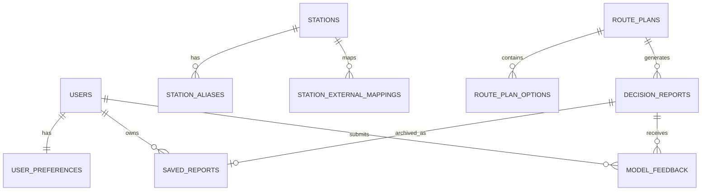

# 탈수있나 ERD

> 목적: `docs/deep-research-report.md`의 최종 결정에 따라 canonical DB schema, 식별자 정책, 저장 snapshot 정책, migration batch를 고정한다.
> SSOT: `docs/deep-research-report.md`

## 1. ERD 원칙

현재 DB는 없다. FE의 `StationNode`, `RoutePlan`, `SavedReport`, `UserPreferences`는 출발점일 뿐이며 그대로 DB로 복사하지 않는다. 최종 DB는 Spring Boot 소유 canonical schema이고, FastAPI는 canonical DB owner가 아니다.

DB 엔진의 1차 권고는 Cloud SQL for MySQL 8.0이다. JSON snapshot/evidence 저장과 Spring/JPA 운영 단순성을 우선한다. 고급 공간 질의가 커지면 PostgreSQL/PostGIS 전환을 별도 검토한다.

| 원칙 | 결정 |
|---|---|
| Station ID | 내부 PK `id BIGINT`와 외부 공개용 `canonical_station_id VARCHAR(40)`를 분리한다. |
| Provider ID | 외부 API 식별자는 `station_external_mappings`에만 둔다. |
| Route plan | `route_plans`는 요청 단위, `route_plan_options`는 후보 option 단위로 저장한다. |
| Decision | `decision_reports`는 selected route option에 대한 모델/룰 판단 결과다. |
| Saved report | `saved_reports`는 immutable archive이며 route/provider/decision/model/evidence snapshot을 보존한다. |
| Chat | overlay chat persistence는 P1 이후 선택 사항이다. P0 canonical DB 필수 대상이 아니다. |
| Feedback | `model_feedback`으로 품질 회수 루프를 확보한다. |
| Analytics | BigQuery는 raw event, feature snapshot, inference log, training label, offline eval을 맡는다. |

Public ID는 pure ULID가 아니라 prefix가 붙은 문자열이다. 예: `stn_01J...`, `rpln_01J...`, `ropt_01J...`, `drpt_01J...`, `srpt_01J...`, `fb_01J...`. 따라서 public ID 컬럼은 fixed-length pure ULID 타입이 아니라 `VARCHAR(40)` 이상으로 둔다.

## 2. Recommended ERD

## 3. Core Tables

### `stations`

| Field | Type | Null | Note |
|---|---|---|---|
| `id` | BIGINT PK | no | internal DB key |
| `canonical_station_id` | VARCHAR(40) | no | prefixed public immutable ID, never reused |
| `display_name` | VARCHAR(120) | no | UI display |
| `station_type` | VARCHAR(30) | no | `METRO`, `BUS`, `BIKE`, `DISTRICT` |
| `line_code` | VARCHAR(40) | yes | metro/route line |
| `lat` | DECIMAL(10,7) | yes | canonical coordinate |
| `lng` | DECIMAL(10,7) | yes | canonical coordinate |
| `region_code` | VARCHAR(40) | yes | region grouping |
| `active` | BOOLEAN | no | search/display |
| `created_at` | DATETIME | no | audit |
| `updated_at` | DATETIME | no | audit |

Index: unique `canonical_station_id`, index `display_name`, index `region_code`.

### `station_aliases`

| Field | Type | Null | Note |
|---|---|---|---|
| `id` | BIGINT PK | no | |
| `station_id` | BIGINT FK | no | `stations.id` |
| `normalized_alias` | VARCHAR(160) | no | search key |
| `locale` | VARCHAR(20) | no | e.g. `ko-KR` |
| `source` | VARCHAR(40) | no | `MANUAL`, `PUBLIC`, `PROVIDER` |

Index: `normalized_alias`, unique `station_id + normalized_alias + locale`.

### `station_external_mappings`

| Field | Type | Null | Note |
|---|---|---|---|
| `id` | BIGINT PK | no | |
| `station_id` | BIGINT FK | no | `stations.id` |
| `provider` | VARCHAR(40) | no | `PUBLIC`, `SK`, `GOOGLE_MAPS`, etc. |
| `external_station_id` | VARCHAR(160) | no | provider station ID |
| `external_parent_id` | VARCHAR(160) | yes | route/line/parent ID |
| `provider_meta_json` | JSON | yes | provider metadata |
| `last_synced_at` | DATETIME | yes | provider sync time |

Index: unique `provider + external_station_id + external_parent_id`.

### `route_plans`

| Field | Type | Null | Note |
|---|---|---|---|
| `id` | BIGINT PK | no | |
| `route_plan_id` | VARCHAR(40) | no | prefixed public route plan ID |
| `user_id` | BIGINT FK | yes | P0 guest nullable |
| `origin_station_id` | BIGINT FK | yes | station catalog match |
| `destination_station_id` | BIGINT FK | yes | station catalog match |
| `origin_label` | VARCHAR(120) | no | station 밖 입력 fallback |
| `destination_label` | VARCHAR(120) | no | station 밖 입력 fallback |
| `requested_departure_at` | DATETIME | yes | |
| `deadline_at` | DATETIME | yes | |
| `request_snapshot_json` | JSON | no | original request/preferences |
| `provider_snapshot_hash` | VARCHAR(128) | yes | dedupe/audit |
| `created_at` | DATETIME | no | |
| `expires_at` | DATETIME | yes | unsaved route cleanup target |

Index: unique `route_plan_id`, index `user_id + created_at`, index `expires_at`.

### `route_plan_options`

| Field | Type | Null | Note |
|---|---|---|---|
| `id` | BIGINT PK | no | |
| `route_plan_id` | BIGINT FK | no | `route_plans.id` |
| `route_option_id` | VARCHAR(40) | no | prefixed public option ID |
| `option_rank` | INT | no | provider/ranker order |
| `provider` | VARCHAR(40) | no | provider name |
| `provider_option_id` | VARCHAR(160) | yes | provider native option ID |
| `duration_sec` | INT | yes | total duration |
| `walk_sec` | INT | yes | walking duration |
| `transfer_count` | INT | yes | |
| `fare` | INT | yes | KRW |
| `option_snapshot_json` | JSON | no | provider route option snapshot |
| `created_at` | DATETIME | no | |

Index: unique `route_option_id`, unique `route_plan_id + option_rank`.

### `decision_reports`

| Field | Type | Null | Note |
|---|---|---|---|
| `id` | BIGINT PK | no | |
| `decision_report_id` | VARCHAR(40) | no | prefixed public decision report ID |
| `route_plan_id` | BIGINT FK | no | |
| `selected_option_id` | BIGINT FK | yes | selected `route_plan_options.id` |
| `decision_code` | VARCHAR(30) | no | `GO`, `TIGHT`, `NO_GO` |
| `confidence` | DECIMAL(5,4) | no | calibrated confidence |
| `confidence_band` | VARCHAR(20) | no | `LOW`, `MEDIUM`, `HIGH` |
| `model_version` | VARCHAR(80) | no | model artifact version |
| `feature_schema_version` | VARCHAR(80) | no | feature schema version |
| `calibration_version` | VARCHAR(80) | no | calibration version |
| `fallback_used` | VARCHAR(40) | no | normalized fallback strategy, e.g. `none`, `public_baseline`, `heuristic` |
| `fallback_json` | JSON | no | fallback used/strategy/reason |
| `evidence_json` | JSON | no | evidence array and source freshness |
| `summary_text` | TEXT | yes | human summary |
| `llm_explanation_json` | JSON | yes | explanation layer output |
| `created_at` | DATETIME | no | |

Index: unique `decision_report_id`, index `route_plan_id + created_at`.

### `saved_reports`

| Field | Type | Null | Note |
|---|---|---|---|
| `id` | BIGINT PK | no | |
| `saved_report_id` | VARCHAR(40) | no | prefixed public saved report ID |
| `user_id` | BIGINT FK | yes | P0 guest nullable |
| `decision_report_id` | BIGINT FK | no | source decision |
| `title` | VARCHAR(200) | no | archive title |
| `summary_card_json` | JSON | no | archive card payload |
| `route_snapshot_json` | JSON | no | immutable route snapshot |
| `provider_snapshot_json` | JSON | no | immutable provider snapshot |
| `decision_snapshot_json` | JSON | no | immutable decision snapshot |
| `model_metadata_json` | JSON | no | model/calibration metadata |
| `evidence_json` | JSON | no | immutable evidence |
| `created_at` | DATETIME | no | saved time |
| `deleted_at` | DATETIME | yes | soft delete optional |

Index: unique `saved_report_id`, index `user_id + created_at`.

### `model_feedback`

| Field | Type | Null | Note |
|---|---|---|---|
| `id` | BIGINT PK | no | |
| `decision_report_id` | BIGINT FK | no | |
| `user_id` | BIGINT FK | yes | |
| `event_id` | VARCHAR(40) | yes | prefixed idempotent feedback event ID |
| `route_option_id` | BIGINT FK | yes | selected or evaluated option |
| `served_model_version` | VARCHAR(80) | yes | label reconstruction |
| `served_feature_schema_version` | VARCHAR(80) | yes | label reconstruction |
| `served_calibration_version` | VARCHAR(80) | yes | label reconstruction |
| `fallback_used` | VARCHAR(40) | yes | inference mode |
| `ground_truth_outcome` | VARCHAR(80) | yes | actual outcome |
| `helpful` | BOOLEAN | yes | user usefulness |
| `confidence_was_right` | BOOLEAN | yes | calibration signal |
| `arrived_before_deadline` | BOOLEAN | yes | Deadline Success label |
| `observed_eta_minutes` | DECIMAL(6,2) | yes | ETA label |
| `transfer_failed` | BOOLEAN | yes | Transfer Failure label |
| `boarded_first_vehicle` | BOOLEAN | yes | Boarding Risk label |
| `observed_congestion_level` | VARCHAR(30) | yes | Congestion label/proxy |
| `comment` | TEXT | yes | |
| `payload_json` | JSON | yes | extra event |
| `submitted_at` | DATETIME | no | |

Index: unique nullable `event_id`, index `decision_report_id + submitted_at`, index `served_model_version + submitted_at`.

## 4. Optional Tables

| Table | When | Note |
|---|---|---|
| `users` | P1 auth | OAuth subject and account status |
| `user_preferences` | P1 auth/server sync | localStorage remains P0 guest cache |
| `refresh_sessions` | P1 auth | refresh rotation/logout invalidation |
| `decision_chat_sessions` | P1/P2 chat persistence | not required for P0 overlay |

## 5. Transaction Boundaries

| Flow | DB Transaction |
|---|---|
| route request row creation | short TX before provider call |
| external route provider call | no DB TX |
| route option save | short TX after provider response |
| FastAPI decision call | no DB TX |
| decision report save | short TX after FastAPI response |
| saved report archive | single TX, idempotent |
| model feedback | single TX, idempotent if event key exists |

긴 외부 provider 호출과 AI inference를 DB transaction 안에 넣지 않는다.

## 5-1. OLTP / Analytics Split

AI 모델링 심층연구설계의 `route_request`, `route_candidate`, `route_recommendation`, `feedback_event`, `user_preference_profile` 용어는 아래처럼 canonical OLTP 테이블에 매핑한다. 새 이름으로 테이블을 중복 생성하지 않는다.

| Modeling term | Canonical OLTP table | Analytics table |
|---|---|---|
| `route_request` | `route_plans` | `ml_model_inference_log.requestId` context |
| `route_candidate` | `route_plan_options` | candidate-level inference rows |
| `route_recommendation` | `decision_reports` | `ml_model_inference_log` |
| `feedback_event` | `model_feedback` | `ml_feedback_event` |
| `user_preference_profile` | `user_preferences` | feature snapshot derived fields |

BigQuery는 확정 DB가 아니라 ML/분석 저장소다. 운영 transaction의 source of truth는 Spring Boot가 소유한 OLTP DB이며, BigQuery 적재는 비동기/재처리 가능하게 설계한다.

### BigQuery dataset candidates

| Table | Purpose | Partition / cluster |
|---|---|---|
| `ml_raw_transit_events` | GTFS/지자체/SK 원천 이벤트 | `DATE(eventTs)`, provider/station/route |
| `ml_feature_snapshot_hourly` | feature snapshot 및 schema version 추적 | `serviceDate`, station/route/line/featureSchemaVersion |
| `ml_model_inference_log` | 온라인 추론 결과와 model/feature/calibration version | `DATE(requestTs)`, model/origin/destination/route |
| `ml_feedback_event` | label reconstruction용 feedback event | `DATE(occurredAt)`, model/request/route/feedbackType |
| `ml_experiment_eval_summary` | offline experiment evaluation | `DATE(evaluatedAt)`, model/feature/dataset |

OLTP `decision_reports`와 `model_feedback`에는 최소한 `model_version`, `feature_schema_version`, `calibration_version`, `fallback_used`를 남긴다. 그래야 나중에 "어느 모델과 feature schema가 어떤 추천을 냈는지"를 재현할 수 있다.

## 6. Migration Batch

| Batch | Tables | Exit Criteria |
|---|---|---|
| M1 Station Identity | `stations`, `station_aliases`, `station_external_mappings` | FE mock station seed import and search work |
| M2 Route Planning | `route_plans`, `route_plan_options` | `/api/v1/route-plans` can store request/options |
| M3 Decision | `decision_reports` | `/api/v1/decision/route-report` stores decision metadata/evidence |
| M4 Archive | `saved_reports` | `/api/v1/reports` stores immutable snapshots |
| M5 Feedback | `model_feedback` | feedback loop available |
| M6 Auth Optional | `users`, `user_preferences`, `refresh_sessions` | PKCE auth and preference sync available |

## 7. FE Mapping

| FE model | DB target |
|---|---|
| `StationNode.id` | `stations.canonical_station_id` after adapter |
| `StationNode.x/y` | UI-only, not canonical; optional seed metadata |
| `RoutePlan` | `route_plans` + `route_plan_options` |
| `SavedReport` | `saved_reports.summary_card_json` + immutable snapshots |
| `AiChatResponse` | `decision_reports.llm_explanation_json` only when saved/needed |
| `UserPreferences` | P0 localStorage, P1 `user_preferences` |

## 8. 상태 표시

| 구분 | 표시 |
|---|---|
| 현재 코드와 동기화됨 | FE entity/view model과 localStorage 출발점 |
| 결정됨 | canonical station ID, provider mapping, route plan storage, immutable saved report snapshot |
| 미확정 | auth go-live timing, station provider import details, chat persistence |
