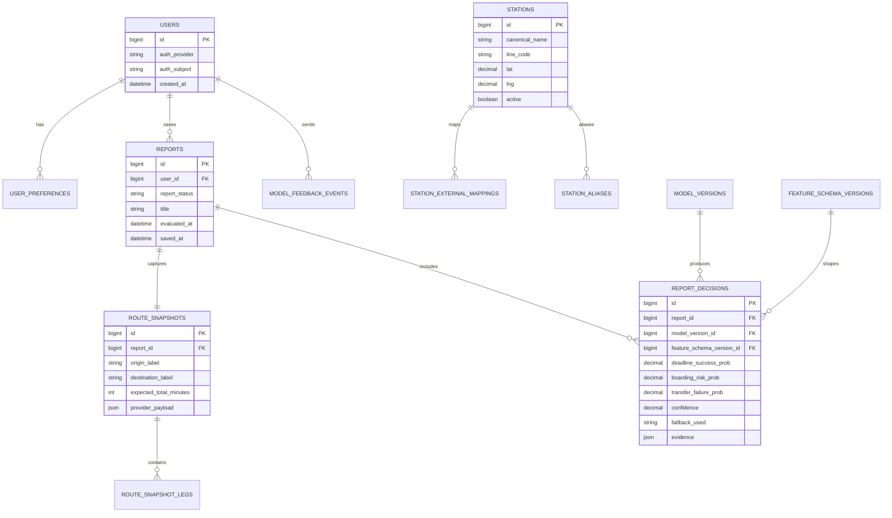

# 탈수있나 ERD

> 목적: 현재 프론트 entity/model/mock에서 출발하되, `deep-research-report.md`의 결정에 따라 canonical DB schema와 migration batch를 고정한다.
> SSOT: `docs/deep-research-report.md`

## 1. ERD 원칙

현재 DB는 없다. frontend-derived draft는 출발점일 뿐이며 그대로 DB로 복사하지 않는다. 영속 모델과 계산 모델을 분리하고, canonical DB는 Spring Boot 소유로 둔다. FastAPI는 canonical DB owner가 아니다.

## 2. Canonical Schema 방향

현재 frontend-derived draft는 폐기하지 않는다. 다만 그대로 DB에 복사하지 않고, 영속 모델과 계산 모델을 분리한다. route preview는 저장하지 않으며, 사용자가 report 저장을 수행한 시점에만 route snapshot과 decision snapshot을 남긴다.

## 3. Entity 후보

| Entity | 현재 출처 | 주요 필드 후보 |
|---|---|---|
| `user` | app memory `user` | `id`, `display_name`, `is_guest`, `created_at` |
| `user_preferences` | `UserPreferences` | `user_id`, `home_station_id/name`, `work_station_id/name`, `crowd_sensitivity`, `max_taxi_fee`, `walk_limit_min`, `use_bike`, `ai_style` |
| `favorite_route` | `favoriteRoutes: string[]` | `id`, `user_id`, `start_station`, `end_station`, `label`, `sort_order` |
| `station` | `StationNode` | `id`, `name`, `type`, `lat/lng future`, `mock_x`, `mock_y`, `crowd_level` |
| `station_availability_snapshot` | station mock live-ish fields | `station_id`, `bikes_available`, `buses_available`, `crowd_level`, `observed_at`, `source` |
| `route_preview` | `RoutePlan` | DB 테이블이 아니라 `POST /api/v1/route-plans` ephemeral response |
| `route_snapshot` | `RoutePlan` + `TimelineStep` | report 저장 시점에만 `route_snapshots`, `route_snapshot_legs`로 영속 |
| `saved_report` | `SavedReport` | `id`, `user_id`, `date`, `type`, `from`, `to`, `status`, `summary`, `cost`, `route_plan_id nullable` |
| `chat_session` | planned from `ChatMessage[]` | `id`, `user_id nullable`, `start_station`, `end_station`, `created_at` |
| `chat_message` | `ChatMessage` | `id`, `session_id`, `sender`, `text`, `timestamp`, suggestion fields |
| `model_feedback` | planned | `id`, `user_id nullable`, `report_id nullable`, `model_version`, `event_type`, `label`, `created_at` |

## 4. Canonical Table 권고

| 우선순위 | Table | 목적 |
|---|---|---|
| P0 | `stations` | canonical station master |
| P0 | `station_external_mappings` | public/SK/Maps provider ID mapping |
| P0 | `station_aliases` | 검색/표기 alias |
| P0 | `reports` | 사용자가 저장한 판단 리포트 |
| P0 | `route_snapshots` | 저장 시점 route preview snapshot |
| P0 | `route_snapshot_legs` | snapshot의 leg/timeline |
| P0 | `report_decisions` | 모델 판단 결과와 evidence |
| P1 | `model_versions` | inference 재현용 model metadata |
| P1 | `feature_schema_versions` | feature schema version |
| P1 | `model_feedback_events` | 사용자/운영 피드백 |
| P1/P2 | `users`, `user_preferences`, `refresh_sessions` | auth 도입 시 활성 |

정규 `route_plan` 테이블은 P0에서 만들지 않는다. route plan은 계산 결과이며, 저장 리포트의 재현성이 필요할 때만 snapshot으로 저장한다.

## 5. 관계 초안

| 관계 | Cardinality | 비고 |
|---|---|---|
| user -> user_preferences | 1:1 | guest는 local-only 가능 |
| user -> favorite_route | 1:N | 현재 string 배열을 정규화 후보로 분리 |
| stations -> station_external_mappings | 1:N | provider별 external id |
| stations -> station_aliases | 1:N | 검색/표기 alias |
| user -> reports | 1:N | P0 guest는 nullable/anonymous 가능 |
| reports -> route_snapshots | 1:1 | 저장 리포트의 route 근거 |
| route_snapshots -> route_snapshot_legs | 1:N | timeline/leg 분리 |
| reports -> report_decisions | 1:N | decision evidence와 model metadata |
| model_versions -> report_decisions | 1:N | inference 재현성 |
| feature_schema_versions -> report_decisions | 1:N | feature schema 재현성 |
| reports -> model_feedback_events | 1:N | 모델 평가/피드백 |

## 6. Java BE 소유 후보

Spring Boot가 소유하는 테이블: `stations`, `station_external_mappings`, `station_aliases`, `reports`, `route_snapshots`, `route_snapshot_legs`, `report_decisions`, `model_versions`, `feature_schema_versions`, `model_feedback_events`, auth 도입 시 `users`, `user_preferences`, `refresh_sessions`.

`route_plan` 정규 테이블은 만들지 않는다. route plan은 매 요청 ephemeral response이고, 저장 리포트의 재현성이 필요할 때만 route snapshot으로 남긴다.

## 7. FastAPI 저장 정책

FastAPI가 저장하지 않아야 할 것: canonical user, preferences, saved_report, station master.

FastAPI가 저장할 수 있는 것: anonymized inference log, feature snapshot, model prediction, model feedback, experiment/evaluation result. 운영 DB와 ML feature store/로그 저장소는 분리한다.

## 8. Mock to DB Mapping

| Current mock/state | DB 후보 | 주의 |
|---|---|---|
| `stations[].x/y` | `station.mock_x/mock_y` | Google Maps 전환 후 `lat/lng` 필요 |
| `stations[].crowdLevel` | snapshot 또는 derived field | master field로 고정하지 않기 |
| `RoutePlan.confidence` | `route_snapshots.provider_payload` 또는 `report_decisions.evidence` | preview response는 저장하지 않음 |
| `SavedReport.from/to` string | `reports` label + `route_snapshots` origin/destination | station catalog 밖 입력 지원 여부 결정 |
| `favoriteRoutes` string | favorite_route rows | parsing에 의존하지 않기 |

## 8-1. Mermaid ERD

## 9. 상태 표시

| 구분 | 표시 |
|---|---|
| 현재 코드와 동기화됨 | entity 후보, 필드 후보, localStorage persistence |
| 계획성 | Java-owned DB, report snapshot persistence, model feedback |
| 미확정 | user/auth 도입 시점, provider별 station canonicalization detail |
